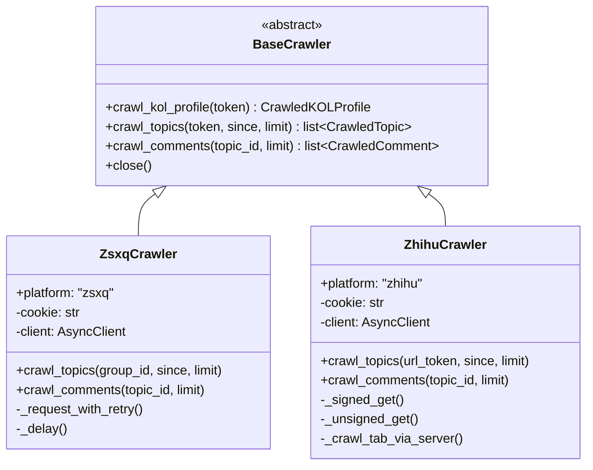
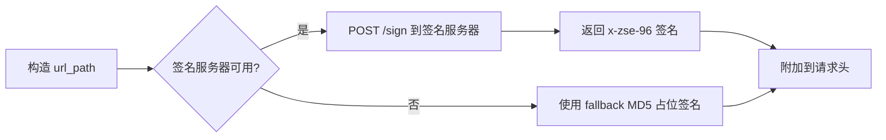
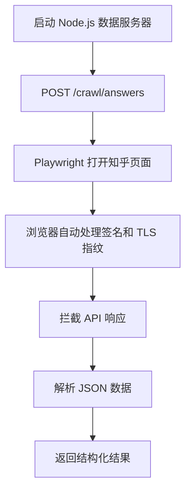

# 爬虫详解

本文档详细介绍 Dungeon Lord 中各平台爬虫的实现原理、认证机制和容错策略。

## 架构总览



两个爬虫共享 `BaseCrawler` 基类定义的数据结构：

- **CrawledTopic** -- 主题/文章/回答/想法
- **CrawledComment** -- 评论/回复
- **CrawledKOLProfile** -- KOL 用户信息

---

## 知识星球（ZSXQ）爬虫

### API 端点

| 端点 | 方法 | 说明 |
|------|------|------|
| `/v2/groups/{group_id}` | GET | 获取星球信息（名称、成员数等） |
| `/v2/groups/{group_id}/topics` | GET | 获取主题列表（分页） |
| `/v2/topics/{topic_id}/comments` | 获取主题评论 |

基础 URL：`https://api.zsxq.com/v2`

### 认证方式

知识星球使用 **Cookie 认证**。需要登录网页版 `wx.zsxq.com` 后从浏览器 DevTools 中提取 Cookie。

**配置项：**
- `zsxq_cookie` -- 完整的 Cookie 字符串
- `zsxq_group_id` -- 目标星球的 ID

**请求头：**

```
Cookie: <zsxq_cookie>
User-Agent: Mozilla/5.0 ...
Origin: https://wx.zsxq.com
Referer: https://wx.zsxq.com/
Content-Type: application/json
```

### 分页机制

使用 `end_time` 游标分页：

1. 首次请求不带 `end_time`，返回最新的 20 条主题
2. 取最后一条的 `create_time` 作为下一页的 `end_time`
3. 连续 3 页为空时判定翻页结束

```python
params = {"scope": "all", "count": 20}
if end_time:
    params["end_time"] = end_time
```

### 内容类型处理

| 类型 | 字段路径 | 提取逻辑 |
|------|---------|---------|
| `q&a` | `item.question` / `item.answer` | 分别提取提问和回答文本，拼接为 `[提问] ... [回答] ...` |
| `talk` | `item.talk` | 直接提取 `text` 字段 |
| `article` | `item.article` | 直接提取 `text` 字段 |

每种类型都会提取内嵌的 `images` 列表。

### 内嵌评论

主题响应中的 `show_comments` 字段包含内嵌评论（通常为最新几条），爬虫会自动提取并保存，无需额外 API 调用。

---

## 知乎（Zhihu）爬虫

### API 端点

| 端点 | 方法 | 签名 | 说明 |
|------|------|------|------|
| `/v4/members/{url_token}` | GET | 不需要 | 获取用户信息 |
| `/v4/members/{url_token}/answers` | GET | 需要 | 获取回答列表 |
| `/v4/members/{url_token}/articles` | GET | 需要 | 获取文章列表 |
| `/v4/members/{url_token}/pins` | GET | 不需要 | 获取想法列表 |
| `/v4/answers/{id}` | GET | 需要 | 获取回答详情（含 content） |
| `/v4/articles/{id}` | GET | 需要 | 获取文章详情 |
| `/v4/pins/{id}/comments` | GET | 不需要 | 获取想法评论 |

基础 URL：`https://www.zhihu.com/api/v4`

### 认证方式

知乎使用 **Cookie 认证** + **x-zse-96 签名**双重机制。

**配置项：**
- `zhihu_cookie` -- 完整的 Cookie 字符串
- `zhihu_url_token` -- 目标用户的 URL token（个人主页 URL 中的标识）
- `zhihu_sign_server` -- 签名服务器地址（默认 `http://localhost:17007`）

### x-zse-96 签名

知乎的 answers 和 articles 端点要求请求携带 `x-zse-96` 签名头。该签名基于知乎自定义的 SM4 加密算法，纯 Python 实现暂未成功。

**签名生成流程：**



**签名服务器 API：**

```
POST http://localhost:17007/sign
Content-Type: application/json

{
  "path": "/members/user123/answers?limit=20&offset=0&sort_by=created",
  "authorization": "",
  "uuid": "",
  "appVersion": "9.41.0"
}
```

返回签名字符串（纯文本）。

### Playwright 浏览器爬取

由于知乎对非浏览器 HTTP 请求会进行 TLS 指纹检测并返回 403，answers 和 articles 的主要爬取路径是通过 **Playwright 浏览器**自动化：



**数据服务器 API：**

```
POST http://localhost:17007/crawl/{tab}
Content-Type: application/json

{
  "url_token": "target-user",
  "cookie": "<zhihu_cookie>",
  "max_pages": 50
}
```

其中 `{tab}` 为 `answers`、`articles` 或 `pins`。

**回退策略：** 如果数据服务器不可用，爬虫会回退到直接 httpx 请求（pins 无需签名可正常工作，answers/articles 大概率被拒绝）。

### 内容类型处理

| 类型 | 解析逻辑 |
|------|---------|
| `answer` | 从 HTML `content` 字段提取纯文本和图片，附加问题标题 |
| `article` | 从 HTML `content` 字段提取纯文本和图片 |
| `pin` | 遍历 `content` 数组，提取 `text`、`link`、`image` 类型内容 |

HTML 内容清理流程：
1. 提取 `` 标签的 `data-original` 或 `data-actualsrc` 属性作为图片 URL
2. 去除所有 HTML 标签，保留纯文本
3. 处理 `&nbsp;`、`&amp;` 等 HTML 实体

### 评论爬取限制

| 内容类型 | 评论爬取 | 说明 |
|---------|---------|------|
| `pin`（想法） | 支持 | 使用 `/pins/{id}/comments`，无需签名 |
| `answer`（回答） | 暂不支持 | 需要签名，SM4 算法未实现 |
| `article`（文章） | 暂不支持 | 需要签名，SM4 算法未实现 |

---

## 增量爬取 vs 全量爬取

### 增量模式（默认）

每次爬取时，系统查询数据库中该平台最新主题的 `published_at` 时间作为 `since` 参数。爬虫在翻页过程中，遇到早于 `since` 的主题时立即停止。

```
数据库最后记录: 2024-06-10 08:00:00
↓
since = 2024-06-10 08:00:00
↓
爬取 2024-06-10 之后的新内容
↓
遇到 2024-06-09 的内容 → 停止
```

**优点：** 速度快、请求量少、节省资源。

### 全量模式

`since` 参数为 `None`，爬虫从最新内容开始翻页直到所有内容爬完。

触发方式：
- API 调用时通过异步接口（默认 `full_crawl=True`）
- 首次爬取（数据库中无该平台记录时自动全量）

---

## 错误处理与重试逻辑

### 重试策略

两个爬虫共享相同的重试机制：

| 参数 | 值 | 说明 |
|------|------|------|
| 最大重试次数 | 3 | 单个请求最多重试 3 次 |
| 退避基数 | 5 秒 | 指数退避的基数 |
| 退避公式 | `5 * 2^(attempt-1)` | 第1次 5s、第2次 10s、第3次 20s |

### 重试条件

| HTTP 状态码 | 处理方式 |
|------------|---------|
| `429` | 等待退避后重试 |
| `401` / `403` | **不重试**，立即抛出（Cookie 过期） |
| `5xx` | 等待退避后重试 |
| 网络异常（`ConnectError`、`ReadTimeout`） | 等待退避后重试 |

### 请求间隔

为避免触发平台限流，每个请求之间添加随机延迟：

| 平台 | 最小延迟 | 最大延迟 |
|------|---------|---------|
| 知识星球 | 1.5 秒 | 3.5 秒 |
| 知乎 | 2.0 秒 | 5.0 秒 |

### 空页容忍

连续空页达到 **3 次**才判定翻页结束，避免因临时网络问题误判。遇到空页时会额外等待 5 秒后重试。
