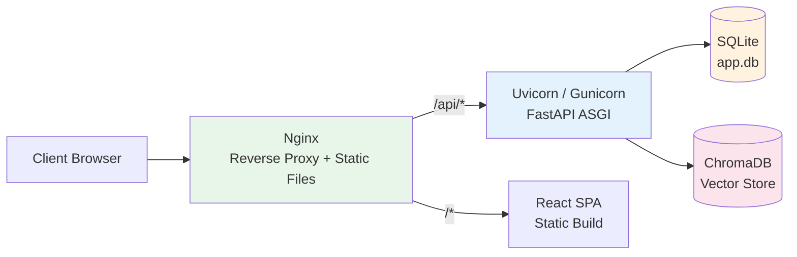

# Deployment Guide

This guide covers deploying Dungeon Lord to production, including ASGI server configuration, Nginx reverse proxy, Docker Compose, systemd service management, and security hardening.

## Deployment Architecture



The recommended production stack is:

1. **Nginx** -- serves static frontend files and reverse-proxies API requests
2. **Uvicorn or Gunicorn+UvicornWorker** -- runs the FastAPI application
3. **SQLite** -- metadata and topic storage
4. **ChromaDB** -- vector embeddings for RAG retrieval

---

## Backend Deployment

### Option A: Uvicorn Standalone (Small-Scale)

Uvicorn is a lightweight ASGI server suitable for development and small deployments.

```bash
cd backend
pip install -e ".[prod]"

uvicorn app.main:app \
  --host 0.0.0.0 \
  --port 8000 \
  --workers 4 \
  --log-level info
```

**Key Parameters:**

| Parameter | Description | Recommended Value |
|-----------|-------------|-------------------|
| `--host` | Bind address | `0.0.0.0` (external access) |
| `--port` | Bind port | `8000` |
| `--workers` | Worker process count | 2--4x CPU cores |
| `--log-level` | Logging verbosity | `info` |
| `--timeout-keep-alive` | Keep-alive timeout (seconds) | `300` (for SSE) |

### Option B: Gunicorn + Uvicorn Worker (Recommended for Production)

Gunicorn provides mature process management. Use Uvicorn's ASGI worker class for async support.

**Install:**

```bash
pip install gunicorn uvicorn[standard]
```

**Quick Start:**

```bash
gunicorn app.main:app \
  --worker-class uvicorn.workers.UvicornWorker \
  --workers 4 \
  --bind 0.0.0.0:8000 \
  --timeout 300 \
  --access-logfile - \
  --error-logfile -
```

**Configuration File** (`gunicorn.conf.py`):

```python
# Bind address
bind = "0.0.0.0:8000"

# Worker configuration
worker_class = "uvicorn.workers.UvicornWorker"
workers = 4

# Timeout configuration (crawls can be long-running)
timeout = 300
graceful_timeout = 30
keepalive = 5

# Logging
accesslog = "-"
errorlog = "-"
loglevel = "info"

# Process recycling (prevents memory leaks)
max_requests = 1000
max_requests_jitter = 50

# Preload for shared state across workers
preload_app = true
```

**Start with config file:**

```bash
gunicorn -c gunicorn.conf.py app.main:app
```

:::warning Multi-Worker Caveats
SQLite does not support high-concurrency writes. When running multiple workers:
1. Ensure crawl tasks execute from a single worker only
2. Use `preload_app = true` to share read-only state
3. ChromaDB also has single-writer limitations -- avoid parallel embedding writes
:::

---

## Systemd Service Configuration

Create a service file at `/etc/systemd/system/dungeon-lord.service`:

```ini
[Unit]
Description=Dungeon Lord Backend
After=network.target

[Service]
Type=exec
User=www-data
Group=www-data
WorkingDirectory=/opt/dungeon-lord/backend
Environment="PATH=/opt/dungeon-lord/backend/.venv/bin"
ExecStart=/opt/dungeon-lord/backend/.venv/bin/gunicorn -c gunicorn.conf.py app.main:app
Restart=always
RestartSec=5

# Security hardening
NoNewPrivileges=true
ProtectSystem=strict
ReadWritePaths=/opt/dungeon/data

[Install]
WantedBy=multi-user.target
```

**Enable and Start:**

```bash
sudo systemctl daemon-reload
sudo systemctl enable dungeon-lord
sudo systemctl start dungeon-lord

# Verify status
sudo systemctl status dungeon-lord

# View logs
sudo journalctl -u dungeon-lord -f
```

---

## Frontend Build and Hosting

### Build Static Files

```bash
cd frontend
npm install
npm run build
```

The build output is placed in `frontend/dist/`.

### Deploy to Nginx

```bash
sudo mkdir -p /var/www/dungeon-lord
sudo cp -r frontend/dist/* /var/www/dungeon-lord/
sudo chown -R www-data:www-data /var/www/dungeon-lord
```

---

## Nginx Reverse Proxy Configuration

### Full Configuration Example

```nginx
# Rate limiting zone for login endpoint
limit_req_zone $binary_remote_addr zone=auth:10m rate=5r/s;
limit_req_zone $binary_remote_addr zone=api:10m rate=30r/s;

# HTTP -> HTTPS redirect
server {
    listen 80;
    server_name your-domain.com;
    return 301 https://$host$request_uri;
}

server {
    listen 443 ssl http2;
    server_name your-domain.com;

    # SSL certificates
    ssl_certificate /etc/ssl/certs/your-domain.pem;
    ssl_certificate_key /etc/ssl/private/your-domain.key;
    ssl_protocols TLSv1.2 TLSv1.3;
    ssl_ciphers HIGH:!aNULL:!MD5;

    # Security headers
    add_header X-Frame-Options DENY;
    add_header X-Content-Type-Options nosniff;
    add_header X-XSS-Protection "1; mode=block";

    # Frontend static files
    root /var/www/dungeon-lord;
    index index.html;

    # SPA route fallback
    location / {
        try_files $uri $uri/ /index.html;
    }

    # Static asset caching
    location ~* \.(js|css|png|jpg|jpeg|gif|ico|svg|woff2?)$ {
        expires 7d;
        add_header Cache-Control "public, immutable";
    }

    # API reverse proxy -- general
    location /api/ {
        limit_req zone=api burst=20 nodelay;

        proxy_pass http://127.0.0.1:8000;
        proxy_set_header Host $host;
        proxy_set_header X-Real-IP $remote_addr;
        proxy_set_header X-Forwarded-For $proxy_add_x_forwarded_for;
        proxy_set_header X-Forwarded-Proto $scheme;

        # SSE streaming support
        proxy_buffering off;
        proxy_cache off;
        proxy_read_timeout 300s;
        proxy_send_timeout 300s;
        proxy_http_version 1.1;
        chunked_transfer_encoding on;
    }

    # Login endpoint -- stricter rate limiting
    location /api/auth/login {
        limit_req zone=auth burst=3 nodelay;

        proxy_pass http://127.0.0.1:8000;
        proxy_set_header Host $host;
        proxy_set_header X-Real-IP $remote_addr;
        proxy_set_header X-Forwarded-For $proxy_add_x_forwarded_for;
        proxy_set_header X-Forwarded-Proto $scheme;
    }
}
```

### SSE-Specific Nginx Settings

Chat endpoints use Server-Sent Events for real-time streaming. Nginx buffers proxy responses by default, which prevents SSE from working. The following directives are **required**:

| Directive | Value | Purpose |
|-----------|-------|---------|
| `proxy_buffering` | `off` | Disable response buffering so chunks are forwarded immediately |
| `proxy_cache` | `off` | Disable caching for dynamic SSE streams |
| `proxy_read_timeout` | `300s` | Allow long-lived connections (LLM generation can take minutes) |
| `proxy_send_timeout` | `300s` | Allow slow clients to receive data |
| `proxy_http_version` | `1.1` | Required for chunked transfer encoding |
| `chunked_transfer_encoding` | `on` | Enable chunked responses |

:::warning
Without `proxy_buffering off`, the client will not receive any SSE events until the entire response completes, effectively disabling real-time streaming.
:::

---

## Docker Deployment

### 代码与数据分离

项目采用 **代码与数据完全分离** 的部署方式：

```
宿主机                              容器
─────────────────────────────────────────────────
/opt/dungeon-lord/                  (构建时 COPY 进镜像，不挂载)
  ├── docker-compose.yml
  ├── backend/
  │   ├── config.json  ──────────→  /app/backend/config.json  (只读)
  │   └── app/
  └── deploy/
      └── backend.Dockerfile

/opt/dungeon/data/                  /app/data/  (读写)
  ├── app.db                   ←→   SQLite 数据库
  ├── chroma/                  ←→   ChromaDB 向量库
  ├── images/                  ←→   图片文件
  ├── uploads/                 ←→   用户上传附件
  ├── plugins/                 ←→   插件配置
  └── notify_state.json        ←→   通知节流状态
```

所有数据使用 **宿主机 bind mount**，不使用 Docker 管理卷。这样做的好处：

- 备份只需打包数据目录和配置文件
- 迁移只需复制数据目录到新机器
- 容器可以随时删除重建，数据不受影响

### 配置文件 (.env)

在项目根目录创建 `.env` 文件（参考 `.env.example`）：

```bash
# 数据目录 — 建议使用绝对路径，方便备份和迁移
DATA_DIR=/opt/dungeon/data

# 配置文件路径
CONFIG_JSON=/opt/dungeon-lord/backend/config.json

# 前端对外端口
FRONTEND_PORT=6666
```

### docker-compose.yml

```yaml
services:
  backend:
    build:
      context: .
      dockerfile: deploy/backend.Dockerfile
    container_name: dungeon-lord-backend
    restart: unless-stopped
    expose:
      - "8000"
    volumes:
      - ${DATA_DIR:-./data}:/app/data
      - ${CONFIG_JSON:-./backend/config.json}:/app/backend/config.json:ro
    environment:
      - PYTHONUNBUFFERED=1
    healthcheck:
      test: ["CMD", "curl", "-f", "http://localhost:8000/api/health"]
      interval: 30s
      timeout: 10s
      retries: 3
      start_period: 180s

  frontend:
    image: dungeon-frontend:latest
    container_name: dungeon-lord-frontend
    restart: unless-stopped
    ports:
      - "${FRONTEND_PORT:-6666}:80"
    volumes:
      - ${DATA_DIR:-./data}/images:/usr/share/nginx/images:ro
    depends_on:
      backend:
        condition: service_healthy
    healthcheck:
      test: ["CMD", "wget", "-qO-", "http://localhost:80/"]
      interval: 30s
      timeout: 5s
      retries: 3
```

### 首次部署

```bash
# 1. 克隆代码
git clone https://github.com/XUranus/dungeon.git /opt/dungeon-lord
cd /opt/dungeon-lord

# 2. 创建数据目录
mkdir -p /opt/dungeon/data

# 3. 创建配置文件（从模板复制并编辑）
cp backend/config.example.json backend/config.json
# 编辑 config.json，填入 API Key、Cookie 等

# 4. 创建 .env
cp .env.example .env
# 编辑 .env，设置 DATA_DIR 等

# 5. 构建并启动
docker compose up -d --build

# 6. 查看日志
docker compose logs -f backend
```

### 日常运维

```bash
# 查看容器状态
docker compose ps

# 查看后端日志
docker compose logs -f backend

# 重启后端（不重建镜像）
docker compose restart backend

# 更新代码并重建
git pull && docker compose up -d --build

# 停止所有服务
docker compose down
```

---

## 数据备份与迁移

### 备份

所有持久化数据集中在两个位置，备份只需打包它们：

```bash
# 完整备份（数据 + 配置）
BACKUP_DATE=$(date +%Y%m%d)
tar czf dungeon-backup-${BACKUP_DATE}.tar.gz \
  /opt/dungeon/data/ \
  /opt/dungeon-lord/backend/config.json \
  /opt/dungeon-lord/.env

echo "备份完成: dungeon-backup-${BACKUP_DATE}.tar.gz"
ls -lh dungeon-backup-${BACKUP_DATE}.tar.gz
```

**备份内容清单：**

| 文件 | 说明 | 大小参考 |
|------|------|---------|
| `data/app.db` | SQLite 数据库（主题、评论、用户） | ~40MB |
| `data/chroma/` | ChromaDB 向量库（RAG 检索用） | ~10MB |
| `data/images/` | 爬取的图片文件 | ~200MB |
| `data/uploads/` | 用户上传的附件 | 视使用量 |
| `data/plugins/` | 插件配置 | ~1KB |
| `data/notify_state.json` | 通知节流状态 | ~1KB |
| `backend/config.json` | 应用配置（含密钥） | ~3KB |
| `.env` | Docker Compose 环境变量 | ~100B |

:::tip 定时备份
建议用 cron 每日自动备份：

```bash
# crontab -e
0 3 * * * tar czf /opt/dungeon-backups/dungeon-$(date +\%Y\%m\%d).tar.gz /opt/dungeon/data/ /opt/dungeon-lord/backend/config.json /opt/dungeon-lord/.env
```
:::

### 恢复

```bash
# 1. 在新机器上安装 Docker 和 Docker Compose

# 2. 克隆代码
git clone https://github.com/XUranus/dungeon.git /opt/dungeon-lord
cd /opt/dungeon-lord

# 3. 解压备份
tar xzf dungeon-backup-20260718.tar.gz -C /

# 4. 创建 .env（如果备份中没有）
cat > .env << 'EOF'
DATA_DIR=/opt/dungeon/data
CONFIG_JSON=/opt/dungeon-lord/backend/config.json
FRONTEND_PORT=6666
EOF

# 5. 构建并启动
docker compose up -d --build

# 6. 验证
docker compose ps
curl http://localhost:6666/api/health
```

### 迁移到新服务器

迁移步骤与恢复相同。核心原则：**只需迁移数据目录和配置文件，代码从 git 重新拉取。**

```bash
# 在旧服务器上备份
tar czf dungeon-migrate.tar.gz \
  /opt/dungeon/data/ \
  /opt/dungeon-lord/backend/config.json \
  /opt/dungeon-lord/.env

# 传输到新服务器
scp dungeon-migrate.tar.gz new-server:/tmp/

# 在新服务器上恢复（按上述「恢复」步骤执行）
```

:::warning 注意事项
- 备份包含 `config.json` 中的 API Key 和 Cookie，注意保管安全
- ChromaDB 向量库依赖 Python 版本和 ChromaDB 版本，跨大版本迁移可能需要重建索引
- SQLite 数据库可以直接复制，无需 dump
:::

---

## Environment Configuration

### config.json Key Settings

Production deployments **must** modify the following values:

```json
{
  "admin_password": "your-strong-password",
  "jwt_secret": "use-a-random-64-char-hex-string",
  "openai_api_key": "sk-...",
  "openai_base_url": "",
  "api_host": "0.0.0.0",
  "api_port": 8000,
  "crawl_interval_minutes": 60,
  "public_chat_daily_limit": 10
}
```

### Data Directory Structure

所有运行时数据都在独立的数据目录中（默认 `/opt/dungeon/data`）：

```
/opt/dungeon/data/
  app.db                   # SQLite 数据库
  app.db.bak               # 数据库备份
  chroma/                  # ChromaDB 向量库
  images/                  # 爬取的图片
  uploads/                 # 用户上传附件
  plugins/                 # 插件配置
  notify_state.json        # 通知节流状态
  runtime_config.json      # 运行时配置

/opt/dungeon-lord/backend/
  config.json              # 应用配置（密钥、Cookie 等）
```

确保服务用户对数据目录有读写权限，对配置目录有读取权限。

### Generating a Secure JWT Secret

```bash
openssl rand -hex 32
```

---

## Security Hardening

### Critical Configuration Changes

| Config Key | Default Value | Risk | Recommendation |
|------------|---------------|------|----------------|
| `admin_password` | `""` (empty) | Anyone can log in | Set a strong password |
| `jwt_secret` | `change-me-to-a-random-string` | Tokens can be forged | Generate a random secret |

### Network Security

1. **Use HTTPS** -- JWT tokens transmitted over HTTP can be intercepted by man-in-the-middle attacks
2. **Restrict management ports** -- If the management API does not need public access, block port 8000 with a firewall
3. **Nginx rate limiting** -- Prevent brute-force attacks on the login endpoint

```nginx
# Define rate limit zones in the http block
limit_req_zone $binary_remote_addr zone=auth:10m rate=5r/s;

# Apply to the login endpoint
location /api/auth/login {
    limit_req zone=auth burst=3 nodelay;
    proxy_pass http://127.0.0.1:8000;
    # ... other proxy settings
}
```

### Cookie Security and Rotation

Platform cookies (Zsxq, Zhihu) expire periodically and must be rotated:

1. **Monitor crawl task status** -- check for `401` or `403` errors in task results
2. **Update cookies** via the Settings API or by editing `config.json` directly
3. **Restart crawling** after updating cookies

```bash
# Check for recent crawl failures
curl http://localhost:8000/api/sources/tasks \
  -H "Authorization: Bearer <token>" | jq '.[] | select(.status == "error")'
```

:::tip Automated Monitoring
Set up a cron job or health check that queries `/api/sources/tasks` and alerts when the most recent task has `status: "error"` with an authentication-related error message.
:::
