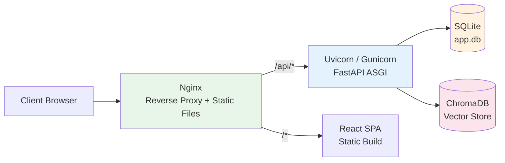

# Deployment Guide

This guide covers deploying Dungeon Lord to production, including ASGI server configuration, Nginx reverse proxy, Docker Compose, systemd service management, and security hardening.

## Deployment Architecture



The recommended production stack is:

1. **Nginx** -- serves static frontend files and reverse-proxies API requests
2. **Uvicorn or Gunicorn+UvicornWorker** -- runs the FastAPI application
3. **SQLite** -- metadata and topic storage
4. **ChromaDB** -- vector embeddings for RAG retrieval

---

## Backend Deployment

### Option A: Uvicorn Standalone (Small-Scale)

Uvicorn is a lightweight ASGI server suitable for development and small deployments.

```bash
cd backend
pip install -e ".[prod]"

uvicorn app.main:app \
  --host 0.0.0.0 \
  --port 8000 \
  --workers 4 \
  --log-level info
```

**Key Parameters:**

| Parameter | Description | Recommended Value |
|-----------|-------------|-------------------|
| `--host` | Bind address | `0.0.0.0` (external access) |
| `--port` | Bind port | `8000` |
| `--workers` | Worker process count | 2--4x CPU cores |
| `--log-level` | Logging verbosity | `info` |
| `--timeout-keep-alive` | Keep-alive timeout (seconds) | `300` (for SSE) |

### Option B: Gunicorn + Uvicorn Worker (Recommended for Production)

Gunicorn provides mature process management. Use Uvicorn's ASGI worker class for async support.

**Install:**

```bash
pip install gunicorn uvicorn[standard]
```

**Quick Start:**

```bash
gunicorn app.main:app \
  --worker-class uvicorn.workers.UvicornWorker \
  --workers 4 \
  --bind 0.0.0.0:8000 \
  --timeout 300 \
  --access-logfile - \
  --error-logfile -
```

**Configuration File** (`gunicorn.conf.py`):

```python
# Bind address
bind = "0.0.0.0:8000"

# Worker configuration
worker_class = "uvicorn.workers.UvicornWorker"
workers = 4

# Timeout configuration (crawls can be long-running)
timeout = 300
graceful_timeout = 30
keepalive = 5

# Logging
accesslog = "-"
errorlog = "-"
loglevel = "info"

# Process recycling (prevents memory leaks)
max_requests = 1000
max_requests_jitter = 50

# Preload for shared state across workers
preload_app = true
```

**Start with config file:**

```bash
gunicorn -c gunicorn.conf.py app.main:app
```

:::warning Multi-Worker Caveats
SQLite does not support high-concurrency writes. When running multiple workers:
1. Ensure crawl tasks execute from a single worker only
2. Use `preload_app = true` to share read-only state
3. ChromaDB also has single-writer limitations -- avoid parallel embedding writes
:::

---

## Systemd Service Configuration

Create a service file at `/etc/systemd/system/dungeon-lord.service`:

```ini
[Unit]
Description=Dungeon Lord Backend
After=network.target

[Service]
Type=exec
User=www-data
Group=www-data
WorkingDirectory=/opt/dungeon-lord/backend
Environment="PATH=/opt/dungeon-lord/backend/.venv/bin"
ExecStart=/opt/dungeon-lord/backend/.venv/bin/gunicorn -c gunicorn.conf.py app.main:app
Restart=always
RestartSec=5

# Security hardening
NoNewPrivileges=true
ProtectSystem=strict
ReadWritePaths=/opt/dungeon-lord/data

[Install]
WantedBy=multi-user.target
```

**Enable and Start:**

```bash
sudo systemctl daemon-reload
sudo systemctl enable dungeon-lord
sudo systemctl start dungeon-lord

# Verify status
sudo systemctl status dungeon-lord

# View logs
sudo journalctl -u dungeon-lord -f
```

---

## Frontend Build and Hosting

### Build Static Files

```bash
cd frontend
npm install
npm run build
```

The build output is placed in `frontend/dist/`.

### Deploy to Nginx

```bash
sudo mkdir -p /var/www/dungeon-lord
sudo cp -r frontend/dist/* /var/www/dungeon-lord/
sudo chown -R www-data:www-data /var/www/dungeon-lord
```

---

## Nginx Reverse Proxy Configuration

### Full Configuration Example

```nginx
# Rate limiting zone for login endpoint
limit_req_zone $binary_remote_addr zone=auth:10m rate=5r/s;
limit_req_zone $binary_remote_addr zone=api:10m rate=30r/s;

# HTTP -> HTTPS redirect
server {
    listen 80;
    server_name your-domain.com;
    return 301 https://$host$request_uri;
}

server {
    listen 443 ssl http2;
    server_name your-domain.com;

    # SSL certificates
    ssl_certificate /etc/ssl/certs/your-domain.pem;
    ssl_certificate_key /etc/ssl/private/your-domain.key;
    ssl_protocols TLSv1.2 TLSv1.3;
    ssl_ciphers HIGH:!aNULL:!MD5;

    # Security headers
    add_header X-Frame-Options DENY;
    add_header X-Content-Type-Options nosniff;
    add_header X-XSS-Protection "1; mode=block";

    # Frontend static files
    root /var/www/dungeon-lord;
    index index.html;

    # SPA route fallback
    location / {
        try_files $uri $uri/ /index.html;
    }

    # Static asset caching
    location ~* \.(js|css|png|jpg|jpeg|gif|ico|svg|woff2?)$ {
        expires 7d;
        add_header Cache-Control "public, immutable";
    }

    # API reverse proxy -- general
    location /api/ {
        limit_req zone=api burst=20 nodelay;

        proxy_pass http://127.0.0.1:8000;
        proxy_set_header Host $host;
        proxy_set_header X-Real-IP $remote_addr;
        proxy_set_header X-Forwarded-For $proxy_add_x_forwarded_for;
        proxy_set_header X-Forwarded-Proto $scheme;

        # SSE streaming support
        proxy_buffering off;
        proxy_cache off;
        proxy_read_timeout 300s;
        proxy_send_timeout 300s;
        proxy_http_version 1.1;
        chunked_transfer_encoding on;
    }

    # Login endpoint -- stricter rate limiting
    location /api/auth/login {
        limit_req zone=auth burst=3 nodelay;

        proxy_pass http://127.0.0.1:8000;
        proxy_set_header Host $host;
        proxy_set_header X-Real-IP $remote_addr;
        proxy_set_header X-Forwarded-For $proxy_add_x_forwarded_for;
        proxy_set_header X-Forwarded-Proto $scheme;
    }
}
```

### SSE-Specific Nginx Settings

Chat endpoints use Server-Sent Events for real-time streaming. Nginx buffers proxy responses by default, which prevents SSE from working. The following directives are **required**:

| Directive | Value | Purpose |
|-----------|-------|---------|
| `proxy_buffering` | `off` | Disable response buffering so chunks are forwarded immediately |
| `proxy_cache` | `off` | Disable caching for dynamic SSE streams |
| `proxy_read_timeout` | `300s` | Allow long-lived connections (LLM generation can take minutes) |
| `proxy_send_timeout` | `300s` | Allow slow clients to receive data |
| `proxy_http_version` | `1.1` | Required for chunked transfer encoding |
| `chunked_transfer_encoding` | `on` | Enable chunked responses |

:::warning
Without `proxy_buffering off`, the client will not receive any SSE events until the entire response completes, effectively disabling real-time streaming.
:::

---

## Docker Deployment

### docker-compose.yml

```yaml
version: "3.8"

services:
  backend:
    build:
      context: ./backend
      dockerfile: Dockerfile
    ports:
      - "8000:8000"
    volumes:
      - ./data:/app/data          # SQLite + ChromaDB persistence
      - ./backend/config.json:/app/config.json
    environment:
      - PYTHONUNBUFFERED=1
    restart: unless-stopped
    healthcheck:
      test: ["CMD", "curl", "-f", "http://localhost:8000/api/health"]
      interval: 30s
      timeout: 10s
      retries: 3

  frontend:
    build:
      context: ./frontend
      dockerfile: Dockerfile
    ports:
      - "3000:80"
    depends_on:
      - backend
    restart: unless-stopped
```

### Backend Dockerfile

```dockerfile
FROM python:3.11-slim

WORKDIR /app

# Install system dependencies
RUN apt-get update && apt-get install -y --no-install-recommends \
    build-essential curl && \
    rm -rf /var/lib/apt/lists/*

COPY requirements.txt .
RUN pip install --no-cache-dir -r requirements.txt

COPY . .

EXPOSE 8000

CMD ["uvicorn", "app.main:app", "--host", "0.0.0.0", "--port", "8000"]
```

### Running with Docker Compose

```bash
# Build and start all services
docker compose up -d

# View logs
docker compose logs -f backend

# Stop all services
docker compose down
```

---

## Environment Configuration

### config.json Key Settings

Production deployments **must** modify the following values:

```json
{
  "admin_password": "your-strong-password",
  "jwt_secret": "use-a-random-64-char-hex-string",
  "openai_api_key": "sk-...",
  "openai_base_url": "",
  "api_host": "0.0.0.0",
  "api_port": 8000,
  "crawl_interval_minutes": 60,
  "public_chat_daily_limit": 10
}
```

### Data Directory Structure

Runtime-generated data files:

```
backend/
  config.json              # Application configuration
  gunicorn.conf.py         # Gunicorn configuration
data/
  app.db                   # SQLite database
  chroma/                  # ChromaDB vector store
```

Ensure the service user has read/write permissions on the `data/` directory.

### Generating a Secure JWT Secret

```bash
openssl rand -hex 32
```

---

## Security Hardening

### Critical Configuration Changes

| Config Key | Default Value | Risk | Recommendation |
|------------|---------------|------|----------------|
| `admin_password` | `""` (empty) | Anyone can log in | Set a strong password |
| `jwt_secret` | `change-me-to-a-random-string` | Tokens can be forged | Generate a random secret |

### Network Security

1. **Use HTTPS** -- JWT tokens transmitted over HTTP can be intercepted by man-in-the-middle attacks
2. **Restrict management ports** -- If the management API does not need public access, block port 8000 with a firewall
3. **Nginx rate limiting** -- Prevent brute-force attacks on the login endpoint

```nginx
# Define rate limit zones in the http block
limit_req_zone $binary_remote_addr zone=auth:10m rate=5r/s;

# Apply to the login endpoint
location /api/auth/login {
    limit_req zone=auth burst=3 nodelay;
    proxy_pass http://127.0.0.1:8000;
    # ... other proxy settings
}
```

### Cookie Security and Rotation

Platform cookies (Zsxq, Zhihu) expire periodically and must be rotated:

1. **Monitor crawl task status** -- check for `401` or `403` errors in task results
2. **Update cookies** via the Settings API or by editing `config.json` directly
3. **Restart crawling** after updating cookies

```bash
# Check for recent crawl failures
curl http://localhost:8000/api/sources/tasks \
  -H "Authorization: Bearer <token>" | jq '.[] | select(.status == "error")'
```

:::tip Automated Monitoring
Set up a cron job or health check that queries `/api/sources/tasks` and alerts when the most recent task has `status: "error"` with an authentication-related error message.
:::
