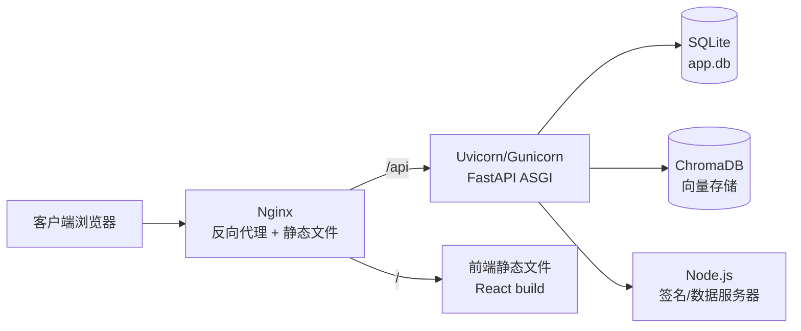

# 部署指南

本文档介绍如何将 Dungeon Lord 部署到生产环境，包括 ASGI 服务器配置、Nginx 反向代理、环境变量管理和安全加固。

## 部署架构



---

## 后端部署

### 使用 Uvicorn（推荐小规模部署）

Uvicorn 是一个轻量级的 ASGI 服务器，适合中小规模部署。

```bash
# 安装依赖
cd backend
pip install -e ".[prod]"

# 直接启动
uvicorn app.main:app \
  --host 0.0.0.0 \
  --port 8000 \
  --workers 4 \
  --log-level info
```

**关键参数：**

| 参数 | 说明 | 推荐值 |
|------|------|--------|
| `--host` | 监听地址 | `0.0.0.0`（对外） |
| `--port` | 监听端口 | `8000` |
| `--workers` | 工作进程数 | CPU 核心数的 2-4 倍 |
| `--log-level` | 日志级别 | `info` |

### 使用 Gunicorn + Uvicorn Worker（推荐生产环境）

Gunicorn 提供更成熟的进程管理能力，配合 Uvicorn 的 ASGI worker 使用。

```bash
pip install gunicorn

gunicorn app.main:app \
  --worker-class uvicorn.workers.UvicornWorker \
  --workers 4 \
  --bind 0.0.0.0:8000 \
  --timeout 300 \
  --access-logfile - \
  --error-logfile -
```

**Gunicorn 配置文件示例** (`gunicorn.conf.py`)：

```python
# 绑定地址
bind = "0.0.0.0:8000"

# Worker 配置
worker_class = "uvicorn.workers.UvicornWorker"
workers = 4

# 超时配置（爬取任务可能耗时较长）
timeout = 300
graceful_timeout = 30

# 日志
accesslog = "-"
errorlog = "-"
loglevel = "info"

# 进程管理
max_requests = 1000
max_requests_jitter = 50
```

启动：

```bash
gunicorn -c gunicorn.conf.py app.main:app
```

:::warning 多 Worker 注意事项
SQLite 不支持高并发写入。多 Worker 部署时，爬取任务可能产生写入冲突。建议：
1. 仅从单个 Worker 执行爬取任务
2. 或使用 Gunicorn 的 `--preload` 选项确保共享状态
:::

### Systemd 服务配置

创建 `/etc/systemd/system/dungeon-lord.service`：

```ini
[Unit]
Description=Dungeon Lord Backend
After=network.target

[Service]
Type=exec
User=www-data
Group=www-data
WorkingDirectory=/opt/dungeon-lord/backend
Environment="PATH=/opt/dungeon-lord/backend/.venv/bin"
ExecStart=/opt/dungeon-lord/backend/.venv/bin/gunicorn -c gunicorn.conf.py app.main:app
Restart=always
RestartSec=5

[Install]
WantedBy=multi-user.target
```

```bash
sudo systemctl daemon-reload
sudo systemctl enable dungeon-lord
sudo systemctl start dungeon-lord
sudo systemctl status dungeon-lord
```

---

## 前端部署

### 构建静态文件

```bash
cd frontend
npm install
npm run build
```

构建产物位于 `frontend/dist/` 目录。

### Nginx 托管前端

将构建产物复制到 Nginx 的静态文件目录：

```bash
sudo cp -r frontend/dist/* /var/www/dungeon-lord/
```

---

## Nginx 反向代理配置

### 完整配置示例

```nginx
server {
    listen 80;
    server_name your-domain.com;

    # 重定向到 HTTPS（可选）
    return 301 https://$host$request_uri;
}

server {
    listen 443 ssl http2;
    server_name your-domain.com;

    # SSL 证书
    ssl_certificate /etc/ssl/certs/your-domain.pem;
    ssl_certificate_key /etc/ssl/private/your-domain.key;
    ssl_protocols TLSv1.2 TLSv1.3;

    # 前端静态文件
    root /var/www/dungeon-lord;
    index index.html;

    # API 反向代理
    location /api/ {
        proxy_pass http://127.0.0.1:8000;
        proxy_set_header Host $host;
        proxy_set_header X-Real-IP $remote_addr;
        proxy_set_header X-Forwarded-For $proxy_add_x_forwarded_for;
        proxy_set_header X-Forwarded-Proto $scheme;

        # SSE 流式响应专用配置
        proxy_buffering off;
        proxy_cache off;
        proxy_read_timeout 300s;
        proxy_send_timeout 300s;

        # 禁用 Nginx 对 chunked 响应的缓冲
        proxy_http_version 1.1;
        chunked_transfer_encoding on;
    }

    # SPA 路由回退
    location / {
        try_files $uri $uri/ /index.html;
    }

    # 静态资源缓存
    location ~* \.(js|css|png|jpg|jpeg|gif|ico|svg|woff2?)$ {
        expires 7d;
        add_header Cache-Control "public, immutable";
    }
}
```

### SSE 流式响应关键配置

聊天接口使用 Server-Sent Events 流式返回，Nginx 默认会缓冲响应，导致客户端无法实时接收数据。以下配置必须添加：

```nginx
proxy_buffering off;       # 禁用代理缓冲
proxy_cache off;           # 禁用代理缓存
proxy_read_timeout 300s;   # 长连接超时（爬取可能耗时）
proxy_http_version 1.1;    # 使用 HTTP/1.1
```

---

## 环境配置

### config.json 关键配置项

生产环境务必修改以下配置：

```json
{
  "admin_password": "your-strong-password",
  "jwt_secret": "use-a-random-64-char-hex-string",
  "openai_api_key": "sk-...",
  "openai_base_url": "",
  "api_host": "0.0.0.0",
  "api_port": 8000
}
```

### 生成安全的 JWT 密钥

```bash
# 使用 OpenSSL 生成 64 字符十六进制随机字符串
openssl rand -hex 32
```

### 数据目录结构

运行时生成的数据文件：

```
backend/
  config.json          # 配置文件
data/
  app.db               # SQLite 数据库
  chroma/              # ChromaDB 向量存储
```

确保运行用户对 `data/` 目录有读写权限。

---

## 安全加固

### 必须修改的默认配置

| 配置项 | 默认值 | 风险 | 建议 |
|--------|--------|------|------|
| `admin_password` | `""`（空） | 任何人可登录管理后台 | 设置强密码 |
| `jwt_secret` | `change-me-to-a-random-string` | Token 可被伪造 | 生成随机密钥 |

### 网络安全

1. **使用 HTTPS** -- JWT Token 在 HTTP 明文中传输可被中间人截获
2. **限制管理端口** -- 如果不需要公网访问管理 API，通过防火墙限制 8000 端口
3. **Nginx 速率限制** -- 防止暴力破解管理员密码

```nginx
# 在 http 块中定义限速区域
limit_req_zone $binary_remote_addr zone=api:10m rate=10r/s;

# 在 location /api/auth/login 中应用
location /api/auth/login {
    limit_req zone=api burst=5 nodelay;
    proxy_pass http://127.0.0.1:8000;
    # ... 其他 proxy 配置
}
```

### Cookie 安全

知乎和知识星球的 Cookie 会过期，需要定期更新。建议：
1. 监控爬取任务状态，出现 401/403 错误时及时更新 Cookie
2. 通过 Settings API 或直接修改 `config.json` 更新

---

## Node.js 签名服务器

知乎爬虫依赖 Node.js 签名/数据服务器，需要单独启动：

```bash
# 签名服务器
cd backend/scripts
node zhihu_sign_server.js  # 默认监听 17007 端口
```

建议使用 PM2 进行进程管理：

```bash
npm install -g pm2

pm2 start backend/scripts/zhihu_sign_server.js --name zhihu-sign
pm2 save
pm2 startup
```
