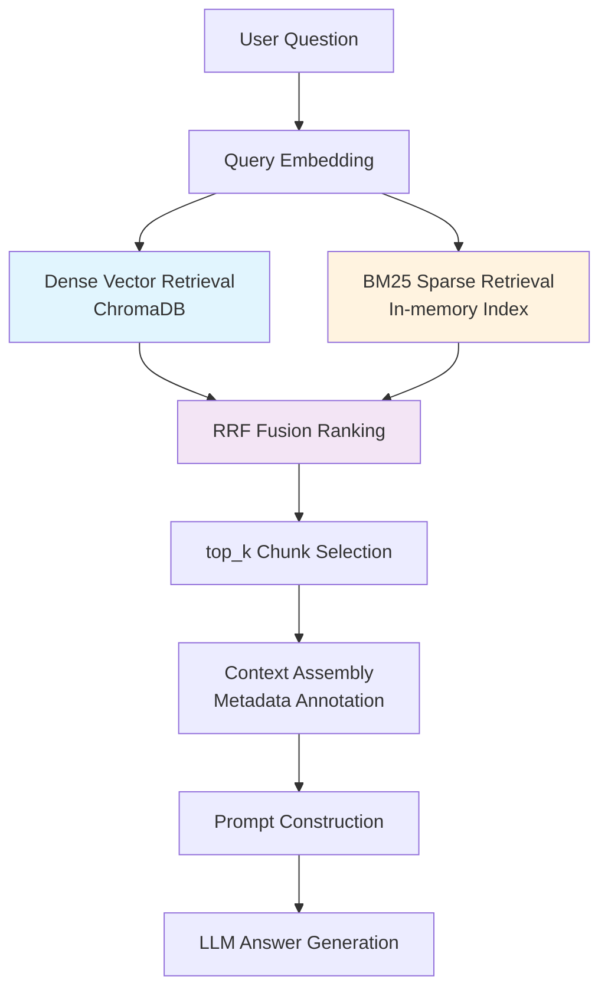
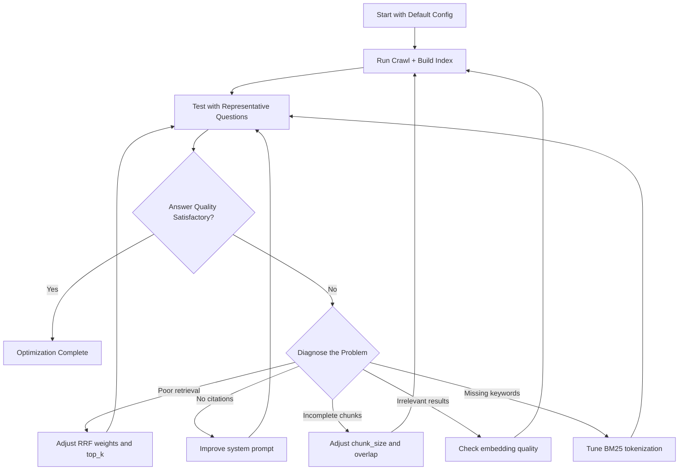

# Performance Optimization

This guide covers optimization strategies and tuning recommendations for the Dungeon Lord RAG system to improve answer quality and retrieval accuracy.

## RAG Pipeline Overview



Each stage in the pipeline can be independently tuned. The sections below address each optimization area.

---

## BM25 Tuning

BM25 is a term-frequency-based sparse retrieval algorithm that complements dense vector retrieval on exact keyword matches.

### Tokenization Strategy

The system uses a custom Chinese-English mixed tokenizer with n-gram support:

| Token Type | Example | Description |
|------------|---------|-------------|
| English words | `bitcoin` -> `bitcoin` | Preserved as-is |
| Chinese unigram | `new energy` -> `new`, `energy` (individual chars) | Single character matching |
| Chinese bigram | `new energy` -> `new energy` (2-char pairs) | Two character matching |
| Chinese trigram | `new energy` -> `new energy` (full phrase) | Full phrase matching |
| Numbers | `2024` -> `2024` | Preserved as complete tokens |

**Tuning Tips:**

- The unigram + bigram + trigram combination balances exact and fuzzy matching
- If short-character noise is excessive, consider removing unigrams and keeping only bigrams and trigrams
- Code location: `_tokenize()` in `backend/app/services/hybrid_retriever.py`

### Enabling / Disabling BM25

Controlled by the `enable_bm25` config value:

```json
{
  "enable_bm25": true
}
```

When disabled, the system degrades to pure vector retrieval (Dense-only). Consider disabling BM25 when:

- Document volume is very small (< 100 chunks) -- BM25 index provides little benefit
- The embedding model is high quality and semantic retrieval alone is sufficient

---

## RRF Weight Tuning

RRF (Reciprocal Rank Fusion) merges results from Dense and BM25 retrieval into a unified ranking.

### Core Formula

```
RRF_score(doc) = dense_weight / (k + rank_dense + 1)
               + bm25_weight / (k + rank_bm25 + 1)
```

### Parameter Reference

| Parameter | Default | Description |
|-----------|---------|-------------|
| `k` | `60` | RRF constant controlling sensitivity to rank differences. Smaller values amplify the advantage of higher-ranked results |
| `dense_weight` | `1.5` | Weight for dense vector retrieval scores |
| `bm25_weight` | `1.0` | Weight for BM25 sparse retrieval scores |
| `top_k` | `12` | Number of final results to return |

### Tuning by Scenario

| Scenario | Recommendation | Reasoning |
|----------|---------------|-----------|
| **Semantic understanding is critical** (e.g., "what does the host think about new energy") | Increase `dense_weight` to `2.0` | Semantic retrieval better captures intent |
| **Exact keyword matching is critical** (e.g., "PE ratio valuation") | Increase `bm25_weight` to `1.5` | BM25 excels at precise term matching |
| **Need more diverse results** | Decrease `k` to `30` | Amplifies rank differences, promoting top results |
| **Balanced performance** (default) | `dense_weight=1.5`, `bm25_weight=1.0`, `k=60` | Good all-around settings |

**Code location:** Parameters passed to `reciprocal_rank_fusion()` in `backend/app/services/rag.py`

---

## Text Chunking Optimization

Chunk quality directly affects retrieval precision. Chunks that are too large dilute relevance; chunks that are too small lose context.

### Configuration

| Parameter | Default | Description |
|-----------|---------|-------------|
| `chunk_size` | `500` | Maximum characters per chunk |
| `chunk_overlap` | `80` | Overlapping characters between adjacent chunks |

### Chunking Strategy

The system uses a **paragraph-first, sentence-fallback** strategy:

1. Split text by paragraph boundaries (`\n\n`)
2. If a single paragraph exceeds `chunk_size`, split further by sentence boundaries
3. Adjacent chunks overlap by `chunk_overlap` characters to preserve semantic continuity

**Sentence boundary detection:**

- Chinese: `.` `?` `!` (full-width)
- English: `.` `?` `!` (half-width)

### Tuning Recommendations

| Content Type | `chunk_size` | `chunk_overlap` | Rationale |
|-------------|-------------|-----------------|-----------|
| Short posts (thoughts, comments) | `300` | `50` | Short content is inherently concise; smaller chunks improve precision |
| Long-form content (articles, answers) | `500-800` | `80-120` | Longer content needs larger chunks to preserve context |
| Mixed content | `500` (default) | `80` (default) | Balanced approach |

:::tip
A `chunk_size` that is too large causes retrieved chunks to contain excessive irrelevant information, diluting relevance. A `chunk_size` that is too small loses context, preventing the LLM from understanding the complete meaning.
:::

---

## LLM Prompt Optimization

### System Prompt Rules

The system prompt defines the LLM's role and behavioral guidelines. The current core rules are:

1. Answer **only** based on the provided reference material -- do not fabricate information
2. Cite source links when referencing original text
3. Keep answers concise and well-structured using Markdown
4. Prioritize references with lower index numbers (higher relevance)
5. When answering recommendation or listing questions, aggregate all relevant chunks

### Prompt Tuning Suggestions

**Improve Citation Accuracy:**

Strengthen citation requirements in the system prompt:

```
Every viewpoint must include a corresponding [source title](URL) link.
If the reference material contains URLs, they must be included in citations.
```

**Control Answer Length:**

```
Keep answers within 300 words unless the user explicitly requests a detailed explanation.
```

**Multi-turn Context:**

The system retains the most recent 12 history messages. To extend the context window:

1. Increase the `12` in `history[-12:]` (watch for token consumption)
2. Summarize older history to compress context

### Temperature Tuning

| Temperature | Effect | Best For |
|-------------|--------|----------|
| `0.0 -- 0.2` | High determinism, very consistent outputs | Factual Q&A, data extraction |
| `0.3 -- 0.5` | Moderate (current default: `0.3`) | Balanced accuracy and expression variety |
| `0.6 -- 1.0` | Higher variety, more creative phrasing | Creative writing, brainstorming |

### Context Assembly Format

Each retrieved chunk is assembled into the context with the following format:

```
--- Chunk 1 [Zhihu | answer] Question Title (2024-06-15) ---
Source URL: https://www.zhihu.com/question/...
Chunk content here...

--- Chunk 2 [Zsxq | talk] (2024-06-14) ---
Source URL: https://wx.zsxq.com/topic/...
Chunk content here...
```

**Included Metadata:**

| Metadata | Description |
|----------|-------------|
| Platform label | Zhihu / Zsxq |
| Content type | `answer`, `article`, `pin`, `talk`, `q&a` |
| Title | Question or topic title (if available) |
| Publication date | For time-sensitive questions |
| Source URL | For citation and traceability |

---

## Embedding Optimization

### Dual Provider Support

| Provider | Model | Description |
|----------|-------|-------------|
| `openai` | `text-embedding-3-small` | Cloud API, high quality, requires API key |
| `local` | `BAAI/bge-small-zh-v1.5` | Local model, no API cost, optimized for Chinese |

**Configuration:**

```json
{
  "embedding_provider": "local",
  "embedding_model": "BAAI/bge-small-zh-v1.5"
}
```

### Local Model Setup

When using a local embedding model, it is automatically downloaded from HuggingFace on first startup. To use a mirror:

```json
{
  "hf_mirror_url": "https://hf-mirror.com"
}
```

### Batch Processing

The OpenAI API supports batch processing. The system defaults to 512 texts per batch. For large-scale data ingestion, batch embedding is significantly faster than single-text calls.

| Approach | Time for 10,000 texts (approx.) |
|----------|----------------------------------|
| Single-text API calls | ~50 minutes |
| Batch API calls (512/batch) | ~2 minutes |
| Local model (bge-small-zh) | ~5 minutes |

---

## Image Content Optimization

For content containing images, the system supports converting images to text descriptions via a Vision model:

```json
{
  "vision_model": "gpt-4o"
}
```

| Behavior | Details |
|----------|---------|
| Max images per topic | 3 (cost control) |
| Image descriptions | Appended to text content, participate in embedding and retrieval |
| Vision model not configured | Image content is ignored |

:::note
Image processing incurs additional API costs. Configure `vision_model` only when image content is important for your use case.
:::

---

## Optimization Flowchart

Use the following iterative process to systematically improve RAG quality:



### Step-by-Step Guide

1. **Establish a baseline** -- Start with default configuration and run a full crawl
2. **Test representative questions** -- Use 10--20 questions that cover typical user queries
3. **Diagnose failure modes:**

| Symptom | Likely Cause | Fix |
|---------|-------------|-----|
| Relevant content not retrieved at all | Embedding mismatch or chunk size too large | Check embedding model, reduce `chunk_size` |
| Retrieved but ranked poorly | RRF weight imbalance | Increase `dense_weight` for semantic queries or `bm25_weight` for keyword queries |
| Retrieved correctly but answer is poor | Prompt or temperature issue | Refine system prompt, lower `temperature` |
| Answer hallucinates or goes off-topic | Prompt too permissive | Strengthen "answer only from references" rule |
| Short answers miss context | Chunks too small | Increase `chunk_size` and `chunk_overlap` |

4. **Change one parameter at a time** -- Isolate the effect of each change
5. **Re-test and compare** -- Use the same question set for before/after comparison
6. **Iterate** -- Repeat until quality stabilizes
