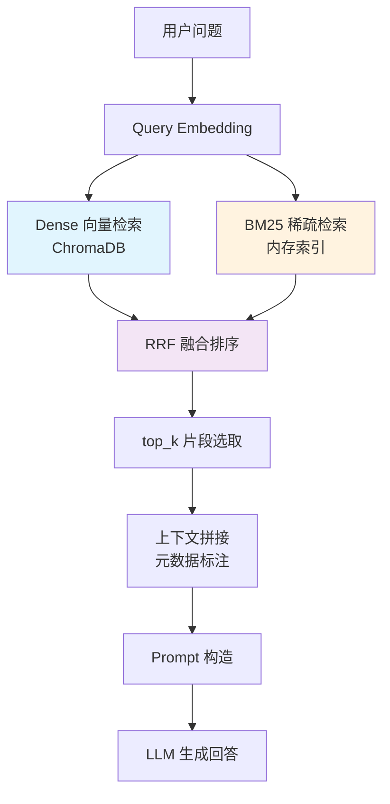
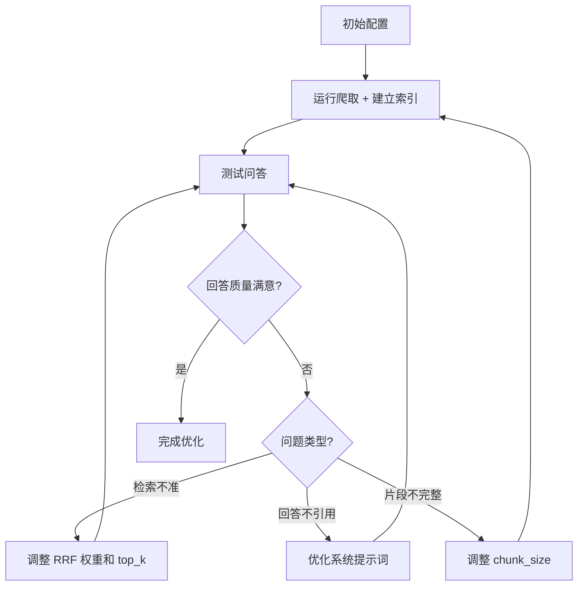

# 性能优化

本文档介绍 Dungeon Lord RAG 系统的各项优化策略和调参建议，帮助提升问答质量和检索准确性。

## RAG 管线总览



优化可从以下环节入手：

---

## BM25 调参

BM25 是基于词频的稀疏检索算法，用于补充向量检索在精确关键词匹配上的不足。

### 分词策略

系统使用自定义的中英文混合分词器，支持：

| 分词类型 | 示例 | 说明 |
|---------|------|------|
| 英文单词 | `bitcoin` → `bitcoin` | 完整保留 |
| 中文 unigram | `新能源` → `新`, `能`, `源` | 单字匹配 |
| 中文 bigram | `新能源` → `新能`, `能源` | 双字匹配 |
| 中文 trigram | `新能源` → `新能源` | 完整词匹配 |
| 数字 | `2024` → `2024` | 保留完整数字 |

**调优建议：**
- unigram + bigram + trigram 的组合能兼顾精确匹配和模糊匹配
- 如果发现短词噪音过大，可以考虑移除 unigram，只保留 bigram 和 trigram
- 修改位置：`backend/app/services/hybrid_retriever.py` 中的 `_tokenize()` 函数

### BM25 启用/禁用

通过配置项 `enable_bm25` 控制：

```json
{
  "enable_bm25": true
}
```

禁用后系统退化为纯向量检索（Dense-only），在以下场景考虑禁用：
- 文档量很小（< 100 条），BM25 索引意义不大
- 向量模型质量很高，纯语义检索效果已足够

---

## RRF 融合权重调参

RRF（Reciprocal Rank Fusion）将 Dense 和 BM25 两路检索结果融合排序。

### 核心公式

```
RRF_score(doc) = dense_weight / (k + rank_dense + 1)
               + bm25_weight / (k + rank_bm25 + 1)
```

### 参数说明

| 参数 | 默认值 | 说明 |
|------|--------|------|
| `k` | `60` | RRF 常数，控制排名差异的敏感度。值越小，排名靠前的优势越大 |
| `dense_weight` | `1.5` | Dense 向量检索的权重 |
| `bm25_weight` | `1.0` | BM25 稀疏检索的权重 |
| `top_k` | `12` | 最终返回的结果数量 |

### 调参策略

**场景 1：语义理解更重要（如"星主怎么看新能源"）**
- 增大 `dense_weight`（如 `2.0`），因为语义检索更擅长理解意图

**场景 2：精确关键词匹配更重要（如"PE 值 估值"）**
- 增大 `bm25_weight`（如 `1.5`），因为 BM25 更擅长精确匹配

**场景 3：需要更多样的结果**
- 减小 `k` 值（如 `30`），使排名靠前的结果获得更大权重差异

修改位置：`backend/app/services/rag.py` 中调用 `reciprocal_rank_fusion()` 的参数。

---

## 文本切分优化

文本切分质量直接影响检索精度。过大或过小的 chunk 都会降低效果。

### 配置项

| 配置项 | 默认值 | 说明 |
|--------|--------|------|
| `chunk_size` | `500` | 每个 chunk 的最大字符数 |
| `chunk_overlap` | `80` | 相邻 chunk 的重叠字符数 |

### 切分策略

系统采用**段落优先、句子回退**的切分策略：

1. 按段落（`\n\n`）分割文本
2. 如果单个段落超过 `chunk_size`，按句子进一步分割
3. 相邻 chunk 之间保留 `chunk_overlap` 字符的重叠，避免语义断裂

**重叠的句子边界检测：**
- 中文句号（`。`）、问号（`？`）、感叹号（`！`）
- 英文句号（`.`）、问号（`?`）、感叹号（`!`）

### 调参建议

| 场景 | chunk_size | chunk_overlap | 理由 |
|------|-----------|---------------|------|
| 短文为主（想法、评论） | 300 | 50 | 短文本身较短，小 chunk 更精确 |
| 长文为主（文章、回答） | 500-800 | 80-120 | 长文需要更大 chunk 保留上下文 |
| 混合内容 | 500（默认） | 80（默认） | 平衡方案 |

:::tip
chunk_size 过大会导致检索到的内容包含大量无关信息，稀释相关性；过小则会丢失上下文，导致 LLM 无法理解完整语义。
:::

---

## LLM 提示词优化

### 系统提示词

系统提示词定义了 LLM 的角色和行为规范。当前的系统提示词核心规则：

1. 只基于参考资料回答，不编造信息
2. 引用原文时标注来源链接
3. 回答简洁有条理，使用 Markdown 格式
4. 优先使用编号靠前的参考资料（相关性更高）
5. 回答推荐/列举类问题时，汇总所有相关片段

### 优化建议

**提高引用准确性：**

在系统提示词中加强引用要求：

```
每条观点必须附上对应的 [来源标题](URL) 链接。
如果参考资料中包含 URL，必须在引用中附上。
```

**控制回答长度：**

```
回答控制在 300 字以内，除非用户明确要求详细展开。
```

**多轮对话优化：**

系统保留最近 12 条历史消息。如果需要更长的上下文窗口，可以：
1. 增大 `history[-12:]` 中的 12 为更大值（注意 token 消耗）
2. 对历史消息做摘要压缩

**温度参数：**

当前 `temperature=0.3`，偏向确定性输出。根据需求调整：

| temperature | 效果 |
|------------|------|
| `0.0-0.2` | 高确定性，适合事实型问答 |
| `0.3-0.5` | 适中（当前默认），兼顾准确性和表达多样性 |
| `0.6-1.0` | 更多样化的表达，适合创意场景 |

### 上下文拼接格式

检索到的每个片段按以下格式拼接为上下文：

```
--- 片段1 [知乎 | answer] 问题标题 (2024-06-15) ---
原文链接: https://www.zhihu.com/question/...
片段内容...

--- 片段2 [知识星球 | talk] (2024-06-14) ---
原文链接: https://wx.zsxq.com/topic/...
片段内容...
```

包含的元数据信息：
- **平台标签** -- 知乎 / 知识星球
- **内容类型** -- answer、article、pin、talk、q&a
- **标题** -- 问题或主题标题（如有）
- **发布日期** -- 用于时间敏感型问题
- **原文链接** -- 用于引用溯源

---

## Embedding 优化

### 双 Provider 支持

| Provider | 模型 | 说明 |
|----------|------|------|
| `openai` | `text-embedding-3-small` | 云端 API，质量高，需 API Key |
| `local` | `BAAI/bge-small-zh-v1.5` | 本地模型，无 API 成本，中文优化 |

通过配置项切换：

```json
{
  "embedding_provider": "local",
  "embedding_model": "BAAI/bge-small-zh-v1.5"
}
```

### 本地模型配置

使用本地 Embedding 模型时，首次启动会自动从 HuggingFace 下载模型。如需使用镜像：

```json
{
  "hf_mirror_url": "https://hf-mirror.com"
}
```

### 批量 Embedding

OpenAI API 支持批量处理，系统默认每批 512 条文本。大批量数据入库时，批量 Embedding 显著优于逐条调用。

---

## 图片内容优化

对于包含图片的内容，系统支持通过 Vision 模型将图片转为文字描述：

```json
{
  "vision_model": "gpt-4o"
}
```

- 每个主题最多处理 3 张图片（控制成本）
- 图片描述会追加到文本内容后，参与 Embedding 和检索
- 未配置 `vision_model` 时图片内容会被忽略

---

## 总结：推荐优化流程



1. **先用默认配置** 建立基线
2. **测试典型问题**，观察检索结果和回答质量
3. **针对性调参**：
   - 检索不到相关内容 → 检查 chunk_size 和 Embedding 质量
   - 检索到但排序不准 → 调整 RRF 权重
   - 检索正确但回答差 → 优化 Prompt 和 temperature
4. **迭代优化**，每次只调整一个参数
