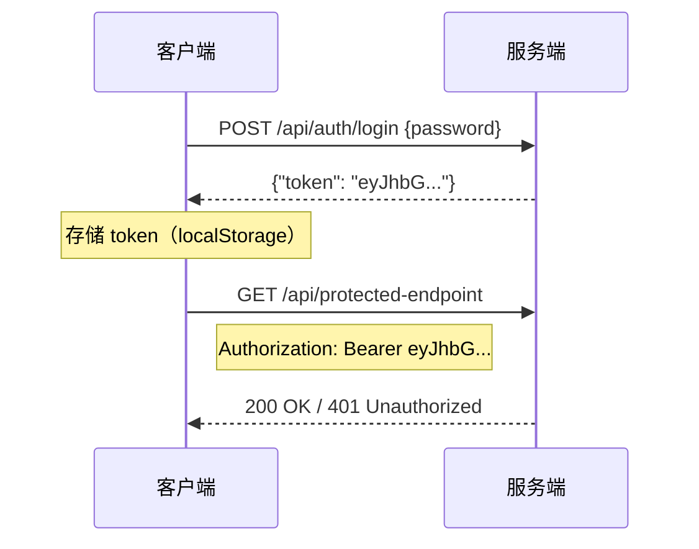

# API 概览

Dungeon Lord 后端基于 **FastAPI** 构建，提供 RESTful JSON API。所有端点以 `/api` 为前缀。

## 基础信息

| 项目 | 说明 |
|------|------|
| **基础 URL** | `http://localhost:8000`（默认） |
| **协议** | HTTP / HTTPS（生产环境推荐 HTTPS） |
| **数据格式** | JSON（`Content-Type: application/json`） |
| **流式响应** | SSE（`text/event-stream`），用于聊天接口 |
| **认证方式** | JWT Bearer Token（HS256） |

## 认证模式

系统采用 **JWT（JSON Web Token）** 认证，使用 HS256 算法签名。



### 认证分类

API 端点分为两类：

- **公开端点** -- 无需认证，任何人可访问（如 Dashboard、公共聊天）
- **管理员端点** -- 需要有效的 JWT Bearer Token（如数据源管理、设置、管理员聊天）

在请求头中携带 Token：

```
Authorization: Bearer <your-jwt-token>
```

## 端点总览

### 健康检查

| 方法 | 路径 | 认证 | 说明 |
|------|------|------|------|
| `GET` | `/api/health` | 无 | 服务健康检查 |

### Auth -- 认证

| 方法 | 路径 | 认证 | 说明 |
|------|------|------|------|
| `POST` | `/api/auth/login` | 无 | 管理员登录，返回 JWT |
| `GET` | `/api/auth/check` | Bearer | 验证 Token 有效性 |

详见 [Auth API](./auth.mdx)。

### Dashboard -- 公共大屏

| 方法 | 路径 | 认证 | 说明 |
|------|------|------|------|
| `GET` | `/api/dashboard/summary` | 无 | 获取最新观点摘要 |
| `GET` | `/api/dashboard/chat-remaining` | 无 | 查询当前 IP 剩余聊天次数 |
| `POST` | `/api/dashboard/chat` | 无 | 公共 RAG 问答（SSE 流式，限频） |

详见 [Dashboard API](./dashboard.mdx)。

### Chat -- 管理员聊天

| 方法 | 路径 | 认证 | 说明 |
|------|------|------|------|
| `POST` | `/api/chat` | Bearer | 管理员 RAG 问答（SSE 流式，无限次） |

详见 [Chat API](./chat.mdx)。

### Topics -- 话题管理

| 方法 | 路径 | 认证 | 说明 |
|------|------|------|------|
| `GET` | `/api/topics` | Bearer | 分页查询话题列表（支持筛选） |
| `GET` | `/api/topics/{topic_id}/comments` | Bearer | 获取话题评论列表 |

### Sources -- 数据源管理

| 方法 | 路径 | 认证 | 说明 |
|------|------|------|------|
| `GET` | `/api/sources/platforms` | Bearer | 列出已启用的平台 |
| `POST` | `/api/sources/crawl` | Bearer | 同步爬取所有平台 |
| `POST` | `/api/sources/crawl/{platform}` | Bearer | 同步爬取指定平台 |
| `POST` | `/api/sources/crawl/async` | Bearer | 异步爬取（后台任务） |
| `GET` | `/api/sources/crawl/status` | Bearer | 查询后台爬取进度 |
| `GET` | `/api/sources/tasks` | Bearer | 爬取任务历史记录 |

详见 [Sources API](./sources.mdx)。

### Settings -- 系统设置

| 方法 | 路径 | 认证 | 说明 |
|------|------|------|------|
| `GET` | `/api/settings/crawl-interval` | Bearer | 获取爬取间隔 |
| `PUT` | `/api/settings/crawl-interval` | Bearer | 更新爬取间隔（热更新） |
| `GET` | `/api/settings/scheduler` | Bearer | 查看调度器状态 |

详见 [Settings API](./settings.mdx)。

### Proxy -- 资源代理

| 方法 | 路径 | 认证 | 说明 |
|------|------|------|------|
| `GET` | `/api/proxy/image` | 无 | 图片代理（绕过防盗链） |

## 通用响应格式

### 成功响应

大部分端点返回 JSON 对象或数组。具体格式因端点而异，请参考各端点文档。

### 错误响应

所有错误均遵循统一的 JSON 格式：

```json
{
  "detail": "错误描述信息"
}
```

### 常见 HTTP 状态码

| 状态码 | 含义 | 常见原因 |
|--------|------|---------|
| `200` | 成功 | 请求正常处理 |
| `400` | 请求参数错误 | 平台未配置、参数校验失败 |
| `401` | 未认证 | Token 缺失、无效或已过期 |
| `404` | 资源不存在 | 路径或资源 ID 不存在 |
| `409` | 冲突 | 已有爬取任务在运行 |
| `429` | 请求过于频繁 | 公共聊天每日次数用完 |
| `500` | 服务器内部错误 | 未捕获的异常 |
| `503` | 服务不可用 | 管理员密码未配置 |

### SSE 流式响应

聊天类端点（`POST /api/dashboard/chat` 和 `POST /api/chat`）使用 **Server-Sent Events** 流式返回 LLM 生成的文本。

**格式说明：**

```
data: 你好
data: ，
data: 根据
data: 参考资料
data: ...
data: [DONE]
```

- 每条消息以 `data: ` 为前缀
- 消息之间以 `\n\n`（双换行）分隔
- 流结束时发送 `data: [DONE]`
- 客户端应逐条拼接 `data:` 后的内容以获得完整回答

**响应头：**

```
Content-Type: text/event-stream
Cache-Control: no-cache
X-Accel-Buffering: no    # 禁用 Nginx 缓冲
```

## CORS 配置

开发模式下，后端允许以下来源的跨域请求：

- `http://localhost:5173`（Vite 开发服务器）
- `http://localhost:3000`

生产环境请通过 Nginx 反向代理统一域名，或修改 CORS 配置。
