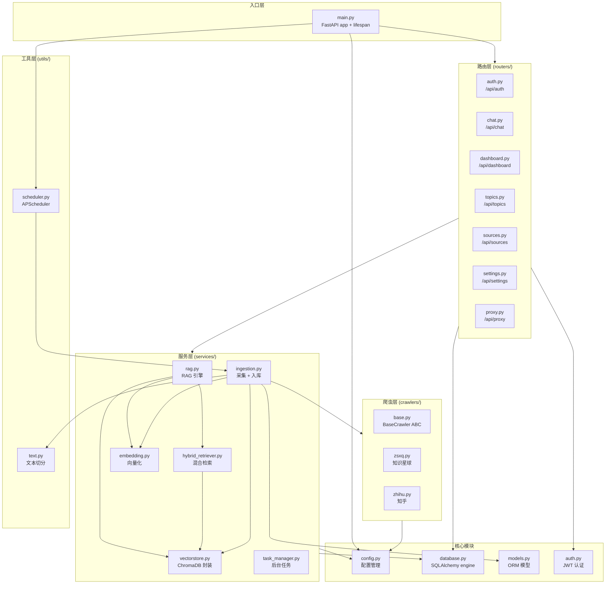
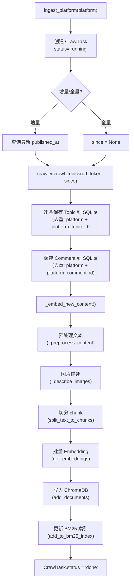
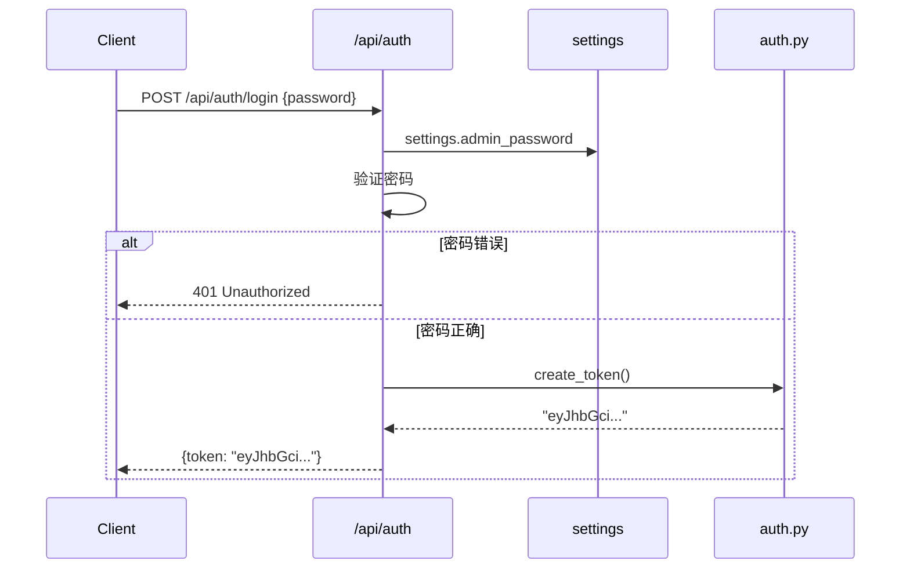
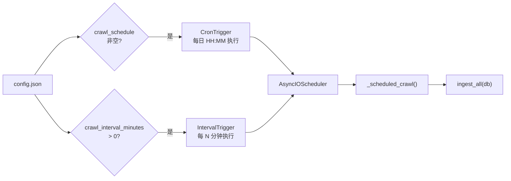
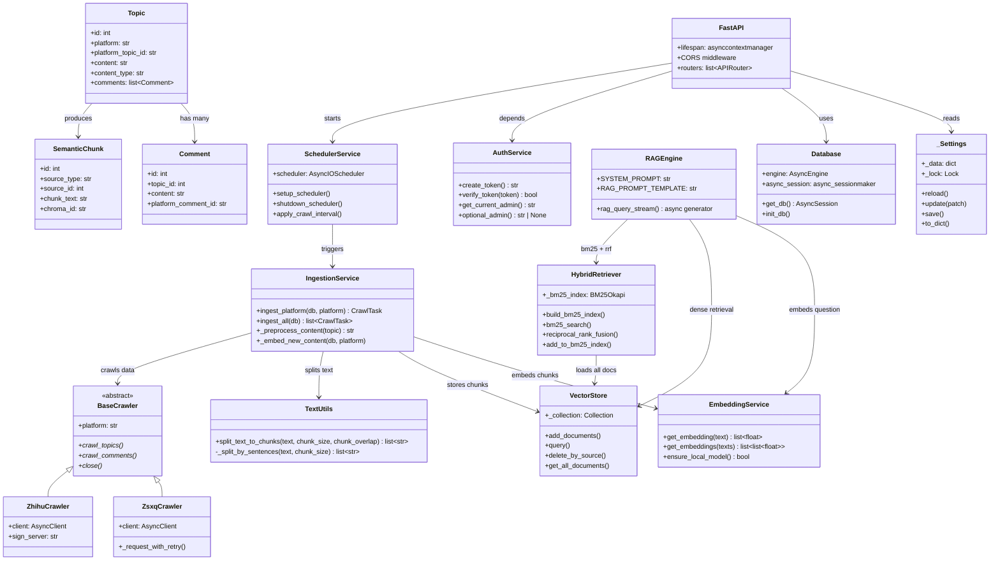

# 后端架构

## 技术栈

| 技术 | 版本 | 用途 |
|------|------|------|
| FastAPI | - | 异步 Web 框架，自动 OpenAPI 文档 |
| SQLAlchemy 2 | async | ORM，async session + aiosqlite 驱动 |
| ChromaDB | - | 向量数据库，持久化 HNSW 索引 |
| APScheduler | - | 定时任务调度（Cron + Interval） |
| python-jose | - | JWT 签发与验证（HS256） |
| httpx | - | 异步 HTTP 客户端（爬虫） |
| openai | - | OpenAI API Python SDK |
| rank-bm25 | - | BM25 稀疏检索算法 |
| sentence-transformers | - | 本地 Embedding 模型推理 |

## 模块结构



## 关键服务详解

### rag.py — RAG 引擎

RAG 引擎是系统的核心问答服务，实现检索增强生成的完整流程。

**核心函数**：`rag_query_stream(question, filters, top_k, history)`

**处理流程**：

1. 对用户问题进行 Embedding
2. 并行执行 Dense 向量检索和 BM25 稀疏检索
3. 使用 RRF 融合排序合并两路结果
4. 构建带元数据标注的上下文
5. 注入系统提示词 + 多轮对话历史
6. 调用 LLM 流式生成回答

**系统提示词**：

```python
SYSTEM_PROMPT = f"""你是一个财经观点分析助手。你的任务是根据{settings.author_name or '星主'}在知乎和
知识星球上的真实发言记录，回答用户的问题。

规则:
1. 只基于提供的参考资料回答，不要编造信息
2. 如果参考资料不足以回答问题，明确说明
3. 回答中引用原文时，用markdown链接标注来源
4. 如果参考资料中提供了原文链接(URL)，必须在引用时附上该链接
5. 回答要简洁、有条理，使用markdown格式
6. 支持多轮对话，结合上下文理解用户意图
7. 优先使用编号靠前的参考资料（相关性更高）
8. 当问题涉及"推荐""列举"时，务必汇总所有相关片段"""
```

**LLM 配置**：

```python
response = await client.chat.completions.create(
    model=settings.openai_model,    # 默认 gpt-4o
    messages=messages,
    temperature=0.3,                # 低温度保证回答稳定性
    stream=True,                    # 流式生成
)
```

### embedding.py — 向量化服务

支持双模式 Embedding：OpenAI API 和本地 bge-small-zh-v1.5。

**模型管理**：

```python
LOCAL_MODEL_ID = "BAAI/bge-small-zh-v1.5"

def ensure_local_model() -> bool:
    """启动时检查本地模型，不存在则下载"""
    from huggingface_hub import snapshot_download
    # 1. 先检查本地缓存 (local_files_only=True)
    # 2. 缓存不存在则从 HF Mirror 下载
    # 3. 设置 HF_ENDPOINT 使用国内镜像
```

**API 设计**：

| 函数 | 说明 |
|------|------|
| `get_embedding(text)` | 单条文本向量化，返回 `list[float]` |
| `get_embeddings(texts)` | 批量向量化，本地模式 batch_size=64，OpenAI 模式 batch_size=512 |

### vectorstore.py — ChromaDB 封装

对 ChromaDB 的薄封装层，提供统一的向量存储接口。

**集合配置**：

```python
COLLECTION_NAME = "kol_opinions"
# HNSW cosine 空间，适合归一化后的向量
client.get_or_create_collection(
    name=COLLECTION_NAME,
    metadata={"hnsw:space": "cosine"},
)
```

**API 方法**：

| 函数 | 说明 |
|------|------|
| `add_documents(ids, documents, embeddings, metadatas)` | 添加文档 |
| `query(query_embedding, n_results, where)` | 向量检索，支持 metadata 过滤 |
| `delete_by_source(source_type, source_id)` | 按来源删除 chunk |
| `get_all_documents()` | 获取所有文档（用于 BM25 索引构建） |

### ingestion.py — 数据采集入库

数据采集服务是连接爬虫和存储的桥梁，负责完整的「爬取 -> 预处理 -> 切分 -> 向量化 -> 入库」流水线。

**入口函数**：

```python
async def ingest_platform(db, platform, progress_callback, full_crawl) -> CrawlTask
async def ingest_all(db) -> list[CrawlTask]
```

**完整流程**：



### hybrid_retriever.py — 混合检索

实现 Dense + BM25 双路检索与 RRF 融合排序。

**BM25 索引管理**：

- 启动时从 ChromaDB 加载所有文档构建内存索引
- 新内容入库后增量更新（全量重建）
- 分词器支持中英文混合：英文单词 + 中文 unigram/bigram/trigram + 数字

**RRF 融合参数**：

| 参数 | 值 | 说明 |
|------|----|------|
| `k` | 60 (查询时) / 30 (构建时) | RRF 平滑参数 |
| `dense_weight` | 1.5 | Dense 检索权重 |
| `bm25_weight` | 1.0 | BM25 检索权重 |
| `top_k` | 12 (最终返回) | 最终结果数量 |

## 认证系统

### JWT 实现

JWT 认证基于 `python-jose` 库，使用 HS256 算法（`backend/app/auth.py`）：

```python
ALGORITHM = "HS256"

def create_token() -> str:
    expire = datetime.now(timezone.utc) + timedelta(hours=settings.jwt_expire_hours)
    payload = {"sub": "admin", "exp": expire}
    return jwt.encode(payload, settings.jwt_secret, algorithm=ALGORITHM)

def verify_token(token: str) -> bool:
    try:
        jwt.decode(token, settings.jwt_secret, algorithms=[ALGORITHM])
        return True
    except JWTError:
        return False
```

### FastAPI 依赖注入

系统提供两个认证依赖，通过 FastAPI 的 `Depends` 机制注入到路由中：

```python
async def get_current_admin(
    cred: HTTPAuthorizationCredentials | None = Depends(_bearer),
) -> str:
    """强制认证：无 token 或 token 无效时返回 401"""
    if cred is None:
        raise HTTPException(status_code=401, detail="未登录")
    if not verify_token(cred.credentials):
        raise HTTPException(status_code=401, detail="Token 无效或已过期")
    return "admin"

async def optional_admin(
    cred: HTTPAuthorizationCredentials | None = Depends(_bearer),
) -> str | None:
    """可选认证：有 token 返回 admin，无 token 返回 None"""
    if cred is None:
        return None
    if verify_token(cred.credentials):
        return "admin"
    return None
```

**路由使用模式**：

```python
# 方式一：路由级强制认证（整个 router 的所有端点都需要认证）
router = APIRouter(
    prefix="/api/chat",
    dependencies=[Depends(get_current_admin)],
)

# 方式二：端点级可选认证
@router.get("/summary")
async def dashboard_summary(admin: str | None = Depends(optional_admin)):
    # admin 可能为 None（公共访客）或 "admin"
```

### 登录流程



## 任务调度

### APScheduler 配置

系统使用 APScheduler 的 `AsyncIOScheduler` 支持两种定时策略（`backend/app/utils/scheduler.py`）：



| 模式 | 配置项 | 触发器 | 说明 |
|------|--------|--------|------|
| 每日定时 | `crawl_schedule` (如 "08:30") | CronTrigger | 每天指定时间执行一次 |
| 间隔循环 | `crawl_interval_minutes` (如 60) | IntervalTrigger | 每 N 分钟执行一次 |

**热更新**：间隔爬取支持运行时热更新，无需重启服务：

```python
def apply_crawl_interval(minutes: int):
    """热更新间隔爬取配置（settings 已持久化后调用）"""
    _rebuild_interval_job(minutes)
    if minutes > 0 and not scheduler.running:
        scheduler.start()
```

## 配置管理

### 热更新配置系统

配置通过 `config.json` 管理，支持运行时读写（`backend/app/config.py`）：

```python
class _Settings:
    """配置单例，支持 save/reload 热更新"""

    def __getattr__(self, key: str):
        # 1. config.json 中的值
        # 2. 计算字段（database_url, chroma_persist_dir）
        # 3. 默认值
```

**配置优先级**：`config.json` > 计算字段 > `_DEFAULTS` 内置默认值

**关键配置项**：

| 配置项 | 默认值 | 说明 |
|--------|--------|------|
| `openai_api_key` | "" | OpenAI API Key |
| `openai_base_url` | "" | 自定义 API 端点（兼容接口） |
| `openai_model` | "gpt-4o" | 问答使用的 LLM 模型 |
| `embedding_provider` | "openai" | Embedding 提供者：openai / local |
| `embedding_model` | "text-embedding-3-small" | OpenAI Embedding 模型 |
| `admin_password` | "" | 管理员密码 |
| `jwt_secret` | "change-me-..." | JWT 签名密钥 |
| `jwt_expire_hours` | 24 | Token 有效期（小时） |
| `public_chat_daily_limit` | 10 | 公共问答每日 IP 限额 |
| `chunk_size` | 500 | 文本切分 chunk 大小 |
| `chunk_overlap` | 80 | chunk 重叠长度 |
| `enable_bm25` | True | 是否启用 BM25 混合检索 |
| `vision_model` | "" | 图片描述模型（留空则跳过） |
| `crawl_schedule` | "" | 每日定时爬取时间 (HH:MM) |
| `crawl_interval_minutes` | 0 | 间隔爬取分钟数（0=关闭） |
| `zsxq_cookie` | "" | 知识星球认证 Cookie |
| `zhihu_cookie` | "" | 知乎认证 Cookie |
| `author_name` | "" | 目标作者名称 |

## 模块关系图



## 启动生命周期

FastAPI 的 lifespan 管理应用启动和关闭时的资源初始化（`backend/app/main.py`）：

```python
@asynccontextmanager
async def lifespan(app: FastAPI):
    # === 启动阶段 ===
    await init_db()                          # 1. 创建 SQLite 表

    if settings.embedding_provider == "local":  # 2. 检查本地 Embedding 模型
        from app.services.embedding import ensure_local_model
        if not ensure_local_model():
            logger.warning("本地embedding模型不可用")

    setup_scheduler()                        # 3. 启动定时任务调度器

    if settings.enable_bm25:                 # 4. 构建 BM25 索引
        from app.services.hybrid_retriever import build_bm25_index
        build_bm25_index()

    yield                                    # === 应用运行 ===

    # === 关闭阶段 ===
    shutdown_scheduler()                     # 停止调度器
```

**启动顺序**：

1. **数据库初始化**：通过 SQLAlchemy `create_all` 创建所有 ORM 表
2. **Embedding 模型预检**：本地模式下确保 bge-small-zh-v1.5 模型已下载
3. **调度器启动**：根据配置注册 Cron/Interval 任务
4. **BM25 索引构建**：从 ChromaDB 加载所有文档构建内存 BM25 索引
