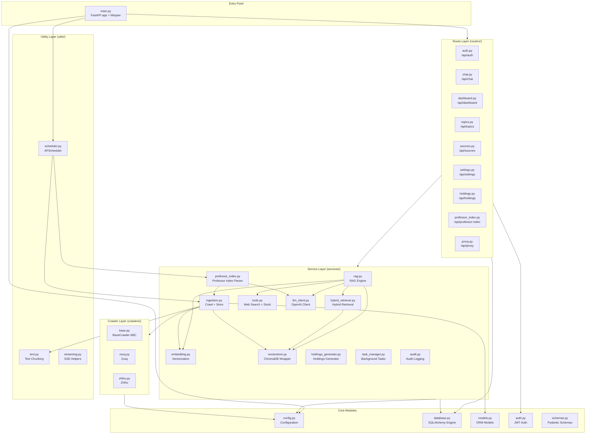
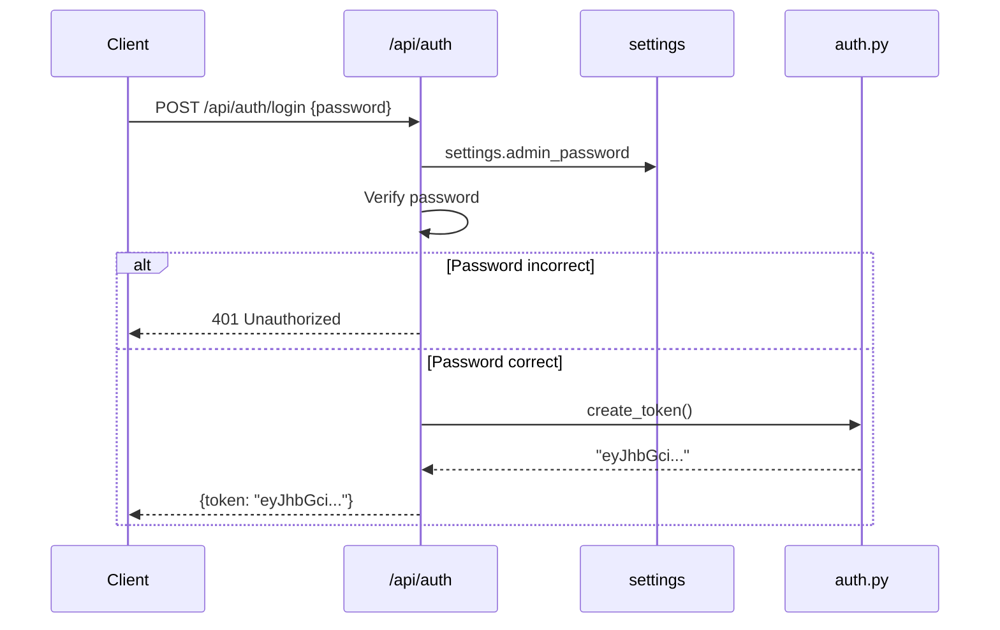
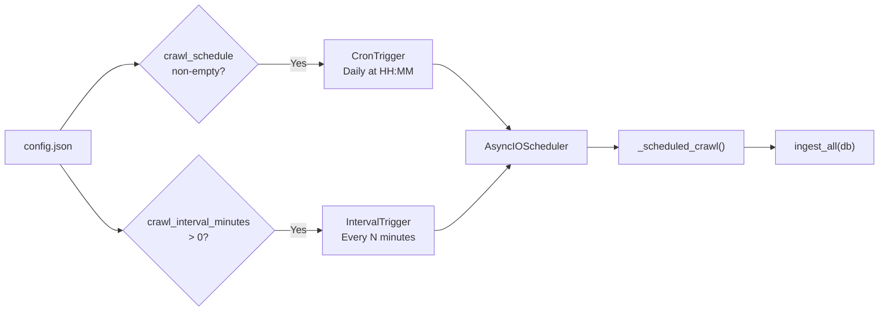
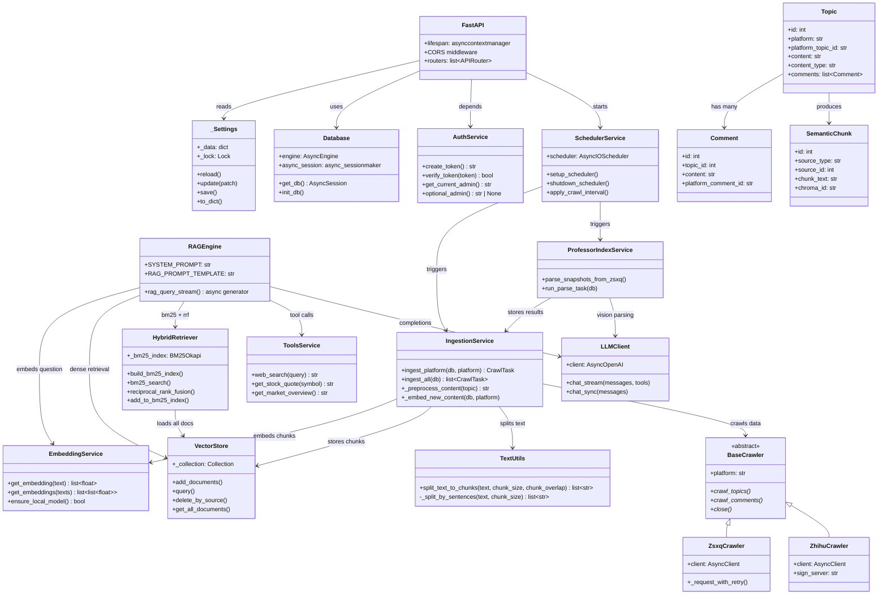

# Backend Architecture

## Technology Stack

| Technology | Purpose |
|-----------|---------|
| FastAPI | Async Python web framework with automatic OpenAPI documentation |
| SQLAlchemy 2 (async) | ORM with async session and `aiosqlite` driver |
| ChromaDB | Vector database with persistent HNSW index |
| APScheduler | Task scheduling (Cron + Interval triggers via `AsyncIOScheduler`) |
| python-jose | JWT issuance and verification (HS256) |
| httpx | Async HTTP client for platform crawlers |
| openai | OpenAI-compatible API Python SDK |
| rank-bm25 | BM25Okapi sparse retrieval algorithm |
| sentence-transformers | Local embedding model inference (`bge-small-zh-v1.5`) |
| yfinance | Stock quote retrieval for LLM tool-calling |
| tavily-python | Web search for LLM tool-calling |

## Module Organization



## Application Lifecycle

The FastAPI application uses an `asynccontextmanager` lifespan to manage startup and shutdown sequences (`backend/app/main.py`):

```python
@asynccontextmanager
async def lifespan(app: FastAPI):
    logger = logging.getLogger(__name__)

    # Security checks
    if settings.jwt_secret == "change-me-to-a-random-string":
        logger.warning("jwt_secret uses default value -- set a random key in config.json!")
    if not settings.admin_password:
        logger.warning("admin_password is not configured")

    await init_db()                          # 1. Create SQLite tables

    if settings.embedding_provider == "local":  # 2. Check local embedding model
        from app.services.embedding import ensure_local_model
        if not ensure_local_model():
            logger.warning("Local embedding model unavailable")

    setup_scheduler()                        # 3. Start task scheduler

    if settings.enable_bm25:                 # 4. Build BM25 index
        from app.services.hybrid_retriever import build_bm25_index
        build_bm25_index()

    yield                                    # === Application running ===

    shutdown_scheduler()                     # Stop scheduler
```

**Startup sequence**:

1. **Database initialization**: Creates all ORM tables via SQLAlchemy `create_all`
2. **Embedding model pre-check**: In local mode, ensures `bge-small-zh-v1.5` is downloaded
3. **Scheduler startup**: Registers cron/interval tasks based on configuration
4. **BM25 index build**: Loads all documents from ChromaDB into an in-memory BM25Okapi index

## Router Structure

All routers are registered in `main.py` with their respective prefixes and tags:

```python
app.include_router(auth.router)              # /api/auth
app.include_router(dashboard.router)         # /api/dashboard
app.include_router(chat.router)              # /api/chat
app.include_router(topics.router)            # /api/topics
app.include_router(sources.router)           # /api/sources
app.include_router(settings_router.router)   # /api/settings
app.include_router(settings_router.public_router)  # /api/settings (public)
app.include_router(holdings.router)          # /api/holdings
app.include_router(professor_index.router)   # /api/professor-index
app.include_router(professor_index.public_router)  # /api/professor-index (public)
app.include_router(proxy.router)             # /api/proxy
```

| Router | Prefix | Auth | Key Endpoints |
|--------|--------|------|---------------|
| `auth.py` | `/api/auth` | None | `POST /login`, `GET /check` |
| `chat.py` | `/api/chat` | Required | `POST /` (SSE streaming RAG Q&A) |
| `dashboard.py` | `/api/dashboard` | Optional | `GET /summary`, `POST /chat`, `GET /chat-remaining`, `GET /holdings`, `GET /professor-index` |
| `topics.py` | `/api/topics` | Required | `GET /` (paginated), `GET /{id}/comments` |
| `sources.py` | `/api/sources` | Required | `GET /platforms`, `POST /crawl`, `POST /crawl/async`, `GET /crawl/status`, `GET /tasks` |
| `settings.py` | `/api/settings` | Mixed | `GET/PUT /crawl-interval`, `GET/PUT /system-info`, `GET/PUT /tools`, `GET/PUT /log-level` |
| `holdings.py` | `/api/holdings` | Required | `GET /`, `POST /generate`, `DELETE /{id}` |
| `professor_index.py` | `/api/professor-index` | Mixed | `POST /parse`, `GET /parse/status`, `GET /parse/history`, `GET/PUT /interval` |
| `proxy.py` | `/api/proxy` | None | `GET /image?url=` |

## Service Layer

### rag.py -- RAG Engine

The RAG engine is the core Q&A service implementing the complete retrieval-augmented generation flow.

**Core function**: `rag_query_stream(question, filters, top_k, history)`

**Processing flow**:

1. Embed the user question
2. Execute dense vector retrieval and BM25 sparse retrieval in parallel
3. Merge results via weighted RRF (Reciprocal Rank Fusion)
4. Build context with metadata annotations
5. Inject system prompt + multi-turn conversation history (last 12 messages)
6. Call LLM with streaming enabled

**System prompt**:

```python
SYSTEM_PROMPT = f"""You are a financial opinion analysis assistant. Your task is to answer
user questions based on the authentic发言 records of {settings.author_name} on Zhihu and Zsxq.

Rules:
1. Answer only based on provided references -- do not fabricate information
2. If references are insufficient, state so explicitly
3. Cite sources with markdown links when referencing original text
4. Attach source URLs when available in references
5. Keep answers concise and well-organized using markdown format
6. Support multi-turn dialogue with context awareness
7. Prioritize higher-ranked references (greater relevance)
8. When questions involve "recommendations" or "lists", aggregate all relevant snippets"""
```

**LLM configuration**:

```python
response = await client.chat.completions.create(
    model=settings.openai_model,    # Default: gpt-4o
    messages=messages,
    temperature=0.3,                # Low temperature for stable answers
    stream=True,                    # Streaming generation
)
```

### hybrid_retriever.py -- Hybrid Retrieval

Implements dual-path retrieval (Dense + BM25) with RRF fusion ranking.

**BM25 index management**:

- Built at startup from all documents in ChromaDB
- Rebuilt (full) when new content is ingested
- Tokenizer supports mixed Chinese/English: English words + Chinese unigram/bigram/trigram + numbers

**RRF fusion parameters**:

| Parameter | Value | Description |
|-----------|-------|-------------|
| `k` | 60 (query) / 30 (build) | RRF smoothing parameter |
| `dense_weight` | 1.5 | Dense retrieval weight |
| `bm25_weight` | 1.0 | BM25 retrieval weight |
| `top_k` | 12 (final) | Final result count |

**RRF formula**: `score(doc) = dense_weight / (k + dense_rank + 1) + bm25_weight / (k + bm25_rank + 1)`

### embedding.py -- Vectorization Service

Supports dual-mode embedding, switchable via the `embedding_provider` configuration:

| Provider | Model | Batch Size | Pros | Cons |
|----------|-------|------------|------|------|
| `openai` | `text-embedding-3-small` | 512 | High quality, no local resources | Requires API key, network latency |
| `local` | `bge-small-zh-v1.5` (512-dim) | 64 | No network dependency, Chinese-optimized | First-run model download (~100MB) |

**Model management**:

```python
LOCAL_MODEL_ID = "BAAI/bge-small-zh-v1.5"

def ensure_local_model() -> bool:
    """Check local model on startup; download if missing."""
    from huggingface_hub import snapshot_download
    # 1. Check local cache (local_files_only=True)
    # 2. If missing, download from HF Mirror (hf_mirror_url)
    # 3. Set HF_ENDPOINT for domestic mirror
```

### vectorstore.py -- ChromaDB Wrapper

A thin wrapper around ChromaDB providing a unified vector storage interface.

**Collection configuration**:

```python
COLLECTION_NAME = "kol_opinions"
client.get_or_create_collection(
    name=COLLECTION_NAME,
    metadata={"hnsw:space": "cosine"},
)
```

**API methods**:

| Function | Description |
|----------|-------------|
| `add_documents(ids, documents, embeddings, metadatas)` | Add documents to the collection |
| `query(query_embedding, n_results, where)` | Vector search with optional metadata filtering |
| `delete_by_source(source_type, source_id)` | Delete chunks by source reference |
| `get_all_documents()` | Retrieve all documents (for BM25 index construction) |

### ingestion.py -- Data Ingestion

The ingestion service bridges crawlers and storage, orchestrating the complete "crawl -> preprocess -> chunk -> vectorize -> store" pipeline.

**Entry functions**:

```python
async def ingest_platform(db, platform, progress_callback, full_crawl) -> CrawlTask
async def ingest_all(db) -> list[CrawlTask]
```

### professor_index.py -- Professor Index Parser

Parses Professor Index screenshots from Zsxq articles using multimodal LLM capabilities:

1. Fetches recent articles from the configured Zsxq group
2. Extracts images from articles containing index screenshots
3. Sends images to a vision-capable LLM for structured data extraction
4. Stores parsed holdings as `ProfessorIndexSnapshot` and `ProfessorIndexHolding` records
5. Supports both "China" and "Global" index versions

### tools.py -- LLM Tool-Calling

Provides external tools that the LLM can invoke during RAG Q&A:

| Tool | Description | Source |
|------|-------------|--------|
| `web_search(query)` | Real-time web search | Tavily API |
| `get_stock_quote(symbol)` | Individual stock price and metadata | yfinance |
| `get_market_overview()` | Major index summary | yfinance |

### llm_client.py -- LLM Client

Manages the OpenAI-compatible API client with support for:

- Custom base URL (for compatible endpoints)
- Configurable model selection
- Streaming and non-streaming completions
- Tool-calling function definitions

## Configuration System

### Hot-Reload Singleton

Configuration is managed via `config.json` with a thread-safe singleton pattern (`backend/app/config.py`):

```python
class _Settings:
    """Configuration singleton with save/reload hot-reload support."""

    def __getattr__(self, key: str):
        # 1. Value from config.json
        if key in self._data:
            return self._data[key]
        # 2. Computed fields (database_url, chroma_persist_dir)
        if key in _COMPUTED:
            return _COMPUTED[key]
        # 3. Built-in defaults
        if key in _DEFAULTS:
            return _DEFAULTS[key]
        raise AttributeError(f"Unknown config key: {key}")
```

**Priority**: `config.json` values > computed fields > `_DEFAULTS` built-in defaults

**Key configuration items**:

| Config Key | Default | Description |
|-----------|---------|-------------|
| `openai_api_key` | `""` | OpenAI API key |
| `openai_base_url` | `""` | Custom API endpoint (compatible interface) |
| `openai_model` | `"gpt-4o"` | LLM model for Q&A |
| `embedding_provider` | `"openai"` | Embedding provider: `openai` / `local` |
| `embedding_model` | `"text-embedding-3-small"` | OpenAI embedding model |
| `admin_password` | `""` | Admin login password |
| `jwt_secret` | `"change-me-..."` | JWT signing secret |
| `jwt_expire_hours` | `24` | Token validity period (hours) |
| `public_chat_daily_limit` | `10` | Public Q&A daily IP quota |
| `chunk_size` | `500` | Text chunk max size (characters) |
| `chunk_overlap` | `80` | Chunk overlap length |
| `enable_bm25` | `true` | Enable BM25 hybrid retrieval |
| `vision_model` | `""` | Image description model (empty = skip) |
| `enable_tools` | `true` | Enable LLM tool-calling |
| `tavily_api_key` | `""` | Tavily search API key |
| `crawl_schedule` | `""` | Daily crawl time (HH:MM) |
| `crawl_interval_minutes` | `0` | Interval crawl minutes (0 = disabled) |
| `professor_index_interval_days` | `7` | Professor Index auto-parse interval |
| `zsxq_cookie` | `""` | Zsxq authentication cookie |
| `zhihu_cookie` | `""` | Zhihu authentication cookie |
| `author_name` | `""` | Target author name |
| `cors_origins` | `["*"]` | Allowed CORS origins |

## Database Setup

The system uses SQLAlchemy 2 with async sessions and the `aiosqlite` driver (`backend/app/database.py`):

```python
from sqlalchemy.ext.asyncio import create_async_engine, async_sessionmaker, AsyncSession
from sqlalchemy.orm import DeclarativeBase

engine = create_async_engine(settings.database_url, echo=False)
async_session = async_sessionmaker(engine, expire_on_commit=False)

class Base(DeclarativeBase):
    pass

async def init_db():
    async with engine.begin() as conn:
        await conn.run_sync(Base.metadata.create_all)

async def get_db():
    async with async_session() as session:
        yield session
```

**Database file location**: `data/app.db` (auto-derived from project root)

## Authentication Flow

### JWT Implementation

JWT authentication uses the `python-jose` library with HS256 algorithm (`backend/app/auth.py`):

```python
ALGORITHM = "HS256"

def create_token() -> str:
    expire = datetime.now(timezone.utc) + timedelta(hours=settings.jwt_expire_hours)
    payload = {"sub": "admin", "exp": expire}
    return jwt.encode(payload, settings.jwt_secret, algorithm=ALGORITHM)

def verify_token(token: str) -> bool:
    try:
        jwt.decode(token, settings.jwt_secret, algorithms=[ALGORITHM])
        return True
    except JWTError:
        return False
```

### FastAPI Dependency Injection

Two authentication dependencies are provided via FastAPI's `Depends` mechanism:

```python
async def get_current_admin(
    cred: HTTPAuthorizationCredentials | None = Depends(_bearer),
) -> str:
    """Mandatory auth: returns 401 if token is missing or invalid."""
    if cred is None:
        raise HTTPException(status_code=401, detail="Not logged in")
    if not verify_token(cred.credentials):
        raise HTTPException(status_code=401, detail="Token invalid or expired")
    return "admin"

async def optional_admin(
    cred: HTTPAuthorizationCredentials | None = Depends(_bearer),
) -> str | None:
    """Optional auth: returns "admin" if valid token, None otherwise."""
    if cred is None:
        return None
    if verify_token(cred.credentials):
        return "admin"
    return None
```

**Usage patterns**:

```python
# Pattern 1: Router-level mandatory auth (all endpoints require auth)
router = APIRouter(
    prefix="/api/chat",
    dependencies=[Depends(get_current_admin)],
)

# Pattern 2: Endpoint-level optional auth
@router.get("/summary")
async def dashboard_summary(admin: str | None = Depends(optional_admin)):
    # admin is either None (public visitor) or "admin"
```

### Login Sequence



## Task Scheduler

### APScheduler Configuration

The system uses APScheduler's `AsyncIOScheduler` with two scheduling strategies (`backend/app/utils/scheduler.py`):



| Mode | Config Key | Trigger | Description |
|------|-----------|---------|-------------|
| Daily fixed time | `crawl_schedule` (e.g. `"08:30"`) | `CronTrigger` | Runs once per day at the specified time |
| Interval loop | `crawl_interval_minutes` (e.g. `60`) | `IntervalTrigger` | Runs every N minutes |

**Hot-reload**: The interval schedule supports runtime updates without restarting the service:

```python
def apply_crawl_interval(minutes: int):
    """Hot-reload crawl interval configuration (called after settings persist)."""
    _rebuild_interval_job(minutes)
    if minutes > 0 and not scheduler.running:
        scheduler.start()
```

## Middleware

### CORS

Cross-Origin Resource Sharing is configured via FastAPI's `CORSMiddleware`:

```python
_cors_origins = settings.cors_origins  # Default: ["*"]
app.add_middleware(
    CORSMiddleware,
    allow_origins=_cors_origins,
    allow_credentials="*" not in _cors_origins,
    allow_methods=["*"],
    allow_headers=["*"],
)
```

:::warning
When `cors_origins` is set to `["*"]`, `allow_credentials` is automatically disabled (per CORS specification). To enable credentials (cookies/auth headers), specify explicit origin URLs instead of the wildcard.
:::

## Error Handling Patterns

The backend follows consistent error handling conventions:

### HTTP Exceptions

Standard HTTP errors use FastAPI's `HTTPException`:

```python
from fastapi import HTTPException

# 401 Unauthorized
raise HTTPException(status_code=401, detail="Not logged in")

# 404 Not Found
raise HTTPException(status_code=404, detail="Topic not found")

# 429 Too Many Requests
raise HTTPException(status_code=429, detail="Daily limit exceeded")

# 500 Internal Server Error
raise HTTPException(status_code=500, detail="Crawl task failed")
```

### Background Task Error Handling

Background tasks (crawl, professor index parsing) capture errors in their corresponding task records:

```python
try:
    # ... crawl logic ...
    task.status = "done"
except Exception as e:
    task.status = "error"
    task.error_message = str(e)[:2000]  # Truncate long error messages
finally:
    task.finished_at = datetime.now(timezone.utc)
    await db.commit()
```

### SSE Error Streaming

For SSE endpoints, errors are communicated as special event payloads before closing the stream:

```python
async def event_stream():
    try:
        async for text in rag_query_stream(question, ...):
            yield f"data: {text}\n\n"
        yield "data: [DONE]\n\n"
    except Exception as e:
        yield f"data: [Error: {str(e)}]\n\n"
        yield "data: [DONE]\n\n"
```

## Module Dependency Diagram


