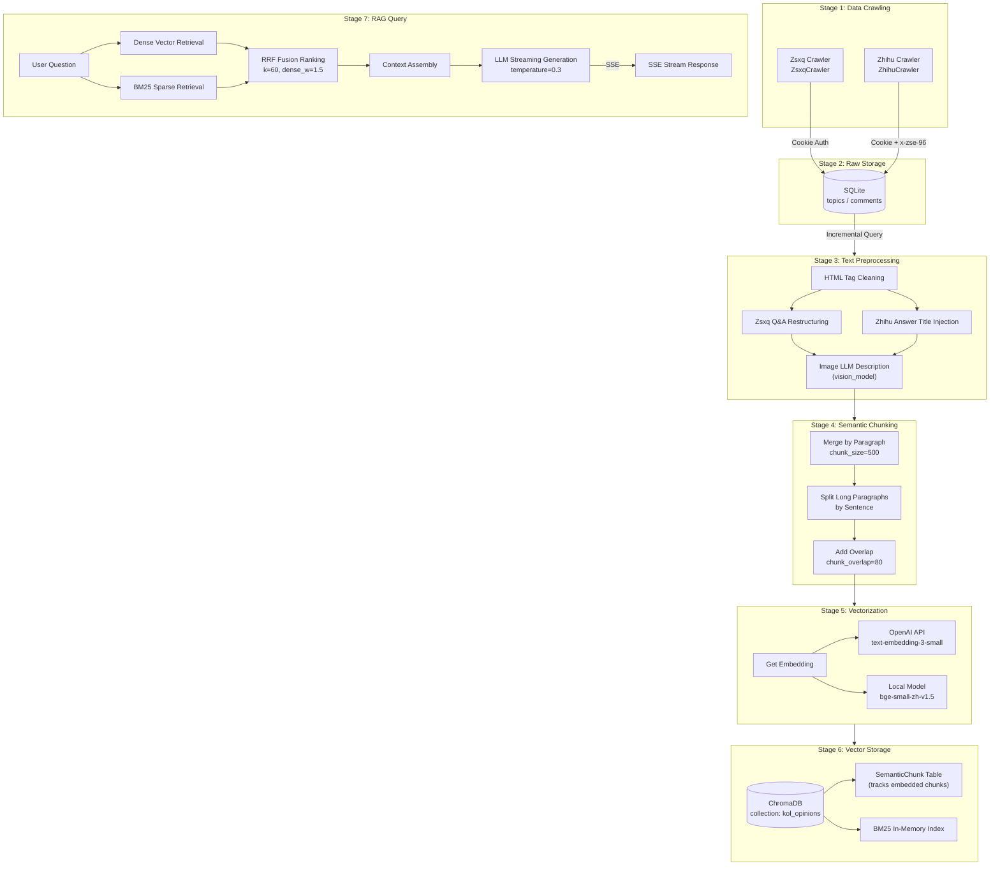
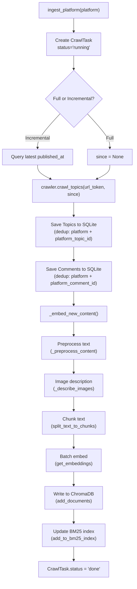
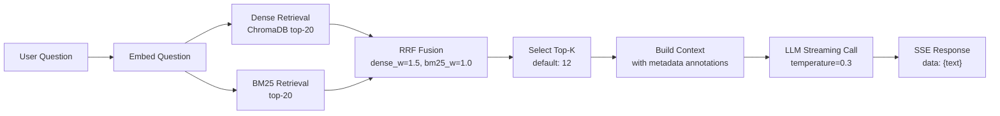
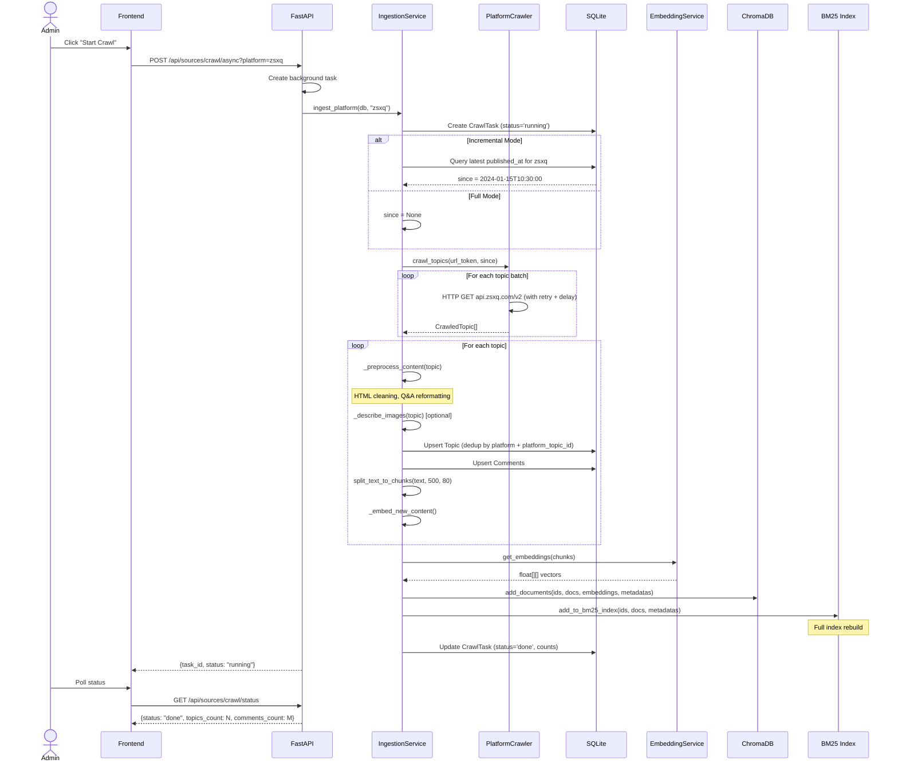
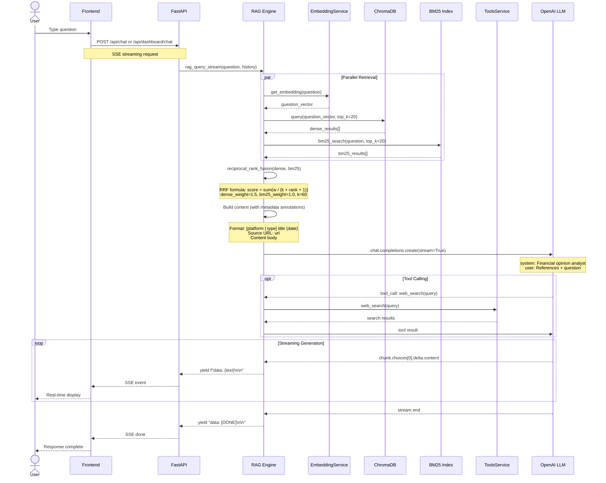
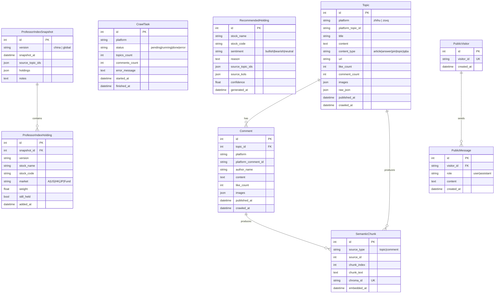

# Data Flow

This document describes the complete data lifecycle in the Dungeon Lord system -- from content ingestion through platforms like Zsxq and Zhihu, through text preprocessing, semantic chunking, and vectorization, to final RAG-based question answering.

## End-to-End Pipeline



## Ingestion Pipeline

The ingestion pipeline transforms raw platform content into searchable vector embeddings. It runs as a sequential flow orchestrated by `backend/app/services/ingestion.py`.



## Query Pipeline

The RAG query pipeline processes user questions through retrieval, fusion, and generation:



## Crawl Operation Sequence

The following sequence diagram illustrates a complete crawl operation from the admin triggering a task through data storage:



## RAG Query Sequence

A complete RAG query from user input to streamed response:



## Data Model ER Diagram



## Incremental vs Full Crawl

The ingestion system supports two crawling modes, controlled by the `full_crawl` parameter:

### Incremental Mode (Default)

Incremental crawling queries the database for the most recent `published_at` timestamp of the target platform, then only fetches content published after that point. This is the default behavior for both manual triggers and scheduled tasks.

```python
if full_crawl:
    since = None
else:
    last_topic_result = await db.execute(
        select(Topic)
        .where(Topic.platform == platform)
        .order_by(Topic.published_at.desc())
        .limit(1)
    )
    last = last_topic_result.scalar_one_or_none()
    since = last.published_at if last else None
```

**Characteristics**:
- Fetches only new content since the last crawl
- Faster execution, lower API usage
- Default mode for scheduled crawls
- Deduplication by `(platform, platform_topic_id)` prevents duplicate entries

### Full Mode

Full crawling fetches all available content from the target platform regardless of existing data.

**Characteristics**:
- Re-fetches all content from the platform
- Useful after configuration changes or data corruption
- Slower execution, higher API usage
- Existing records are updated via upsert (unique constraint on `platform + platform_topic_id`)
- New chunks are added to the vector store; orphaned chunks from deleted topics are cleaned up

### Deduplication Strategy

Both modes use database-level deduplication:

- **Topics**: Unique constraint on `(platform, platform_topic_id)` -- upsert on conflict
- **Comments**: Unique constraint on `(platform, platform_comment_id)` -- upsert on conflict
- **Semantic chunks**: Before re-embedding, existing chunks for a source are deleted from both ChromaDB and the `SemanticChunk` table

:::tip
Use full crawl sparingly. For regular operations, incremental mode is sufficient and significantly reduces load on both the target platform APIs and the local embedding service.
:::
