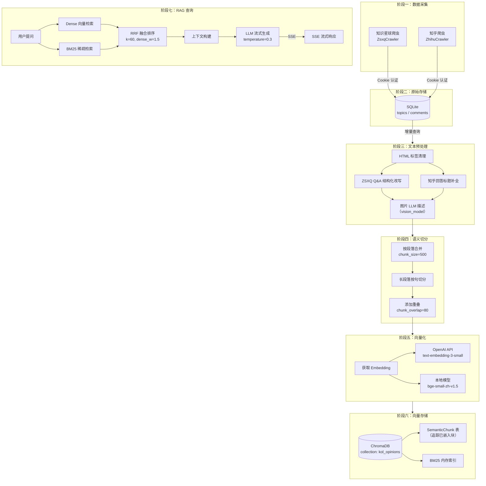
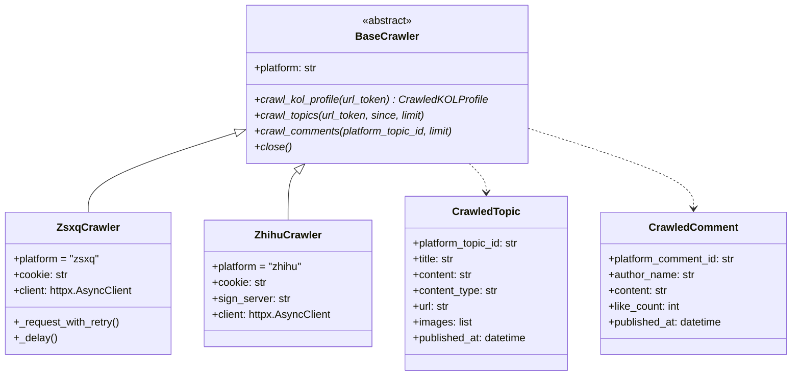
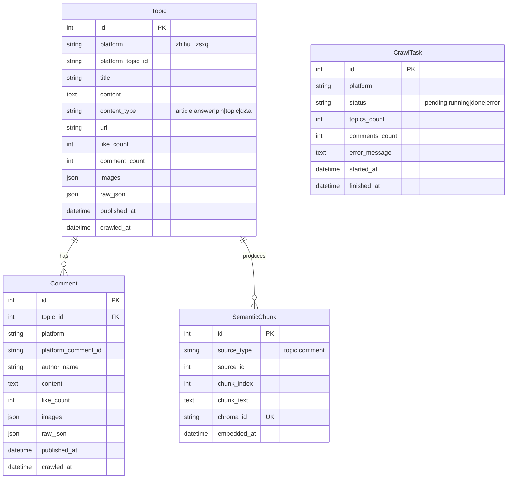
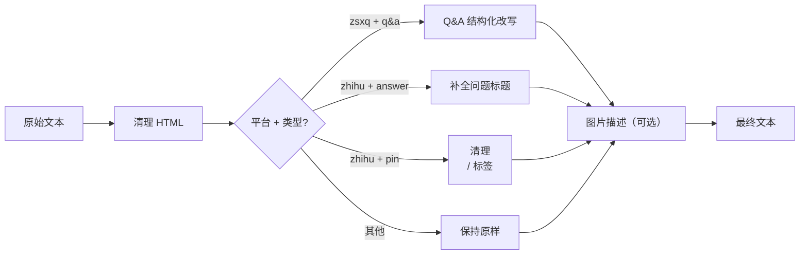
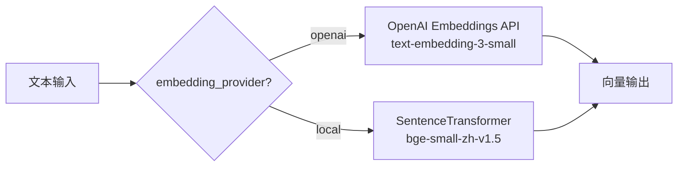
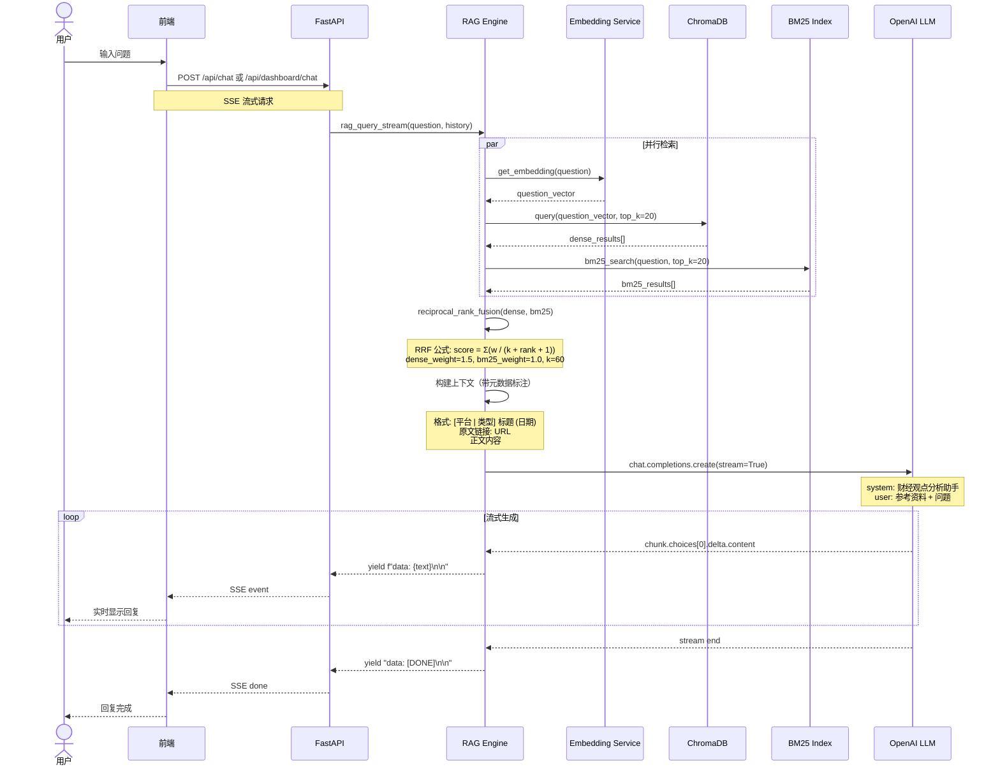

# 数据流详解

本文档详细描述 Dungeon Lord 系统中数据从采集、预处理、向量化到最终 RAG 问答的完整流转过程。

## 完整数据流水线



## 阶段一：数据采集

系统通过平台爬虫从知识星球和知乎采集目标作者的内容。

### 爬虫架构



### 增量爬取

爬取支持增量模式：系统查询 SQLite 中该平台最新的 `published_at` 时间戳，只采集该时间之后的新内容。

参考 `backend/app/services/ingestion.py` 中的增量逻辑：

```python
if full_crawl:
    since = None
else:
    last_topic_result = await db.execute(
        select(Topic)
        .where(Topic.platform == platform)
        .order_by(Topic.published_at.desc())
        .limit(1)
    )
    last = last_topic_result.scalar_one_or_none()
    since = last.published_at if last else None
```

### 知识星球爬虫特性

- **认证方式**：Cookie 认证，通过 `config.json` 中的 `zsxq_cookie` 配置
- **API 端点**：`https://api.zsxq.com/v2`
- **请求节拍**：每次请求间隔 1.5 ~ 3.5 秒随机延迟
- **重试策略**：最多 3 次重试，指数退避（基础 5 秒），429 限流时加倍等待
- **内容类型**：支持 `q&a`、`talk`、`article` 三种主题类型
- **评论采集**：优先使用独立评论 API，失败时回退到主题内嵌的 `show_comments`

## 阶段二：原始存储

所有采集到的原始数据存储在 SQLite 数据库中。

### 数据模型



## 阶段三：文本预处理

在进入向量化之前，原始文本需经过结构化预处理以提升检索质量。

### 预处理流水线



### HTML 清理

通用的 HTML 标签清理逻辑（`backend/app/services/ingestion.py`）：

```python
def _clean_html(text: str) -> str:
    text = re.sub(r'<e[^>]*/?>', '', text)  # ZSXQ <e> 标记
    text = re.sub(r'<br\s*/?>', '\n', text)
    text = re.sub(r'<[^>]+>', '', text)
    text = re.sub(r'\n{3,}', '\n\n', text)
    return text.strip()
```

### ZSXQ Q&A 结构化改写

知识星球的 Q&A 类型内容会被改写为更清晰的问答结构，提升后续检索时的语义匹配：

```python
def _reformat_zsxq_qa(content: str, title: str | None) -> str:
    if '[提问]' in content or '[回答]' in content:
        content = re.sub(r'\[提问\]\s*(\S+?):', r'提问者: \1\n问题:', content)
        content = re.sub(r'\[回答\]\s*(\S+?):', r'\n\n回答者: \1\n回答:', content)
    return content
```

改写前：
```
[提问] 张三: 对A股后市怎么看？
[回答] 星主: 我认为短期震荡，中长期看好...
```

改写后：
```
提问者: 张三
问题: 对A股后市怎么看？

回答者: 星主
回答: 我认为短期震荡，中长期看好...
```

### 图片描述

如果配置了 `vision_model`，系统会调用 LLM 多模态能力将图片内容转为文字描述，附加到文本末尾：

```python
async def _describe_images(topic: Topic) -> str:
    # 只处理前 3 张图片（控制成本）
    # 调用 vision_model 生成不超过 100 字的中文描述
    # 返回格式：
    # [图片描述]
    # 1. 上证指数日K线图，显示近期连续上涨...
    # 2. 板块资金流向图，半导体板块净流入...
```

## 阶段四：语义切分

文本切分采用「先段落合并、后句子细分、再添加重叠」的三步策略。

### 切分策略

核心参数（`backend/app/utils/text.py`）：

| 参数 | 默认值 | 说明 |
|------|-------|------|
| `chunk_size` | 500 字符 | 每个 chunk 的最大长度 |
| `chunk_overlap` | 80 字符 | 相邻 chunk 的重叠长度 |

### 切分过程可视化

假设一段 1200 字符的文本：

```
原始文本 (1200 字符):
┌──────────────────────────────────────────┐
│ 段落A (200字) │ 段落B (350字) │ 段落C (400字) │ 段落D (250字) │
└──────────────────────────────────────────┘

第一步：按段落合并
┌─────────────────────┐ ┌──────────────────────────┐ ┌──────────────────────────┐
│ Chunk 1:             │ │ Chunk 2:                  │ │ Chunk 3:                  │
│ 段落A + 段落B        │ │ 段落C                     │ │ 段落D                     │
│ (550字 > 500, 拆分)  │ │ (400字)                   │ │ (250字)                   │
└─────────────────────┘ └──────────────────────────┘ └──────────────────────────┘

第二步：过长段落按句切分
┌──────────────┐ ┌──────────────┐ ┌──────────────────────────┐ ┌──────────────────────────┐
│ Chunk 1a:    │ │ Chunk 1b:    │ │ Chunk 2:                  │ │ Chunk 3:                  │
│ 段落A        │ │ 段落B        │ │ 段落C                     │ │ 段落D                     │
│ (200字)      │ │ (350字)      │ │ (400字)                   │ │ (250字)                   │
└──────────────┘ └──────────────┘ └──────────────────────────┘ └──────────────────────────┘

第三步：添加重叠 (overlap=80)
┌──────────────┐ ┌──────────────────────┐ ┌──────────────────────────┐ ┌──────────────────────────┐
│ Chunk 1:     │ │ Chunk 2:              │ │ Chunk 3:                  │ │ Chunk 4:                  │
│ 段落A        │ │ ...段落A尾80字        │ │ ...段落B尾80字            │ │ ...段落C尾80字            │
│ (200字)      │ │ + 段落B (350字)       │ │ + 段落C (400字)           │ │ + 段落D (250字)           │
│              │ │ ≈ 430字               │ │ ≈ 480字                   │ │ ≈ 330字                   │
└──────────────┘ └──────────────────────┘ └──────────────────────────┘ └──────────────────────────┘
```

### 重叠边界优化

重叠区域会尝试在句子边界处切割，而非硬切 80 字符：

```python
# 尝试在句子边界切割重叠部分
for sep in ["。", "！", "？", "；", ".", "!", "?", "\n"]:
    idx = overlap_text.find(sep)
    if idx != -1:
        overlap_text = overlap_text[idx + 1:]
        break
```

## 阶段五：向量化

### 双模式 Embedding

系统支持两种 Embedding 提供者，通过 `embedding_provider` 配置切换：



| 提供者 | 模型 | 优势 | 劣势 |
|--------|------|------|------|
| OpenAI | text-embedding-3-small | 质量高，无需本地资源 | 需要 API Key，有延迟 |
| Local | bge-small-zh-v1.5 | 无网络依赖，中文优化 | 首次需下载模型（~100MB） |

本地模式启动时自动检查模型是否存在，支持通过 HF Mirror（`hf_mirror_url`）加速下载。

批量 Embedding 时，OpenAI 模式以 512 条为一批，本地模式以 64 条为一批。

## 阶段六：向量存储

### ChromaDB 存储

向量存储在 ChromaDB 的 `kol_opinions` 集合中，使用 HNSW cosine 空间：

```python
COLLECTION_NAME = "kol_opinions"

def get_collection() -> chromadb.Collection:
    client = get_chroma_client()  # PersistentClient
    return client.get_or_create_collection(
        name=COLLECTION_NAME,
        metadata={"hnsw:space": "cosine"},
    )
```

每条文档的 metadata 结构：

```python
{
    "author_name": "星主名称",
    "platform": "zsxq",           # 或 "zhihu"
    "source_type": "topic",
    "source_id": 123,
    "content_type": "q&a",        # q&a | talk | article | answer | pin
    "published_at": "2024-01-15T10:30:00",
    "topic_title": "关于A股走势的分析",
    "url": "https://wx.zsxq.com/topic/xxx",
}
```

### BM25 索引同步

每次有新内容入库时，BM25 索引会被增量更新（实际为全量重建，因为 `BM25Okapi` 不支持增量更新）：

```python
def add_to_bm25_index(ids, documents, metadatas):
    _bm25_ids.extend(ids)
    _bm25_docs.extend(documents)
    _bm25_metadatas.extend(metadatas)
    # 重建索引
    tokenized = [_tokenize(doc) for doc in _bm25_docs]
    _bm25_index = BM25Okapi(tokenized)
```

## 阶段七：RAG 查询

### 用户请求完整流程



### 混合检索与 RRF 融合

系统使用 Dense + BM25 双路检索，通过加权 RRF（Reciprocal Rank Fusion）融合排序：

```python
def reciprocal_rank_fusion(
    dense_results, bm25_results,
    k=30, top_k=8, dense_weight=1.5, bm25_weight=1.0
):
    # Dense 排名
    for rank, item in enumerate(dense_results):
        rrf_scores[doc_id] += dense_weight / (k + rank + 1)

    # BM25 排名
    for rank, item in enumerate(bm25_results):
        rrf_scores[doc_id] += bm25_weight / (k + rank + 1)
```

RRF 公式：`score(doc) = dense_weight / (k + dense_rank + 1) + bm25_weight / (k + bm25_rank + 1)`

- **dense_weight=1.5**：语义检索权重更高，更适合中文语义匹配
- **bm25_weight=1.0**：关键词检索补充精确匹配
- **k=60**：平滑参数，控制排名差异的敏感度

### BM25 分词策略

BM25 使用自定义的中英文混合分词器（`backend/app/services/hybrid_retriever.py`）：

```python
def _tokenize(text: str) -> list[str]:
    words = re.findall(r'[a-zA-Z]+', text.lower())      # 英文单词
    chinese_chars = re.findall(r'[一-鿿]', text)           # 中文单字
    ngrams = list(chinese_chars)                           # unigram
    for i in range(len(chinese_chars) - 1):
        ngrams.append(chinese_chars[i] + chinese_chars[i+1])     # bigram
    for i in range(len(chinese_chars) - 2):
        ngrams.append(chinese_chars[i] + chinese_chars[i+1] + chinese_chars[i+2])  # trigram
    numbers = re.findall(r'\d+', text)                     # 数字
    return words + ngrams + numbers
```

### 上下文构建

检索结果被格式化为带元数据标注的参考资料，送入 LLM：

```
--- 片段1 [知识星球 | q&a] 关于A股走势的分析 (2024-01-15) ---
原文链接: https://wx.zsxq.com/topic/xxx
提问者: 张三
问题: 对A股后市怎么看？

--- 片段2 [知乎 | answer] 如何看待当前市场 (2024-01-10) ---
原文链接: https://www.zhihu.com/question/xxx/answer/yyy
问题: 如何看待当前市场？
回答: 从技术面来看...
```

### 多轮对话

RAG 引擎支持多轮对话，最近 12 条历史消息会被注入到 LLM 的 messages 中：

```python
if history:
    for msg in history[-12:]:
        if msg.get("role") in ("user", "assistant") and msg.get("content"):
            messages.append({"role": msg["role"], "content": msg["content"]})
```
