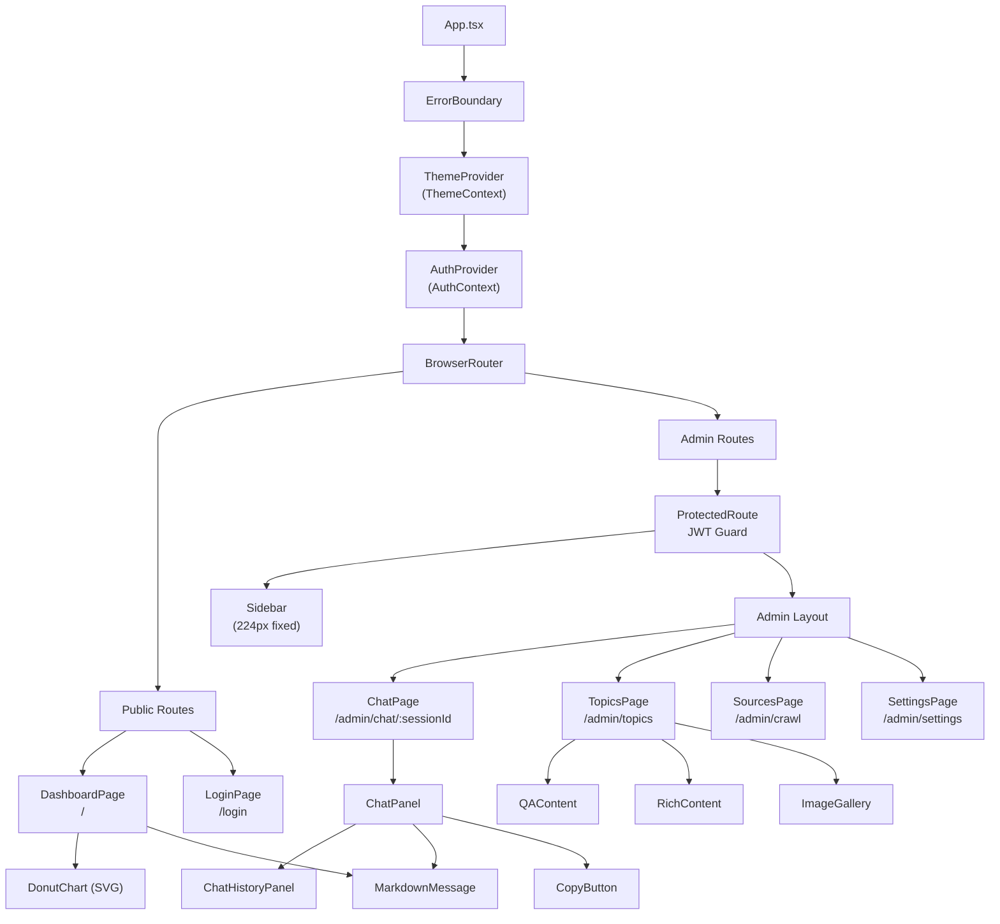
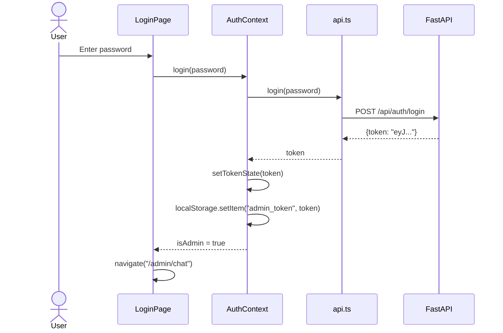

# Frontend Architecture

## Technology Stack

| Technology | Version | Purpose |
|-----------|---------|---------|
| React | 19.2 | UI framework, function components + Hooks |
| TypeScript | 6.0 | Type safety across the entire codebase |
| Vite | 8.0 | Build tool and dev server with HMR |
| Tailwind CSS | 4.3 | Utility-first CSS framework with custom `@utility` classes |
| react-router-dom | 7.18 | Client-side routing with nested route support |
| react-markdown | 10.1 | Markdown rendering for chat messages |
| remark-gfm | 4.0 | GitHub Flavored Markdown support (tables, strikethrough, etc.) |
| lucide-react | 1.20 | Lightweight icon library |
| @tailwindcss/typography | 0.5 | Prose styling for rendered markdown content |

## Component Hierarchy



## Routing Structure

The application uses React Router v7 with a two-level route structure separating public and admin areas:

```tsx
// App.tsx
<Routes>
  {/* Public routes — no sidebar */}
  <Route path="/" element={<DashboardPage />} />
  <Route path="/login" element={<LoginPage />} />

  {/* Admin routes — with sidebar */}
  <Route
    path="/admin/*"
    element={
      <ProtectedRoute>
        <div className="flex h-screen overflow-hidden">
          <Sidebar />
          <main className="flex-1 overflow-y-auto">
            <Routes>
              <Route path="/chat/:sessionId" element={<ChatPage />} />
              <Route path="/chat" element={<ChatPage />} />
              <Route path="/topics" element={<TopicsPage />} />
              <Route path="/crawl" element={<SourcesPage />} />
              <Route path="/settings" element={<SettingsPage />} />
            </Routes>
          </main>
        </div>
      </ProtectedRoute>
    }
  />
</Routes>
```

| Path | Component | Access | Description |
|------|-----------|--------|-------------|
| `/` | DashboardPage | Public | Opinion summaries, rate-limited Q&A, Professor Index, holdings |
| `/login` | LoginPage | Public | Admin password login |
| `/admin/chat/:sessionId` | ChatPage | Admin | RAG Q&A with session-specific chat history |
| `/admin/chat` | ChatPage | Admin | RAG Q&A, new session |
| `/admin/topics` | TopicsPage | Admin | Data browsing and search |
| `/admin/crawl` | SourcesPage | Admin | Crawl task management |
| `/admin/settings` | SettingsPage | Admin | System configuration |

## State Management

The application uses React Context for global state, avoiding external state management libraries.

### AuthContext

`AuthContext` manages the administrator login state (`frontend/src/contexts/AuthContext.tsx`):

```tsx
interface AuthContextType {
  token: string | null
  isAdmin: boolean       // derived: token !== null
  login: (password: string) => Promise<void>
  logout: () => void
}
```

**Authentication flow**:



**Token synchronization**: `AuthContext` uses a `useEffect` hook to sync the token to the `api.ts` module-level `_token` variable. All subsequent API requests automatically include the `Authorization: Bearer <token>` header.

**Startup validation**: On page load, any existing stored token is validated against the backend:

```tsx
useEffect(() => {
  if (!token) return
  checkAuth(token)
    .then(() => {})
    .catch(() => {
      setTokenState(null)
      localStorage.removeItem(TOKEN_KEY)
    })
}, [token])
```

### ThemeContext

`ThemeContext` provides global dark mode state management (`frontend/src/contexts/ThemeContext.tsx`):

```tsx
interface ThemeContextValue {
  theme: Theme  // 'light' | 'dark'
  toggle: () => void
}
```

**Initialization logic**:

1. Read from `localStorage.getItem('theme')` (highest priority)
2. Fall back to system preference: `window.matchMedia('(prefers-color-scheme: dark)')`
3. On toggle, sync DOM class on `<html>` element and persist to localStorage

```tsx
useEffect(() => {
  const root = document.documentElement
  if (theme === 'dark') {
    root.classList.add('dark')
  } else {
    root.classList.remove('dark')
  }
  localStorage.setItem('theme', theme)
}, [theme])
```

## Key Components

### ChatPanel

The `ChatPanel` component (`frontend/src/components/chat/ChatPanel.tsx`) is the core Q&A interface used by both admin and public visitors.

**Features**:
- SSE streaming via `ReadableStream` + `readSSEStream` utility
- Multi-turn conversation with history persistence
- Markdown rendering via `MarkdownMessage`
- Copy-to-clipboard via `CopyButton`
- Chat session management via `ChatHistoryPanel` (admin only)

**SSE streaming implementation**:

```typescript
// frontend/src/utils/sse.ts
export async function readSSEStream(
  reader: ReadableStreamDefaultReader<Uint8Array>,
  onChunk: (text: string) => void,
): Promise<string> {
  const decoder = new TextDecoder()
  let fullText = ''
  let done = false

  while (!done) {
    const result = await reader.read()
    if (result.done) break

    const text = decoder.decode(result.value, { stream: true })
    const lines = text.split('\n')

    for (const line of lines) {
      if (!line.startsWith('data: ')) continue
      const data = line.slice(6).trim()
      if (data === '[DONE]') {
        done = true
        break
      }
      if (data) {
        fullText += data
        onChunk(fullText)  // Callback receives cumulative text
      }
    }
  }

  return fullText
}
```

:::note
The `onChunk` callback receives the **cumulative full text** (not incremental deltas), making it straightforward to update React state directly with the latest complete response.
:::

### RichContent

The `RichContent` component (`frontend/src/components/content/RichContent.tsx`) renders topic and comment content with platform-specific formatting:

- Sanitizes and renders HTML content from Zsxq topics
- Integrates `ImageGallery` for image display with proxy support
- Handles Q&A structured content with distinct question/answer sections
- Uses the `proxiedImageUrl` helper to bypass anti-hotlink protections

### DonutChart

The `DonutChart` component (`frontend/src/components/DonutChart.tsx`) renders SVG-based donut charts on the public dashboard:

- Displays platform content distribution (Zsxq vs Zhihu)
- Animated segment transitions
- Responsive sizing with configurable dimensions
- Label and legend support

### Sidebar

The `Sidebar` component (`frontend/src/components/layout/Sidebar.tsx`) provides a fixed-width (224px) navigation panel for admin pages:

```tsx
const navItems = [
  { to: '/admin/chat',     icon: MessageSquare, label: 'Q&A' },
  { to: '/admin/topics',   icon: FileText,      label: 'Data Browser' },
  { to: '/admin/crawl',    icon: RefreshCw,     label: 'Crawl Manager' },
  { to: '/admin/settings', icon: Settings,       label: 'Settings' },
]
```

The bottom section includes: return to public dashboard, dark mode toggle, and logout.

### ProtectedRoute

The `ProtectedRoute` component (`frontend/src/components/auth/ProtectedRoute.tsx`) guards admin routes. When the user is not authenticated, it redirects to the login page:

```tsx
<ProtectedRoute>
  <div className="flex h-screen overflow-hidden">
    <Sidebar />
    <main>{/* Admin pages */}</main>
  </div>
</ProtectedRoute>
```

## Styling Approach

### Glassmorphism Design System

The application uses a glassmorphism visual style. Four custom utility classes are defined in `frontend/src/index.css` using Tailwind CSS v4's `@utility` syntax:

```css
@utility glass {
  background: oklch(1 0 0 / 0.7);
  backdrop-filter: blur(24px) saturate(1.2);
  border: 1px solid oklch(1 0 0 / 0.2);
}

@utility glass-dark {
  background: oklch(0.14 0 0 / 0.65);
  backdrop-filter: blur(24px) saturate(1.2);
  border: 1px solid oklch(1 0 0 / 0.08);
}

@utility glass-card {
  background: oklch(1 0 0 / 0.85);
  backdrop-filter: blur(20px) saturate(1.1);
  border: 1px solid oklch(1 0 0 / 0.5);
  box-shadow: 0 1px 3px oklch(0 0 0 / 0.04), 0 1px 2px oklch(0 0 0 / 0.06);
}

@utility glass-card-dark {
  background: oklch(0.16 0 0 / 0.8);
  backdrop-filter: blur(20px) saturate(1.1);
  border: 1px solid oklch(1 0 0 / 0.1);
  box-shadow: 0 1px 3px oklch(0 0 0 / 0.3), 0 1px 2px oklch(0 0 0 / 0.2);
}
```

| Utility Class | Usage | Opacity | Blur |
|--------------|-------|---------|------|
| `glass` | Light-mode top-level containers (Header, Sidebar) | 70% | 24px |
| `glass-dark` | Dark-mode top-level containers | 65% | 24px |
| `glass-card` | Light-mode card components | 85% | 20px |
| `glass-card-dark` | Dark-mode card components | 80% | 20px |

**Usage pattern**:

```tsx
<header className="glass dark:glass-dark sticky top-0 z-10">
  <div className="glass-card dark:glass-card-dark rounded-xl p-4">
    {/* Card content */}
  </div>
</header>
```

### Dark Mode

Dark mode is implemented via Tailwind's `dark:` variant with a custom `@custom-variant` declaration:

```css
@custom-variant dark (&:where(.dark, .dark *));
```

The `ThemeContext` toggles the `dark` class on the `<html>` element, activating all `dark:` prefixed utility classes across the application.

## API Service Layer

The `services/api.ts` module (`frontend/src/services/api.ts`) provides a unified HTTP request interface.

### Core Request Helper

```typescript
async function request<T>(url: string, options?: RequestInit): Promise<T> {
  const headers: Record<string, string> = {
    'Content-Type': 'application/json',
  }
  if (_token) {
    headers['Authorization'] = `Bearer ${_token}`
  }

  const res = await fetch(`${BASE}${url}`, {
    ...options,
    headers: { ...headers, ...options?.headers },
  })
  if (!res.ok) {
    const err = await res.json().catch(() => ({ detail: res.statusText }))
    throw new Error(err.detail || 'Request failed')
  }
  return res.json()
}
```

### Token Management

The module maintains a module-level `_token` variable that is synchronized with `AuthContext`:

```typescript
let _token: string | null = null

export function setToken(token: string | null) {
  _token = token
}

// Restore from localStorage on module initialization
if (typeof window !== 'undefined') {
  _token = localStorage.getItem('admin_token')
}
```

### Image Proxy

To bypass anti-hotlink protections from Zsxq and Zhihu, image URLs are routed through a backend proxy:

```typescript
export function proxiedImageUrl(url: string): string {
  if (url.includes('zsxq.com') || url.includes('zhimg.com')) {
    return `${BASE}/proxy/image?url=${encodeURIComponent(url)}`
  }
  return url
}
```

### Conversation History Persistence

Chat sessions are stored in browser `localStorage`, scoped by role (`frontend/src/utils/chatHistory.ts`):

```typescript
interface ChatSession {
  id: string        // Timestamp + random ID
  title: string     // Truncated first user message (max 30 chars)
  messages: { role: string; content: string }[]
  createdAt: number
  updatedAt: number
}
```

| Storage Key | Scope |
|------------|-------|
| `chat_sessions_public` | Public visitor conversations |
| `chat_sessions_admin` | Admin conversations |

| Method | Description |
|--------|-------------|
| `loadSessions(scope)` | Load all sessions, sorted by `updatedAt` descending |
| `createSession(scope, messages)` | Create and persist a new session |
| `updateSession(scope, sessionId, messages)` | Update an existing session |
| `deleteSession(scope, sessionId)` | Delete a session |

**Limit**: A maximum of 50 sessions are retained (`MAX_SESSIONS = 50`).
