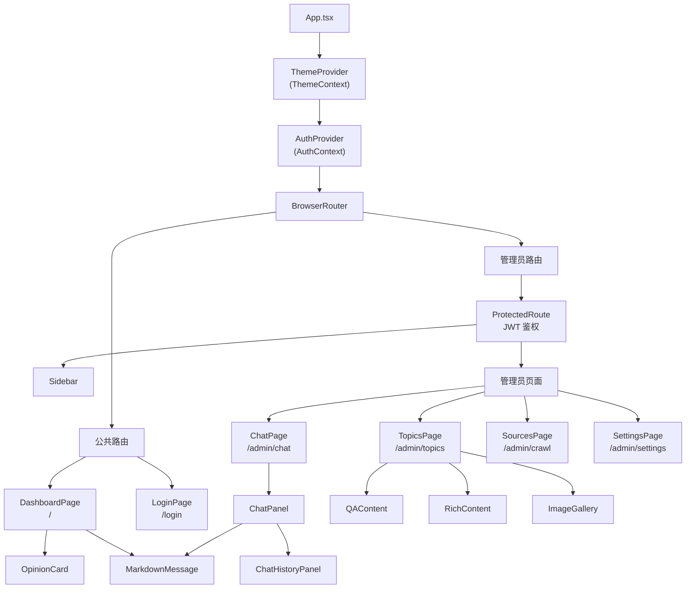
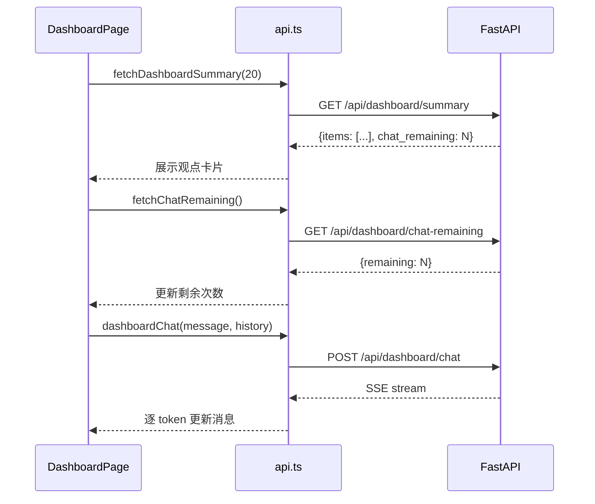
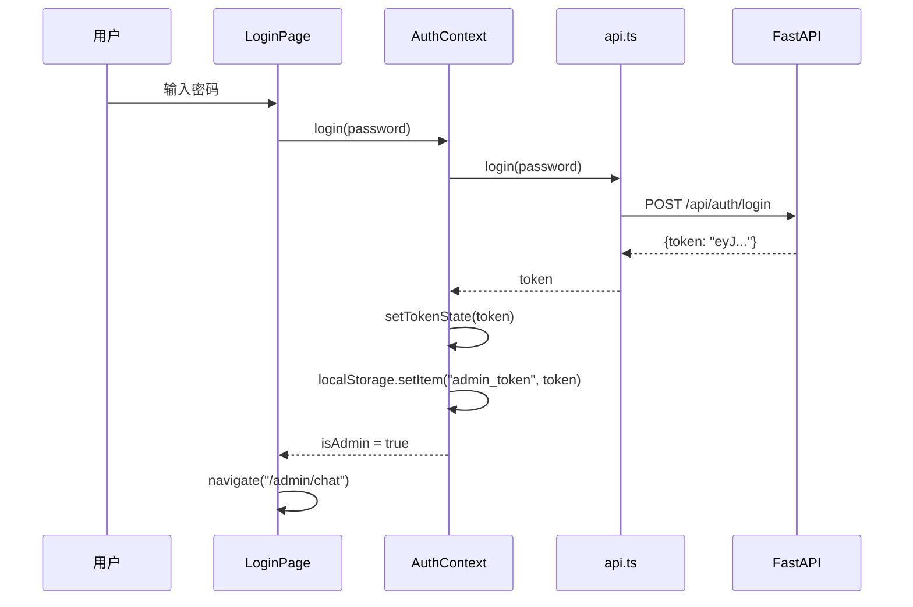

# 前端架构

## 技术栈

| 技术 | 版本 | 用途 |
|------|------|------|
| React | 19.2 | UI 框架，函数组件 + Hooks |
| TypeScript | 6.0 | 类型安全 |
| Vite | 8.0 | 构建工具，开发服务器 |
| Tailwind CSS | 4.3 | 原子化 CSS 框架 |
| react-router-dom | 7.18 | 客户端路由 |
| react-markdown | 10.1 | Markdown 渲染（聊天消息） |
| remark-gfm | 4.0 | GitHub Flavored Markdown 支持 |
| lucide-react | 1.20 | 图标库 |
| @tailwindcss/typography | 0.5 | prose 排版样式 |

## 组件树



## 路由结构

前端使用 React Router v7 定义两级路由结构：

```tsx
// App.tsx 路由定义
<Routes>
  {/* 公共路由 - 无侧边栏 */}
  <Route path="/" element={<DashboardPage />} />
  <Route path="/login" element={<LoginPage />} />

  {/* 管理员路由 - 带侧边栏 */}
  <Route
    path="/admin/*"
    element={
      <ProtectedRoute>
        <div className="flex h-screen overflow-hidden">
          <Sidebar />
          <main className="flex-1 overflow-y-auto">
            <Routes>
              <Route path="/chat" element={<ChatPage />} />
              <Route path="/topics" element={<TopicsPage />} />
              <Route path="/crawl" element={<SourcesPage />} />
              <Route path="/settings" element={<SettingsPage />} />
            </Routes>
          </main>
        </div>
      </ProtectedRoute>
    }
  />
</Routes>
```

| 路径 | 组件 | 权限 | 说明 |
|------|------|------|------|
| `/` | DashboardPage | 公共 | 观点摘要 + 受限问答 |
| `/login` | LoginPage | 公共 | 管理员密码登录 |
| `/admin/chat` | ChatPage | 管理员 | 完整 RAG 问答 |
| `/admin/topics` | TopicsPage | 管理员 | 数据浏览与搜索 |
| `/admin/crawl` | SourcesPage | 管理员 | 爬取任务管理 |
| `/admin/settings` | SettingsPage | 管理员 | 系统配置 |

## 关键页面

### DashboardPage（公共大屏）

公共大屏是系统的默认首页，面向所有访客，无需登录即可访问。

**功能模块**：

1. **统计概览**：4 个指标卡片，展示最新观点数、免费问答次数、各平台内容分布
2. **最新观点**：以卡片网格展示最近 20 条观点摘要，包含平台标签、内容类型、发布时间、点赞数
3. **AI 问答**：受限的 RAG 问答区域，支持多轮对话，IP 每日限额 10 次

**数据流**：



### ChatPanel（管理员问答）

管理员问答面板由 `ChatPanel` 组件实现，与公共问答的主要区别：

- 无次数限制
- 左侧集成 `ChatHistoryPanel` 对话历史管理
- 通过 JWT Token 认证调用 `/api/chat` 接口

### TopicsPage（数据浏览）

展示 SQLite 中存储的所有主题数据，支持：

- 按平台筛选（知乎 / 知识星球）
- 按内容类型筛选（文章 / 回答 / 想法 / 问答）
- 关键词搜索
- 分页浏览
- 查看评论详情

### SourcesPage（数据采集）

管理爬取任务的页面，支持：

- 查看已配置的平台列表
- 触发全量 / 单平台爬取（异步后台任务）
- 查看爬取历史记录（CrawlTask 列表）
- 实时显示爬取进度

### SettingsPage（系统设置）

提供 Web 界面修改 `config.json` 中的配置项，包括爬取间隔、模型参数等。

## 样式方案

### Glassmorphism 设计系统

系统采用毛玻璃（Glassmorphism）视觉风格，通过 Tailwind CSS v4 的 `@utility` 语法定义了 4 个自定义工具类：

```css
/* index.css */

@utility glass {
  background: oklch(1 0 0 / 0.7);
  backdrop-filter: blur(24px) saturate(1.2);
  border: 1px solid oklch(1 0 0 / 0.2);
}

@utility glass-dark {
  background: oklch(0.14 0 0 / 0.65);
  backdrop-filter: blur(24px) saturate(1.2);
  border: 1px solid oklch(1 0 0 / 0.08);
}

@utility glass-card {
  background: oklch(1 0 0 / 0.85);
  backdrop-filter: blur(20px) saturate(1.1);
  border: 1px solid oklch(1 0 0 / 0.5);
  box-shadow: 0 1px 3px oklch(0 0 0 / 0.04), 0 1px 2px oklch(0 0 0 / 0.06);
}

@utility glass-card-dark {
  background: oklch(0.16 0 0 / 0.8);
  backdrop-filter: blur(20px) saturate(1.1);
  border: 1px solid oklch(1 0 0 / 0.1);
  box-shadow: 0 1px 3px oklch(0 0 0 / 0.3), 0 1px 2px oklch(0 0 0 / 0.2);
}
```

| 工具类 | 用途 | 透明度 | 模糊度 |
|--------|------|--------|--------|
| `glass` | 浅色模式下的顶层容器（Header、Sidebar） | 70% | 24px |
| `glass-dark` | 深色模式下的顶层容器 | 65% | 24px |
| `glass-card` | 浅色模式下的卡片组件 | 85% | 20px |
| `glass-card-dark` | 深色模式下的卡片组件 | 80% | 20px |

**使用示例**：

```tsx
<header className="glass dark:glass-dark sticky top-0 z-10">
  <div className="glass-card dark:glass-card-dark rounded-xl p-4">
    {/* 卡片内容 */}
  </div>
</header>
```

### 暗色模式

暗色模式通过 Tailwind 的 `dark:` 变体和自定义 `@custom-variant` 实现：

```css
@custom-variant dark (&:where(.dark, .dark *));
```

配合 `ThemeContext` 在 `<html>` 元素上切换 `dark` class：

```tsx
useEffect(() => {
  const root = document.documentElement
  if (theme === 'dark') {
    root.classList.add('dark')
  } else {
    root.classList.remove('dark')
  }
  localStorage.setItem('theme', theme)
}, [theme])
```

## 暗色模式实现

### ThemeContext

`ThemeContext` 提供全局的主题状态管理：

```tsx
// contexts/ThemeContext.tsx
interface ThemeContextValue {
  theme: Theme  // 'light' | 'dark'
  toggle: () => void
}
```

**初始化逻辑**：

1. 优先读取 `localStorage.getItem('theme')`
2. 若无存储，检测系统偏好 `window.matchMedia('(prefers-color-scheme: dark)')`
3. 每次切换时同步更新 DOM class 和 localStorage

**使用方式**：

```tsx
import { useTheme } from '../contexts/ThemeContext'

function MyComponent() {
  const { theme, toggle } = useTheme()
  return (
    <button onClick={toggle}>
      {theme === 'dark' ? '浅色模式' : '深色模式'}
    </button>
  )
}
```

## SSE 流式处理

### readSSEStream 工具

`readSSEStream` 是封装了 SSE 协议解析的核心工具函数（`frontend/src/utils/sse.ts`）：

```typescript
export async function readSSEStream(
  reader: ReadableStreamDefaultReader<Uint8Array>,
  onChunk: (text: string) => void,
): Promise<string> {
  const decoder = new TextDecoder()
  let fullText = ''
  let done = false

  while (!done) {
    const result = await reader.read()
    if (result.done) break

    const text = decoder.decode(result.value, { stream: true })
    const lines = text.split('\n')

    for (const line of lines) {
      if (!line.startsWith('data: ')) continue
      const data = line.slice(6).trim()
      if (data === '[DONE]') {
        done = true
        break
      }
      if (data) {
        fullText += data
        onChunk(fullText)  // 回调累计文本
      }
    }
  }

  return fullText
}
```

**关键设计**：

- `onChunk` 回调接收**累计完整文本**（而非增量），方便直接替换状态
- 正确处理 `[DONE]` 终止信号
- 使用 `stream: true` 解码器处理跨 chunk 的多字节字符

### 聊天组件中的 SSE 使用

```tsx
// ChatPanel.tsx 中的流式读取
const reader = res.body.getReader()
const fullText = await readSSEStream(reader, (text) => {
  setMessages((prev) => {
    const updated = [...prev]
    updated[updated.length - 1] = { role: 'assistant', content: text }
    return updated
  })
})
```

## 对话历史持久化

### chatHistory 工具

对话历史存储在浏览器 `localStorage` 中，按作用域（`public` / `admin`）隔离（`frontend/src/utils/chatHistory.ts`）。

**数据结构**：

```typescript
interface ChatSession {
  id: string       // 基于时间戳 + 随机数生成
  title: string    // 从第一条用户消息截取（最多 30 字符）
  messages: { role: string; content: string }[]
  createdAt: number
  updatedAt: number
}
```

**存储 Key**：

- 公共访客：`chat_sessions_public`
- 管理员：`chat_sessions_admin`

**API 方法**：

| 方法 | 说明 |
|------|------|
| `loadSessions(scope)` | 加载所有会话，按更新时间倒序 |
| `createSession(scope, messages)` | 创建新会话并持久化 |
| `updateSession(scope, sessionId, messages)` | 更新已有会话 |
| `deleteSession(scope, sessionId)` | 删除会话 |

**限制**：最多保留 50 个历史会话（`MAX_SESSIONS = 50`）。

## 认证状态管理

### AuthContext

`AuthContext` 管理管理员登录状态（`frontend/src/contexts/AuthContext.tsx`）：

```tsx
interface AuthContextType {
  token: string | null
  isAdmin: boolean       // token !== null
  login: (password: string) => Promise<void>
  logout: () => void
}
```

**认证流程**：



**Token 同步**：`AuthContext` 通过 `useEffect` 将 token 同步到 `api.ts` 模块中的 `_token` 变量，所有后续 API 请求自动附加 `Authorization: Bearer <token>` 头。

**启动验证**：页面加载时自动检查已存储 token 的有效性：

```tsx
useEffect(() => {
  if (!token) return
  checkAuth(token)
    .then(() => {})
    .catch(() => {
      setTokenState(null)
      localStorage.removeItem(TOKEN_KEY)
    })
}, [token])
```

### ProtectedRoute

`ProtectedRoute` 组件保护管理员路由，未认证时重定向到登录页：

```tsx
<ProtectedRoute>
  <div className="flex h-screen overflow-hidden">
    <Sidebar />
    <main>{/* 管理员页面 */}</main>
  </div>
</ProtectedRoute>
```

## API 请求封装

`services/api.ts` 提供统一的 HTTP 请求封装：

```typescript
async function request<T>(url: string, options?: RequestInit): Promise<T> {
  const headers: Record<string, string> = { 'Content-Type': 'application/json' }
  if (_token) headers['Authorization'] = `Bearer ${_token}`

  const res = await fetch(`${BASE}${url}`, { ...options, headers })
  if (!res.ok) {
    const err = await res.json().catch(() => ({ detail: res.statusText }))
    throw new Error(err.detail || 'Request failed')
  }
  return res.json()
}
```

**图片代理**：为绕过知识星球和知乎的防盗链机制，图片 URL 通过后端代理加载：

```typescript
export function proxiedImageUrl(url: string): string {
  if (url.includes('zsxq.com') || url.includes('zhimg.com')) {
    return `${BASE}/proxy/image?url=${encodeURIComponent(url)}`
  }
  return url
}
```

## 左侧导航栏

`Sidebar` 组件为管理员后台提供固定宽度（224px）的侧边导航：

```tsx
const navItems = [
  { to: '/admin/chat',    icon: MessageSquare, label: '问答' },
  { to: '/admin/topics',  icon: FileText,      label: '数据浏览' },
  { to: '/admin/crawl',   icon: RefreshCw,     label: '数据采集' },
  { to: '/admin/settings', icon: Settings,      label: '设置' },
]
```

底部操作区包含：返回公共大屏、切换暗色模式、退出登录。
