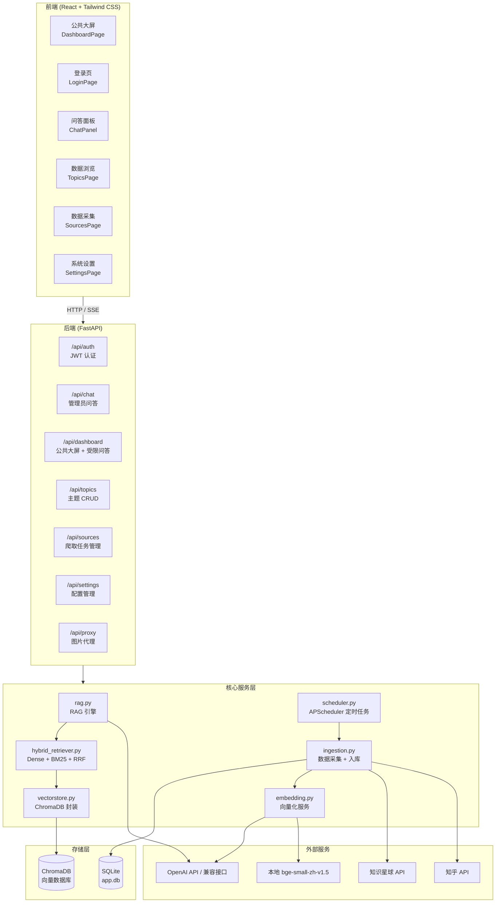
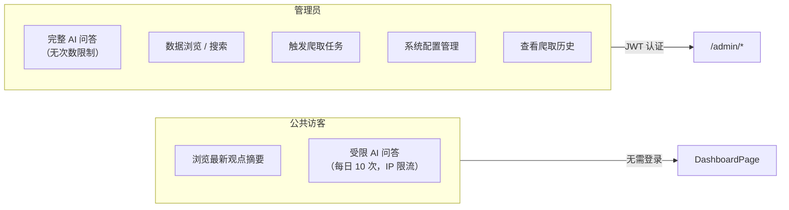
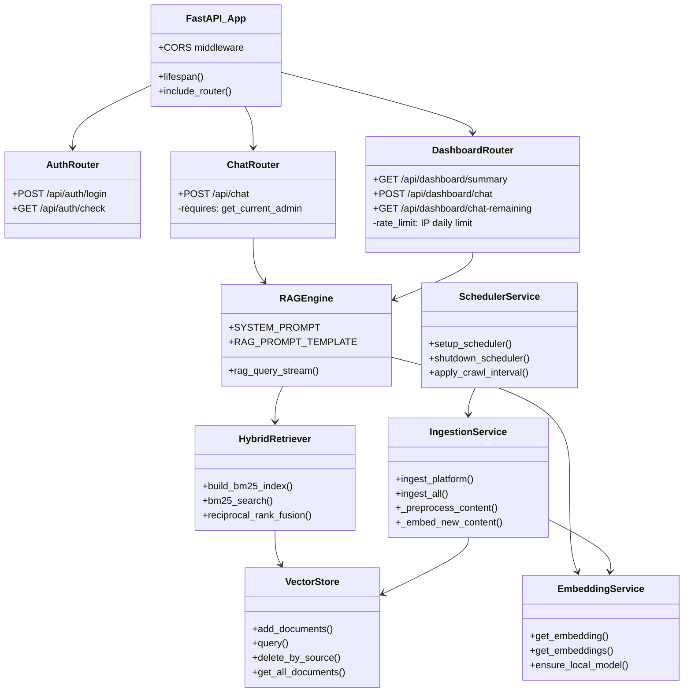

# 系统架构概览

Dungeon Lord 是一套面向财经领域大V观点分析的 RAG（Retrieval-Augmented Generation）问答系统。系统自动从知乎、知识星球等平台采集目标作者的公开内容，经过文本预处理、语义切分、向量化后存入向量数据库，最终通过混合检索 + LLM 流式生成为用户提供智能问答服务。

## 高层架构



## 两角色模型

系统采用简洁的两角色权限模型，区分公共访客和管理员：



| 能力 | 公共访客 | 管理员 |
|------|---------|--------|
| 查看观点摘要 | 是 | 是 |
| AI 问答 | 受限（IP 每日上限） | 无限制 |
| 数据浏览与搜索 | 否 | 是 |
| 触发爬取任务 | 否 | 是 |
| 系统设置 | 否 | 是 |

## 关键设计决策

### SSE 流式响应

所有问答接口采用 **Server-Sent Events (SSE)** 流式返回，而非一次性返回完整响应：

- **后端**：使用 `StreamingResponse` 以 `text/event-stream` 媒体类型逐 token 推送
- **前端**：通过 `ReadableStream` reader 逐行解析 `data:` 前缀的事件行
- **终止信号**：`data: [DONE]\n\n` 标记流结束

参考后端实现（`backend/app/routers/chat.py`）：

```python
async def event_stream():
    async for text in rag_query_stream(req.message, filters=filters, history=history):
        yield f"data: {text}\n\n"
    yield "data: [DONE]\n\n"

return StreamingResponse(
    event_stream(),
    media_type="text/event-stream",
    headers={"Cache-Control": "no-cache", "X-Accel-Buffering": "no"},
)
```

### JWT 认证

管理员通过密码登录获取 JWT Token，前端将其存储在 `localStorage` 并附加到请求头：

- 算法：HS256
- 有效期：可配置（默认 24 小时）
- 依赖注入：`get_current_admin`（强制认证）和 `optional_admin`（可选认证）

### IP 级速率限制

公共问答接口基于客户端 IP 进行每日配额限制：

- 存储：内存字典 `_chat_usage: dict[str, dict[str, int]]`
- 限制：可配置的 `public_chat_daily_limit`（默认 10 次/天）
- 超限返回 HTTP 429

## 组件关系图



## 项目目录结构

```
dungeon-lord/
├── backend/                        # 后端 Python 项目
│   ├── app/
│   │   ├── __init__.py
│   │   ├── main.py                 # FastAPI 入口，lifespan，路由注册
│   │   ├── config.py               # 配置管理（单例，热更新）
│   │   ├── database.py             # SQLAlchemy async engine + session
│   │   ├── models.py               # ORM 模型：Topic, Comment, CrawlTask, SemanticChunk
│   │   ├── auth.py                 # JWT 认证：create_token, get_current_admin
│   │   ├── routers/                # API 路由层
│   │   │   ├── auth.py             # /api/auth - 登录 / token 验证
│   │   │   ├── chat.py             # /api/chat - 管理员 RAG 问答（SSE）
│   │   │   ├── dashboard.py        # /api/dashboard - 公共大屏 + 受限问答
│   │   │   ├── topics.py           # /api/topics - 主题数据 CRUD
│   │   │   ├── sources.py          # /api/sources - 爬取任务管理
│   │   │   ├── settings.py         # /api/settings - 配置读写
│   │   │   └── proxy.py            # /api/proxy - 图片防盗链代理
│   │   ├── services/               # 核心业务逻辑
│   │   │   ├── rag.py              # RAG 问答引擎（SSE 流式）
│   │   │   ├── hybrid_retriever.py # 混合检索：BM25 + Dense + RRF
│   │   │   ├── embedding.py        # Embedding 服务（OpenAI / 本地 BGE）
│   │   │   ├── vectorstore.py      # ChromaDB 向量存储封装
│   │   │   ├── ingestion.py        # 数据采集 + 预处理 + 入库
│   │   │   └── task_manager.py     # 后台任务管理
│   │   ├── crawlers/               # 平台爬虫
│   │   │   ├── base.py             # 爬虫抽象基类
│   │   │   ├── zsxq.py             # 知识星球爬虫
│   │   │   └── zhihu.py            # 知乎爬虫
│   │   └── utils/                  # 工具模块
│   │       ├── text.py             # 文本切分（chunk_size=500, overlap=80）
│   │       └── scheduler.py        # APScheduler 定时任务
│   ├── config.json                 # 运行时配置（git ignored）
│   ├── config.example.json         # 配置模板
│   └── pyproject.toml              # Python 依赖声明
│
├── frontend/                       # 前端 React 项目
│   ├── src/
│   │   ├── main.tsx                # 入口
│   │   ├── App.tsx                 # 路由定义
│   │   ├── index.css               # Tailwind + glassmorphism 工具类
│   │   ├── pages/                  # 页面组件
│   │   │   ├── DashboardPage.tsx   # 公共大屏（观点摘要 + 受限问答）
│   │   │   ├── LoginPage.tsx       # 管理员登录
│   │   │   ├── ChatPage.tsx        # 管理员问答页
│   │   │   ├── TopicsPage.tsx      # 数据浏览
│   │   │   ├── SourcesPage.tsx     # 数据采集管理
│   │   │   └── SettingsPage.tsx    # 系统设置
│   │   ├── components/             # 可复用组件
│   │   │   ├── auth/ProtectedRoute.tsx
│   │   │   ├── chat/ChatPanel.tsx
│   │   │   ├── chat/ChatHistoryPanel.tsx
│   │   │   ├── chat/MarkdownMessage.tsx
│   │   │   ├── content/QAContent.tsx
│   │   │   ├── content/RichContent.tsx
│   │   │   ├── content/ImageGallery.tsx
│   │   │   └── layout/Sidebar.tsx
│   │   ├── contexts/               # React Context
│   │   │   ├── AuthContext.tsx      # 认证状态管理
│   │   │   └── ThemeContext.tsx     # 暗色模式管理
│   │   ├── services/
│   │   │   └── api.ts              # HTTP 请求封装
│   │   ├── utils/
│   │   │   ├── sse.ts              # SSE 流读取工具
│   │   │   └── chatHistory.ts      # 对话历史 localStorage 管理
│   │   └── types/
│   │       └── index.ts            # TypeScript 类型定义
│   ├── package.json
│   └── vite.config.ts
│
├── data/                           # 运行时数据（git ignored）
│   ├── app.db                      # SQLite 数据库
│   └── chroma/                     # ChromaDB 持久化目录
│
├── scripts/                        # 辅助脚本
│   ├── zhihu_crawl_answers.js
│   └── zhihu_sign.js
│
└── package.json                    # monorepo 根 package.json
```

## 技术栈总览

| 层级 | 技术选型 | 说明 |
|------|---------|------|
| 前端框架 | React 19 + TypeScript | SPA，Vite 构建 |
| 样式方案 | Tailwind CSS v4 | 自定义 glassmorphism 工具类 |
| 路由 | react-router-dom v7 | 嵌套路由，ProtectedRoute 鉴权 |
| Markdown 渲染 | react-markdown v10 + remark-gfm | 聊天消息渲染 |
| 图标库 | lucide-react | 轻量级图标 |
| 后端框架 | FastAPI | 异步 Python Web 框架 |
| ORM | SQLAlchemy 2 (async) | aiosqlite 驱动 |
| 向量数据库 | ChromaDB | 持久化存储，HNSW cosine 空间 |
| Embedding | OpenAI API / bge-small-zh-v1.5 | 双模式可切换 |
| 任务调度 | APScheduler | Cron + Interval 两种触发器 |
| 认证 | python-jose (JWT) | HS256 算法 |
| 爬虫 | httpx (async HTTP) | 支持重试、限流、增量爬取 |
