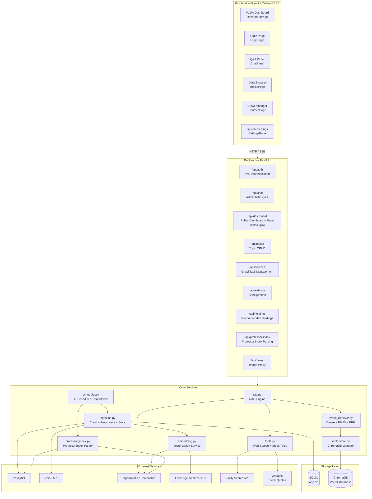
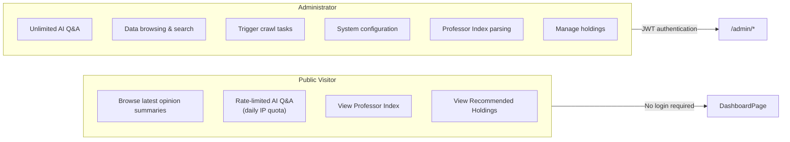

# Architecture Overview

Dungeon Lord is a financial KOL (Key Opinion Leader) opinion analysis and RAG (Retrieval-Augmented Generation) Q&A system. It automatically crawls public content from platforms like Zsxq (知识星球) and Zhihu (知乎), processes text through cleaning, semantic chunking, and vectorization, stores embeddings in a vector database, and delivers intelligent Q&A via hybrid retrieval combined with LLM streaming generation.

## High-Level Architecture



## Two-Role Model

The system uses a simple two-role permission model, distinguishing between public visitors and administrators:



| Capability | Public Visitor | Administrator |
|-----------|---------------|---------------|
| View opinion summaries | Yes | Yes |
| AI Q&A | Rate-limited (IP daily cap) | Unlimited |
| View Professor Index | Yes | Yes |
| View recommended holdings | Yes | Yes |
| Data browsing and search | No | Yes |
| Trigger crawl tasks | No | Yes |
| Professor Index parsing | No | Yes |
| System settings | No | Yes |

## Key Design Decisions

### SSE Streaming

All Q&A endpoints use **Server-Sent Events (SSE)** for real-time streaming instead of returning complete responses:

- **Backend**: Uses `StreamingResponse` with `text/event-stream` media type, pushing tokens incrementally.
- **Frontend**: Parses `data:` prefixed event lines via `ReadableStream` reader.
- **Termination signal**: `data: [DONE]\n\n` marks the end of the stream.

Reference implementation from `backend/app/routers/chat.py`:

```python
async def event_stream():
    async for text in rag_query_stream(req.message, filters=filters, history=history):
        yield f"data: {text}\n\n"
    yield "data: [DONE]\n\n"

return StreamingResponse(
    event_stream(),
    media_type="text/event-stream",
    headers={"Cache-Control": "no-cache", "X-Accel-Buffering": "no"},
)
```

### JWT Authentication

Administrators obtain a JWT token via password login. The frontend stores it in `localStorage` and attaches it to subsequent requests:

- **Algorithm**: HS256
- **Expiration**: Configurable (default 24 hours)
- **Dependency injection**: `get_current_admin` (mandatory) and `optional_admin` (optional)

### IP-Level Rate Limiting

The public Q&A endpoint enforces a per-client-IP daily quota:

- **Storage**: In-memory dictionary `_chat_usage: dict[str, dict[str, int]]`
- **Limit**: Configurable `public_chat_daily_limit` (default 10 requests/day)
- **Response on excess**: HTTP 429 Too Many Requests

## Component Relationship Diagram

```mermaid
classDiagram
    class FastAPI_App {
        +lifespan()
        +CORS middleware
        +include_router()
    }

    class AuthRouter {
        +POST /api/auth/login
        +GET /api/auth/check
    }

    class ChatRouter {
        +POST /api/chat
        -requires: get_current_admin
    }

    class DashboardRouter {
        +GET /api/dashboard/summary
        +POST /api/dashboard/chat
        +GET /api/dashboard/chat-remaining
        +GET /api/dashboard/holdings
        +GET /api/dashboard/professor-index
        -rate_limit: IP daily limit
    }

    class HoldingsRouter {
        +GET /api/holdings
        +POST /api/holdings/generate
        +DELETE /api/holdings/{id}
        -requires: get_current_admin
    }

    class ProfessorIndexRouter {
        +POST /api/professor-index/parse
        +GET /api/professor-index/parse/status
        +GET /api/professor-index/parse/history
        +PUT /api/professor-index/interval
        -requires: get_current_admin
    }

    class RAGEngine {
        +rag_query_stream()
        +SYSTEM_PROMPT
        +RAG_PROMPT_TEMPLATE
    }

    class HybridRetriever {
        +build_bm25_index()
        +bm25_search()
        +reciprocal_rank_fusion()
    }

    class EmbeddingService {
        +get_embedding()
        +get_embeddings()
        +ensure_local_model()
    }

    class VectorStore {
        +add_documents()
        +query()
        +delete_by_source()
        +get_all_documents()
    }

    class IngestionService {
        +ingest_platform()
        +ingest_all()
        +_preprocess_content()
        +_embed_new_content()
    }

    class ToolsService {
        +web_search()
        +get_stock_quote()
        +get_market_overview()
    }

    class ProfessorIndexService {
        +parse_snapshots_from_zsxq()
        +run_parse_task()
    }

    class SchedulerService {
        +setup_scheduler()
        +shutdown_scheduler()
        +apply_crawl_interval()
    }

    FastAPI_App --> AuthRouter
    FastAPI_App --> ChatRouter
    FastAPI_App --> DashboardRouter
    FastAPI_App --> HoldingsRouter
    FastAPI_App --> ProfessorIndexRouter
    ChatRouter --> RAGEngine
    DashboardRouter --> RAGEngine
    RAGEngine --> HybridRetriever
    RAGEngine --> EmbeddingService
    RAGEngine --> ToolsService
    HybridRetriever --> VectorStore
    IngestionService --> EmbeddingService
    IngestionService --> VectorStore
    ProfessorIndexService --> IngestionService
    SchedulerService --> IngestionService
    SchedulerService --> ProfessorIndexService
```

## Project Directory Structure

```
dungeon-lord/
├── backend/                        # Python backend project
│   ├── app/
│   │   ├── __init__.py
│   │   ├── main.py                 # FastAPI entry point, lifespan, router registration
│   │   ├── config.py               # Configuration singleton with hot-reload from config.json
│   │   ├── database.py             # SQLAlchemy async engine + session factory
│   │   ├── models.py               # ORM models: Topic, Comment, CrawlTask, SemanticChunk,
│   │   │                           #   RecommendedHolding, ProfessorIndexSnapshot, etc.
│   │   ├── schemas.py              # Pydantic request/response schemas
│   │   ├── auth.py                 # JWT auth: create_token, verify_token, get_current_admin
│   │   ├── routers/                # API route layer
│   │   │   ├── auth.py             # /api/auth — login / token verification
│   │   │   ├── chat.py             # /api/chat — admin RAG Q&A (SSE)
│   │   │   ├── dashboard.py        # /api/dashboard — public dashboard + rate-limited Q&A
│   │   │   ├── topics.py           # /api/topics — topic data CRUD
│   │   │   ├── sources.py          # /api/sources — crawl task management
│   │   │   ├── settings.py         # /api/settings — configuration read/write
│   │   │   ├── holdings.py         # /api/holdings — recommended holdings management
│   │   │   ├── professor_index.py  # /api/professor-index — parse tasks + interval config
│   │   │   └── proxy.py            # /api/proxy — anti-hotlink image proxy
│   │   ├── services/               # Core business logic
│   │   │   ├── rag.py              # RAG Q&A engine (SSE streaming)
│   │   │   ├── hybrid_retriever.py # Hybrid retrieval: BM25 + Dense + RRF
│   │   │   ├── embedding.py        # Embedding service (OpenAI / local BGE)
│   │   │   ├── vectorstore.py      # ChromaDB vector storage wrapper
│   │   │   ├── ingestion.py        # Data crawl + preprocess + store pipeline
│   │   │   ├── professor_index.py  # Professor Index multimodal LLM parsing
│   │   │   ├── holdings_generator.py # AI-generated recommended holdings
│   │   │   ├── tools.py            # Tool-calling: web search, stock quotes
│   │   │   ├── llm_client.py       # OpenAI-compatible LLM client
│   │   │   ├── task_manager.py     # Background task management
│   │   │   └── audit.py            # Audit logging
│   │   ├── crawlers/               # Platform crawlers
│   │   │   ├── base.py             # Abstract base crawler
│   │   │   ├── zsxq.py             # Zsxq (知识星球) crawler
│   │   │   └── zhihu.py            # Zhihu (知乎) crawler
│   │   └── utils/                  # Utility modules
│   │       ├── text.py             # Text chunking (chunk_size=500, overlap=80)
│   │       ├── streaming.py        # SSE streaming helpers
│   │       └── scheduler.py        # APScheduler setup
│   ├── scripts/
│   │   └── migrate_zsxq_xml.py     # Data migration script
│   ├── config.json                 # Runtime configuration (git-ignored)
│   ├── config.example.json         # Configuration template
│   └── pyproject.toml              # Python dependency declarations
│
├── frontend/                       # React frontend project
│   ├── src/
│   │   ├── main.tsx                # Entry point
│   │   ├── App.tsx                 # Route definitions
│   │   ├── index.css               # Tailwind + glassmorphism utility classes
│   │   ├── pages/                  # Page components
│   │   │   ├── DashboardPage.tsx   # Public dashboard (opinions + rate-limited Q&A)
│   │   │   ├── LoginPage.tsx       # Admin login
│   │   │   ├── ChatPage.tsx        # Admin Q&A page
│   │   │   ├── TopicsPage.tsx      # Data browser
│   │   │   ├── SourcesPage.tsx     # Crawl management
│   │   │   └── SettingsPage.tsx    # System settings
│   │   ├── components/             # Reusable components
│   │   │   ├── auth/ProtectedRoute.tsx
│   │   │   ├── chat/ChatPanel.tsx
│   │   │   ├── chat/ChatHistoryPanel.tsx
│   │   │   ├── chat/MarkdownMessage.tsx
│   │   │   ├── chat/CopyButton.tsx
│   │   │   ├── content/QAContent.tsx
│   │   │   ├── content/RichContent.tsx
│   │   │   ├── content/ImageGallery.tsx
│   │   │   ├── layout/Sidebar.tsx
│   │   │   ├── DonutChart.tsx
│   │   │   ├── Logo.tsx
│   │   │   └── ErrorBoundary.tsx
│   │   ├── contexts/               # React Context providers
│   │   │   ├── AuthContext.tsx      # Authentication state management
│   │   │   └── ThemeContext.tsx     # Dark mode management
│   │   ├── services/
│   │   │   └── api.ts              # HTTP request wrapper
│   │   ├── utils/
│   │   │   ├── sse.ts              # SSE stream reader utility
│   │   │   ├── chatHistory.ts      # Chat session localStorage persistence
│   │   │   └── visitor.ts          # Public visitor ID management
│   │   └── types/
│   │       └── index.ts            # TypeScript type definitions
│   ├── package.json
│   └── vite.config.ts
│
├── data/                           # Runtime data (git-ignored)
│   ├── app.db                      # SQLite database
│   └── chroma/                     # ChromaDB persistence directory
│
├── docs/                           # Docusaurus documentation site
│   ├── docs/
│   │   ├── architecture/           # Architecture documentation
│   │   ├── features/               # Feature documentation
│   │   ├── rag/                    # RAG system documentation
│   │   ├── api/                    # API reference
│   │   ├── guides/                 # Getting started guides
│   │   └── advanced/               # Advanced topics
│   ├── src/
│   ├── docusaurus.config.ts
│   └── sidebars.ts
│
└── package.json                    # Monorepo root package.json
```

## Technology Stack

| Layer | Technology | Purpose |
|-------|-----------|---------|
| Frontend framework | React 19 + TypeScript | SPA with function components and Hooks |
| Build tool | Vite 8 | Development server, optimized production builds |
| CSS framework | Tailwind CSS v4 | Utility-first styling with custom glassmorphism classes |
| Client-side routing | react-router-dom v7 | Nested routes, `ProtectedRoute` for admin guard |
| Markdown rendering | react-markdown v10 + remark-gfm | Chat message rendering with GFM support |
| Icon library | lucide-react | Lightweight icon set |
| Backend framework | FastAPI | Async Python web framework with auto-generated OpenAPI docs |
| ORM | SQLAlchemy 2 (async) | `aiosqlite` driver, mapped columns, relationship loading |
| Vector database | ChromaDB | Persistent HNSW cosine-space vector index |
| Embedding (remote) | OpenAI API | `text-embedding-3-small` (1536-dim) |
| Embedding (local) | sentence-transformers | `bge-small-zh-v1.5` (512-dim), Chinese-optimized |
| Sparse retrieval | rank-bm25 | BM25Okapi with n-gram tokenization |
| LLM | OpenAI-compatible API | Streaming chat completions, `temperature=0.3` |
| Task scheduling | APScheduler | Cron + interval triggers via `AsyncIOScheduler` |
| Authentication | python-jose (JWT) | HS256 algorithm, configurable expiration |
| HTTP client (crawlers) | httpx | Async HTTP with retry, rate limiting, incremental crawling |
| Tools | Tavily, yfinance | Web search and stock quote retrieval for LLM tool-calling |
