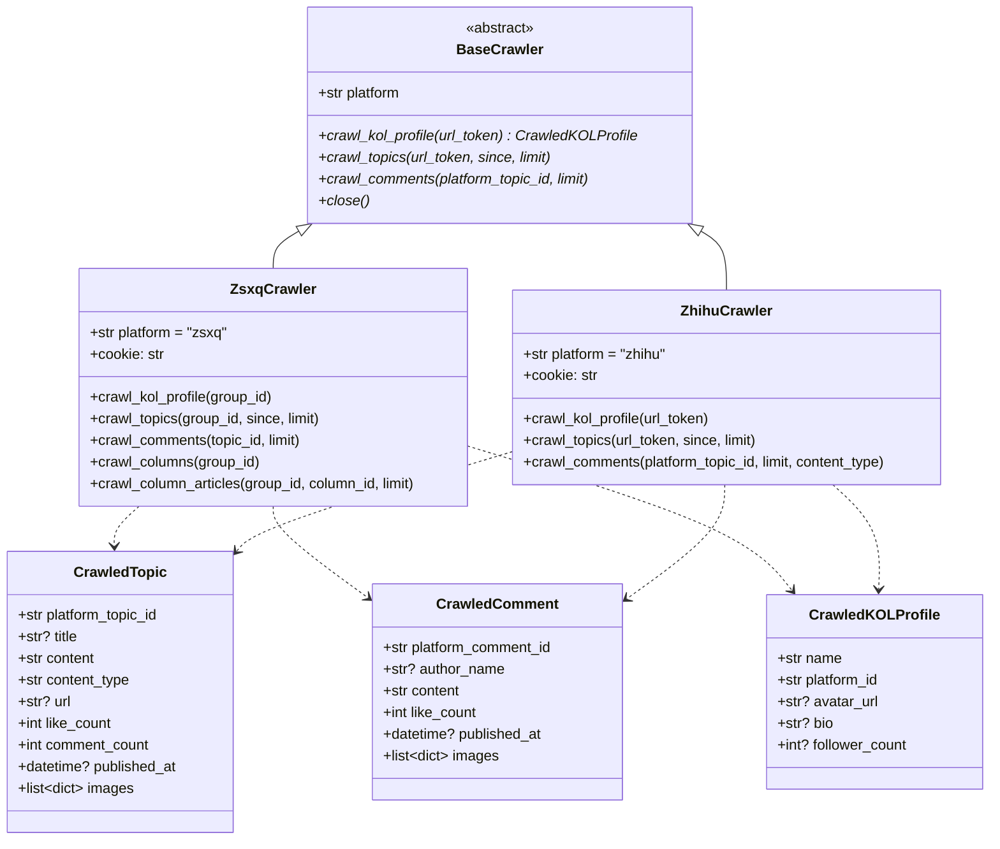
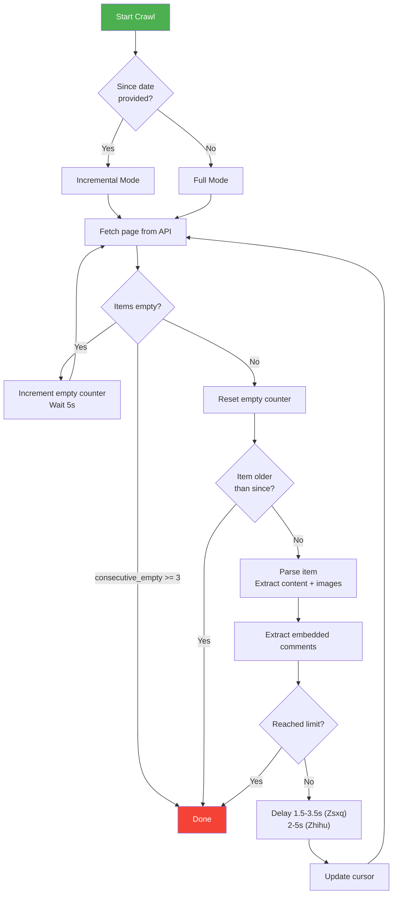
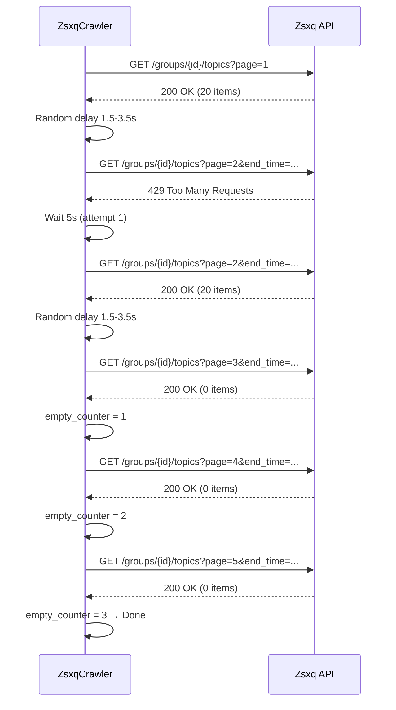
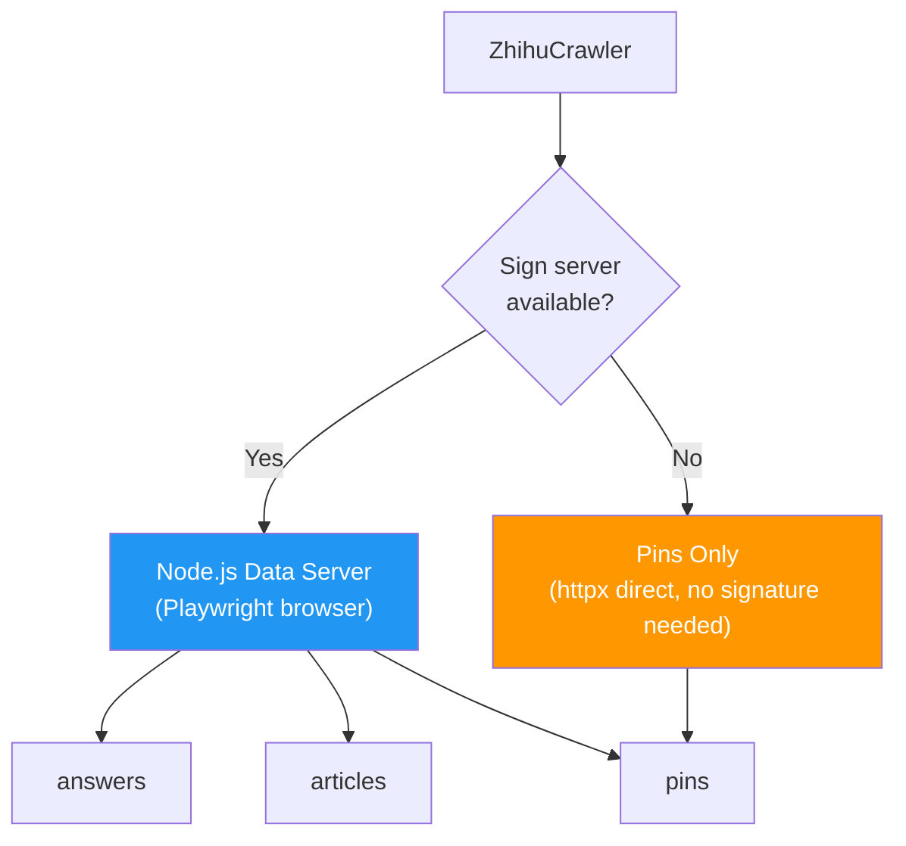

# Crawler System

The crawler system extracts financial KOL content from two Chinese platforms: **Zsxq** (知识星球) and **Zhihu** (知乎). Each platform has distinct authentication mechanisms, API structures, and anti-scraping measures, handled through a unified abstraction layer.

---

## Architecture



---

## Crawl Lifecycle

Both crawlers follow the same high-level lifecycle:



### Key Behaviors

| Behavior | Description |
|----------|-------------|
| **Incremental crawl** | When `since` is provided, stops as soon as it encounters content older than the threshold |
| **Full crawl** | Without `since`, crawls all available content up to the limit |
| **Empty page tolerance** | 3 consecutive empty pages = crawl complete |
| **Embedded comments** | Comments visible in topic list responses are extracted alongside topics (no extra API calls) |
| **Rate limiting** | Random delay between requests to avoid triggering anti-scraping |

---

## Zsxq (知识星球)

### Authentication

Zsxq uses **Cookie-based authentication**. There is no public API -- all requests go through internal endpoints that expect a valid session cookie.

| Parameter | Source |
|-----------|--------|
| `Cookie` | `settings.zsxq_cookie` (from `config.json`) |
| `Origin` | `https://wx.zsxq.com` |
| `Referer` | `https://wx.zsxq.com/` |

:::warning Cookie Expiry
Zsxq cookies expire periodically. When a `401` or `403` response is received, the crawler raises an authentication error immediately rather than retrying.
:::

### API Endpoints

| Endpoint | Method | Description |
|----------|--------|-------------|
| `/v2/groups/{group_id}` | GET | Group (KOL) profile info |
| `/v2/groups/{group_id}/topics` | GET | Topic list with cursor pagination |
| `/v2/topics/{topic_id}` | GET | Single topic detail |
| `/v2/topics/{topic_id}/comments` | GET | Topic comments (paginated) |
| `/v2/groups/{group_id}/columns` | GET | List of column (专栏) categories |
| `/v2/groups/{group_id}/columns/{column_id}/topics` | GET | Articles within a column |

### Content Types

| Type | Description | Extraction |
|------|-------------|------------|
| `q&a` | Question and answer pairs | Concatenates `[提问]` and `[回答]` labels with text |
| `talk` | Short posts / thoughts | Extracts `talk.text` and images |
| `article` | Long-form column articles | Fetches full HTML from `articles.zsxq.com` |

### Pagination

Zsxq uses **cursor-based pagination** via the `end_time` parameter:

```
GET /v2/groups/{group_id}/topics?scope=all&count=20&end_time={create_time_of_last_item}
```

The `create_time` of the last item in each page becomes the cursor for the next request. Crawling proceeds until:
- The `since` threshold is reached (incremental mode)
- 3 consecutive empty pages are returned
- The `limit` is reached

### Column Articles

Column articles are the most authoritative content type. The crawler:

1. Lists all columns via `/groups/{group_id}/columns`
2. For each column, fetches article summaries via `/groups/{group_id}/columns/{column_id}/topics`
3. For each article, fetches the topic detail to obtain the `article_id`
4. Fetches the full HTML content from `https://articles.zsxq.com/id_{article_id}.html`
5. Extracts text and images from the `ql-editor` div

### XML Tag Conversion

Zsxq uses custom XML-like tags in its content. The `zsxq_xml_to_html()` function converts these to standard HTML:

| Zsxq Tag | Converted To | Example |
|----------|-------------|---------|
| `<e type="text_bold" title="..." />` | `<strong>decoded text</strong>` | Bold text |
| `<e type="web" href="..." title="..." />` | `<a href="decoded URL">decoded title</a>` | Hyperlinks |
| `<e type="mention" uid="..." title="@user" />` | `<strong>@user</strong>` | User mentions |
| `<e type="hashtag" hid="..." title="#topic#" />` | `<strong>#topic#</strong>` | Hashtags |

Both self-closing (`<e ... />`) and open-close (`<e ...>text</e>`) forms are handled:

```python
def zsxq_xml_to_html(text: str) -> str:
    # 1) Open-close: <e type="text_bold">inner text</e>
    text = re.sub(
        r'<e\s+([^>]*)>(.+?)</e>',
        _replace_open_close,
        text,
        flags=re.DOTALL,
    )
    # 2) Self-closing: <e type="web" href="..." title="..." />
    text = re.sub(r'<e\s+([^>]*)\s*/>', _replace_self_closing, text)
    return text
```

:::info URL Decoding
The `href` and `title` attributes in Zsxq tags are URL-encoded. The conversion function applies `urllib.parse.unquote()` to decode them back to readable text.
:::

### Rate Limiting and Retry

| Parameter | Value |
|-----------|-------|
| Request delay | 1.5 -- 3.5 seconds (random) |
| Max retries | 3 |
| Backoff base | 5 seconds |
| Backoff formula | `5 * 2^(attempt - 1)` seconds |
| Retry triggers | HTTP 429, 5xx, `ConnectError`, `ReadTimeout` |
| Immediate fail | HTTP 401, 403 (authentication error) |



---

## Zhihu (知乎)

### Authentication

Zhihu requires two authentication components:

| Component | Purpose |
|-----------|---------|
| `Cookie` | Session authentication (from `config.json`) |
| `x-zse-96` | Request signature (anti-tampering) |

The `x-zse-96` signature involves Zhihu's custom SM4 encryption algorithm, which is not trivially replicable in Python. The system uses a **Node.js sign server** to compute valid signatures.

### Dual Strategy: API + Browser

Due to Zhihu's TLS fingerprint detection (which blocks `httpx` requests), the crawler uses two strategies:



**Primary path -- Node.js data server:**
- A separate Node.js service running Playwright handles all content types
- The browser automatically processes TLS fingerprints and JavaScript-rendered signatures
- Content is fetched via `POST /crawl/{tab}` where `tab` is `answers`, `articles`, or `pins`

**Fallback path -- Direct httpx:**
- When the sign server is unavailable, only `pins` are crawled (no signature required)
- The `_check_api()` method tests availability once on first use

### Content Types

| Type | Description | URL Pattern |
|------|-------------|-------------|
| `answer` | Answers to questions | `zhihu.com/question/{qid}/answer/{aid}` |
| `article` | Standalone articles | `zhihu.com/p/{aid}` |
| `pin` | Short posts (similar to tweets) | `zhihu.com/pin/{pid}` |

### API Endpoints

| Endpoint | Auth Required | Description |
|----------|--------------|-------------|
| `/v4/members/{url_token}` | Cookie only | User profile |
| `/v4/members/{url_token}/answers` | x-zse-96 | Paginated answers |
| `/v4/members/{url_token}/articles` | x-zse-96 | Paginated articles |
| `/v4/members/{url_token}/pins` | Cookie only | Paginated pins |
| `/v4/answers/{id}` | x-zse-96 | Single answer with full content |
| `/v4/articles/{id}` | x-zse-96 | Single article with full content |
| `/v4/pins/{id}/comments` | Cookie only | Pin comments |

### Pagination

Zhihu uses **offset-based pagination**:

```
GET /v4/members/{url_token}/answers?limit=20&offset=0&sort_by=created
```

The `offset` increments by the number of items received. Crawling stops when:
- `paging.is_end` is `true`
- The `since` timestamp threshold is reached
- 3 consecutive empty pages are returned
- The `limit` is reached

### Sign Server Integration

The Node.js sign server provides two capabilities:

1. **Signature generation** (`POST /sign`): Computes `x-zse-96` for API requests
2. **Data crawling** (`POST /crawl/{tab}`): Uses Playwright to crawl content directly from Zhihu pages, bypassing all anti-scraping measures

```python
async def _request_sign_from_server(url_path: str) -> str | None:
    server = settings.zhihu_sign_server
    if not server:
        return None
    async with httpx.AsyncClient(timeout=5) as client:
        resp = await client.post(
            f"{server}/sign",
            json={"path": url_path, "authorization": "", "uuid": ""},
        )
        if resp.status_code == 200:
            return resp.text.strip().strip('"')
    return None
```

### Rate Limiting and Retry

| Parameter | Value |
|-----------|-------|
| Request delay | 2.0 -- 5.0 seconds (random) |
| Max retries | 3 |
| Backoff base | 5 seconds |
| Sign server timeout | 5 seconds |
| Playwright page timeout | 30 seconds |

The retry logic is identical to Zsxq: exponential backoff on 429 and 5xx, immediate fail on 401/403.

---

## Comparison Summary

| Feature | Zsxq | Zhihu |
|---------|------|-------|
| **Authentication** | Cookie | Cookie + x-zse-96 signature |
| **API style** | Cursor (`end_time`) | Offset (`offset`) |
| **Content types** | q&a, talk, article | answer, article, pin |
| **Column articles** | Yes (专栏) | No |
| **Custom markup** | XML-like `<e>` tags | Standard HTML |
| **Anti-scraping** | Basic rate limiting | TLS fingerprint, SM4 signature |
| **Browser fallback** | No | Yes (Playwright via Node.js) |
| **Request delay** | 1.5 -- 3.5s | 2.0 -- 5.0s |
| **Embedded comments** | `show_comments` in topic list | Not available in list response |

---

## Code Reference

| File | Responsibility |
|------|---------------|
| `backend/app/crawlers/base.py` | Abstract base class and shared dataclasses |
| `backend/app/crawlers/zsxq.py` | Zsxq crawler: Cookie auth, cursor pagination, XML tag conversion, column articles |
| `backend/app/crawlers/zhihu.py` | Zhihu crawler: Sign server integration, Playwright fallback, offset pagination |
| `backend/app/services/ingestion.py` | Orchestrates crawl calls and feeds data into the ingestion pipeline |
