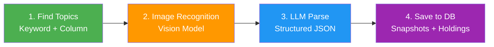
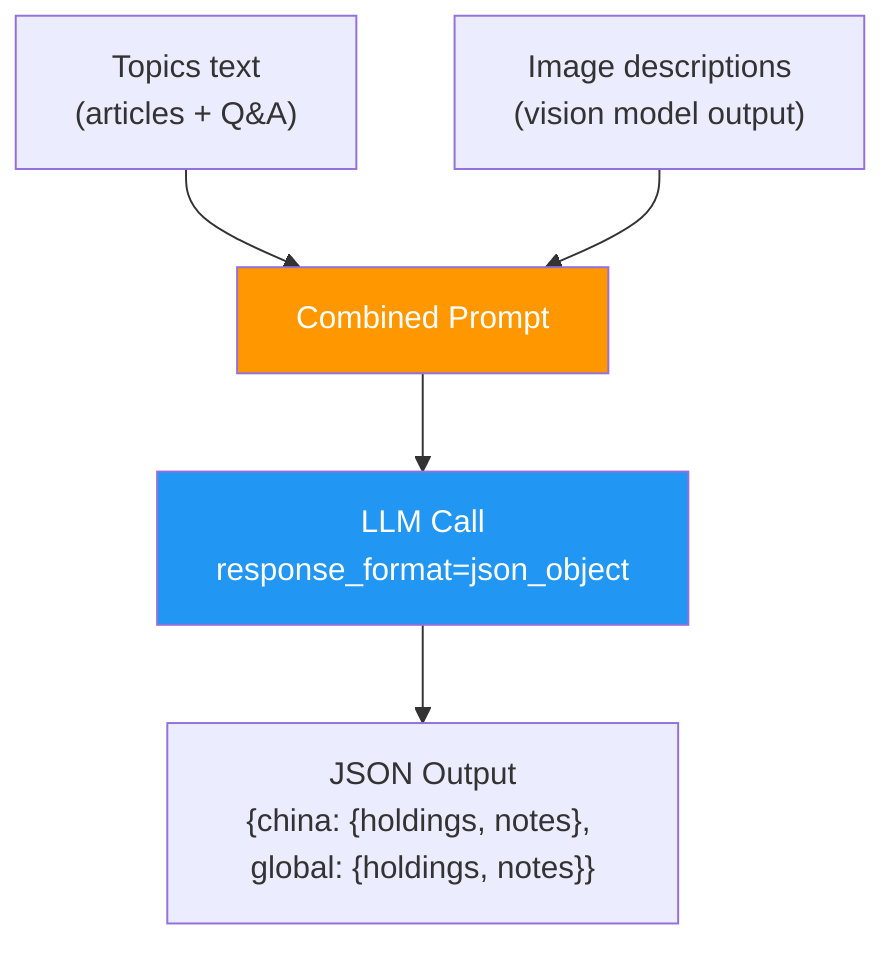
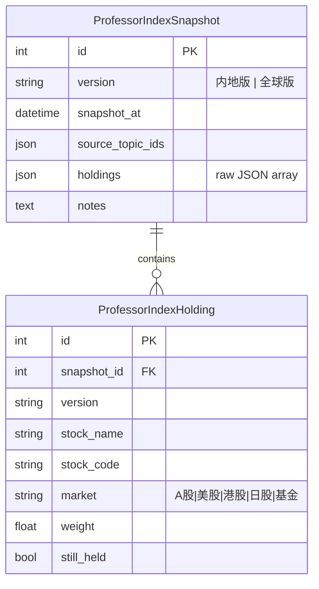
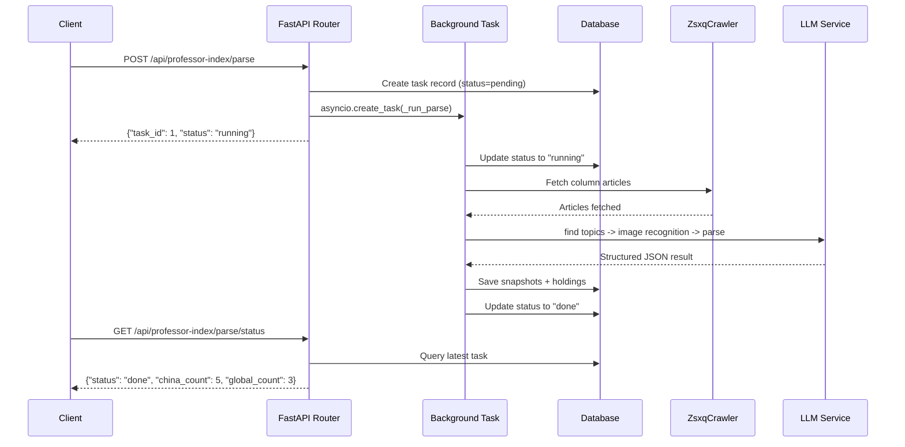
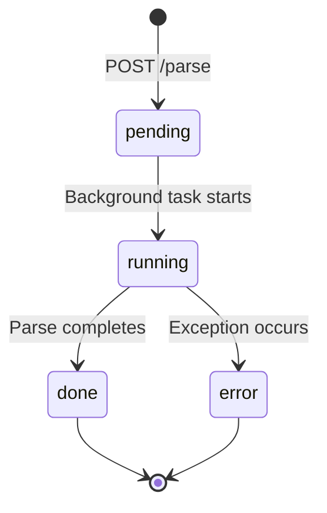

# Professor Index Parser

The **Professor Index** (教授指数 / 叫兽指数) is a tracked investment portfolio published on Zsxq (知识星球) by the KOL known as DeepVan. The system automatically discovers, parses, and persists the latest portfolio allocations using a multimodal LLM pipeline.

---

## Overview

The parser handles two portfolio versions:

| Version | Chinese Name | Markets Covered |
|---------|-------------|-----------------|
| **China** | 内地版 | A股, 港股, 基金 |
| **Global** | 全球版 | 美股, 日股, 港股 |

Each holding record contains:

| Field | Type | Description |
|-------|------|-------------|
| `name` | string | Security name (e.g. "贵州茅台") |
| `code` | string or null | Ticker code (e.g. "600519", "AAPL", "0700.HK") |
| `market` | string | One of: A股, 美股, 港股, 日股, 基金 |
| `weight` | float or null | Portfolio weight as a percentage |

---

## Parsing Pipeline

The core pipeline consists of four stages:



### Stage 1: Find Relevant Topics

The system searches for Professor Index content using two strategies:

1. **Column articles** (highest priority) -- All Zsxq articles (`content_type == "article"`) are fetched as the authoritative data source.
2. **Keyword matching** -- Topics containing "教授指数" or "叫兽指数" in their title or content are included as supplementary Q&A context.

Articles are placed first in the list so the LLM sees the most authoritative data before older Q&A discussions.

```python
_KEYWORDS = ["教授指数", "叫兽指数"]

async def find_professor_index_topics() -> list[Topic]:
    keyword_conditions = [Topic.title.contains(kw) for kw in _KEYWORDS]
    keyword_conditions += [Topic.content.contains(kw) for kw in _KEYWORDS]

    # 1. Column articles (authoritative, highest priority)
    articles = ...  # SELECT from topics WHERE content_type = 'article'

    # 2. Keyword-matched Q&A/talk (supplementary context)
    extras = ...  # SELECT from topics WHERE title/content contains keywords

    return articles + extras  # articles first, Q&A second
```

### Stage 2: Image Recognition (Multimodal)

Many portfolio allocations are published as **screenshots** rather than text. The system uses a multimodal vision model to extract structured data from these images.

:::info Why Screenshots Matter
KOLs on Zsxq often share portfolio tables as screenshots from brokerage apps or spreadsheet exports. Without multimodal recognition, this critical data would be invisible to a text-only LLM pipeline.
:::

Key implementation details:

- **Max 3 images** per topic to control API costs
- **Concurrency limit**: `asyncio.Semaphore(2)` allows at most 2 concurrent vision API calls
- **1-second delay** between image calls to avoid rate limiting
- **Image URL priority**: `large` > `thumbnail` > `url`

```python
async def _describe_images(image_urls: list[str]) -> list[str]:
    """Use multimodal LLM to recognize image content."""
    vision_model = settings.vision_model or settings.openai_model
    descriptions = []
    for url in image_urls[:3]:  # max 3 images
        response = await client.chat.completions.create(
            model=vision_model,
            messages=[{
                "role": "user",
                "content": [
                    {"type": "text", "text": "Describe all holdings in this screenshot..."},
                    {"type": "image_url", "image_url": {"url": url}},
                ],
            }],
            max_tokens=800,
            temperature=0.1,
        )
        descriptions.append(response.choices[0].message.content)
        await asyncio.sleep(1)
    return descriptions
```

### Stage 3: LLM Structured Parse

The text content and image descriptions are combined into a single prompt. The LLM is instructed to return a JSON object with holdings for both the China and Global versions.



Key configuration:

| Parameter | Value | Purpose |
|-----------|-------|---------|
| `temperature` | `0.1` | Minimize hallucination |
| `response_format` | `{"type": "json_object"}` | Force valid JSON output |
| `max_chars` | `80,000` | Truncate older content if prompt exceeds limit |

The prompt instructs the LLM to:

- Prioritize the most recent articles when conflicts exist
- Extract weight percentages from image tables when available
- Return `null` for fields that cannot be determined
- Use standardized market names (A股, 美股, 港股, 日股, 基金)

### Stage 4: Save to Database

Parsed holdings are persisted as snapshot records:



The main entry point `update_professor_index()` orchestrates the full pipeline:

```python
async def update_professor_index() -> dict:
    """Main entry: find topics -> image recognition -> LLM parse -> save to DB"""
    topics = await find_professor_index_topics()
    if not topics:
        return {"china": [], "global": [], "message": "No topics found"}

    result = await parse_professor_index(topics)

    # Save snapshots for both versions
    async with async_session() as db:
        for version_key, version_label in [("china", "内地版"), ("global", "全球版")]:
            data = result.get(version_key, {})
            holdings = data.get("holdings", [])
            if not holdings:
                continue

            snapshot = ProfessorIndexSnapshot(
                version=version_label,
                source_topic_ids=source_ids,
                holdings=holdings,
                notes=data.get("notes", ""),
            )
            db.add(snapshot)
            # ... save individual holdings
        await db.commit()
```

---

## Async API

Parsing is triggered as a background task via the API. Only one parse task can run at a time (guarded by `asyncio.Lock`).



### Endpoints

| Method | Path | Auth | Description |
|--------|------|------|-------------|
| `POST` | `/api/professor-index/parse` | Admin | Trigger a new parse task |
| `GET` | `/api/professor-index/parse/status` | Admin | Poll the latest task status |
| `GET` | `/api/professor-index/parse/history` | Admin | List up to 50 recent tasks |
| `GET` | `/api/professor-index/interval` | Admin | Get the parse interval (days) |
| `PUT` | `/api/professor-index/interval` | Admin | Set the parse interval |
| `GET` | `/api/dashboard/professor-index` | Public | Fetch latest snapshots |

### Task Status Flow



### Interval Configuration

The parse interval controls how frequently the system re-parses the Professor Index:

| Interval | Use Case |
|----------|----------|
| `1 day` | Near real-time tracking |
| `7 days` | Default. Weekly rebalancing detection |
| `15 days` | Bi-weekly check |
| `30 days` | Monthly review |

---

## Code Reference

| File | Responsibility |
|------|---------------|
| `backend/app/services/professor_index.py` | Core parsing logic: topic discovery, image recognition, LLM extraction, DB persistence |
| `backend/app/routers/professor_index.py` | API endpoints: async parse trigger, status polling, interval config |
| `backend/app/models.py` | Database models: `ProfessorIndexSnapshot`, `ProfessorIndexHolding`, `ProfessorIndexParseTask` |

---

## Stock Code Formats

The system recognizes the following code formats:

| Market | Format | Examples |
|--------|--------|----------|
| A股 | 6-digit number | `600519`, `000001`, `300750` |
| 港股 | 4-5 digit + `.HK` | `0700.HK`, `03441.HK` |
| 美股 | Ticker symbol | `AAPL`, `TSLA`, `SPY` |
| 日股 | Numeric code | `7203`, `9984` |
| 基金 | Varies | Fund names without strict code format |

:::tip
The LLM is instructed to fill in codes when possible. If a code is not explicitly mentioned in the source text, it returns `null` for that field.
:::
