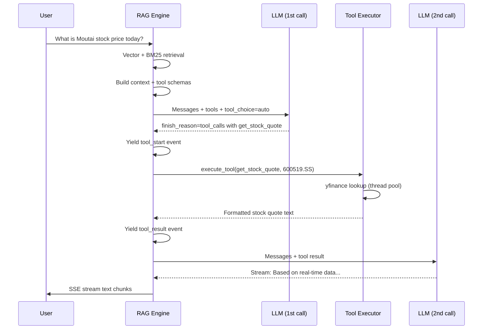
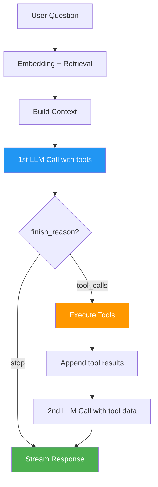

# Tool Calling & Function Calling

The RAG system supports **OpenAI-compatible tool calling** (function calling) to fetch real-time information that is not present in the knowledge base. This allows the LLM to query live stock prices, search the web for breaking news, and retrieve market data on demand.

---

## Available Tools

| Tool | Data Source | Purpose |
|------|------------|---------|
| `web_search` | Tavily Search API | Real-time web search for news, analysis, policy updates |
| `get_stock_quote` | yfinance | Latest price for a specific stock, ETF, or index |
| `get_market_overview` | yfinance | Summary of major market indices (Shanghai, Shenzhen, Hang Seng, NASDAQ, S&P 500) |

### Tool Schemas

All tools follow the OpenAI function calling format. Each tool is defined as a JSON object with the structure shown below.

#### web_search

Parameters:
- `query` (string, required): Search keywords. Concise and specific.

#### get_stock_quote

Parameters:
- `symbol` (string, required): Ticker symbol. A-shares: 601398.SS; HK: 0700.HK; US: AAPL

#### get_market_overview

Parameters: none (takes no arguments)

---

## Tool Calling Flow

The RAG engine implements a two-pass LLM interaction when tools are involved:



---

## Dual Tool Calling Paths

The system supports two mechanisms for detecting tool calls from the LLM response.

### Native OpenAI Tool Calls (Preferred)

When the LLM returns `finish_reason=tool_calls` with structured tool calls in the response delta, the system uses the native OpenAI function calling protocol.

The RAG engine collects tool call chunks during streaming, assembles them into complete tool call objects, and then executes each one:

```python
has_native_tools = first_finish_reason == "tool_calls" and tool_calls_map

if has_native_tools:
    assistant_tool_calls = [
        {
            "id": tc["id"],
            "type": "function",
            "function": {"name": tc["name"], "arguments": tc["arguments"]},
        }
        for tc in tool_calls_map.values()
    ]
    messages.append({"role": "assistant", "tool_calls": assistant_tool_calls})
    # Execute each tool and append results as tool messages
```

### Text-Based Tool Call Parsing (Fallback)

Some OpenAI-compatible models do not support native tool calling but emit tool call instructions as text using XML-like tags. The system parses these with a regex pattern.

The LLM generates text containing tool call XML blocks with function and parameter child tags. The parser extracts the function name and key-value parameters from this text output.

### Comparison

| Aspect | Native Tool Calls | Text-Based Parsing |
|--------|-------------------|-------------------|
| **Detection** | `finish_reason=tool_calls` | Regex match on tool call tags |
| **Parameter format** | JSON string | XML parameter tags |
| **Reliability** | High (structured protocol) | Medium (depends on model compliance) |
| **Model support** | GPT-4o, Claude, etc. | Any model with instruction following |
| **Validation** | Tool call IDs for tracking | Filter by enabled tool names only |
| **Follow-up message** | `role: tool` with tool_call_id | `role: user` with formatted result |

:::info Fallback Safety
When using text-based parsing, the system filters tool calls against the enabled tool set to prevent the model from hallucinating non-existent tool invocations. Only tools that are registered in the enabled tools list are executed.
:::

---

## Tool Implementations

### web_search -- Tavily Search API

Calls the Tavily Search API with `search_depth: basic` and returns up to 5 results with an optional AI-generated answer.

```python
async def _web_search(query: str) -> str:
    resp = await client.post(
        "https://api.tavily.com/search",
        json={
            "api_key": settings.tavily_api_key,
            "query": query,
            "search_depth": "basic",
            "max_results": 5,
            "include_answer": True,
        },
    )
    data = resp.json()
    # Format: AI answer + numbered results with titles, snippets, and URLs
```

Output format: Tavily returns a summary answer plus numbered search results with titles, content snippets, and source URLs.

### get_stock_quote -- yfinance

Fetches real-time stock data using `yfinance`. The synchronous yfinance call is wrapped in `asyncio.to_thread()` to avoid blocking the event loop.

```python
async def _get_stock_quote(symbol: str) -> str:
    def _fetch():
        ticker = yf.Ticker(symbol)
        return ticker.info

    info = await asyncio.to_thread(_fetch)
    # Format: name, price, change, change%, volume
```

Output includes: stock name, latest price with currency, price change (absolute and percentage), volume, and data timestamp.

Supported stock code formats:

| Market | Format | Example |
|--------|--------|---------|
| A-shares (Shanghai) | NNNNNN.SS | 601398.SS (ICBC) |
| A-shares (Shenzhen) | NNNNNN.SZ | 000001.SZ (Ping An Bank) |
| HK Stocks | NNNN.HK | 0700.HK (Tencent) |
| US Stocks | Ticker symbol | AAPL, TSLA, SPY |

### get_market_overview -- yfinance

Fetches `fast_info` for five major indices in a single thread pool call:

| Index | Symbol |
|-------|--------|
| Shanghai Composite | 000001.SS |
| Shenzhen Component | 399001.SZ |
| Hang Seng | ^HSI |
| NASDAQ Composite | ^IXIC |
| S&P 500 | ^GSPC |

---

## Configuration

Tools are configured in `config.json`:

```json
{
  "enable_tools": true,
  "tavily_api_key": "tvly-xxxxxxxxx",
  "openai_api_key": "sk-...",
  "openai_model": "gpt-4o"
}
```

| Config Key | Type | Default | Description |
|-----------|------|---------|-------------|
| `enable_tools` | boolean | true | Master switch for all tool calling |
| `tavily_api_key` | string | empty | Required for web_search. When empty, web_search is excluded from the tool list |

### Tool Availability Logic

| Condition | web_search | get_stock_quote | get_market_overview |
|-----------|-----------|----------------|-------------------|
| enable_tools=false | Disabled | Disabled | Disabled |
| enable_tools=true, no tavily_api_key | Disabled | Enabled | Enabled |
| enable_tools=true, with tavily_api_key | Enabled | Enabled | Enabled |

---

## Integration with RAG

Tool calling is integrated into the RAG query flow at the LLM generation stage.



The system prompt is augmented with tool usage instructions when tools are enabled. This guides the LLM to call tools for time-sensitive queries while relying on the knowledge base for historical analysis.

The prompt instructs the LLM to use tools when:
- The question involves time-sensitive content (keywords like today, latest, now)
- Real-time stock/ETF/index price lookups are needed
- Latest market news or analysis searches are required

After tool execution, the LLM generates a final answer incorporating both the RAG retrieval context and the real-time tool data.

---

## Code Reference

| File | Responsibility |
|------|---------------|
| `backend/app/services/tools.py` | Tool schemas, execution logic, Tavily and yfinance integration |
| `backend/app/services/rag.py` | RAG engine with tool calling orchestration (two-pass LLM flow) |
| `backend/app/config.py` | Configuration: enable_tools, tavily_api_key |
