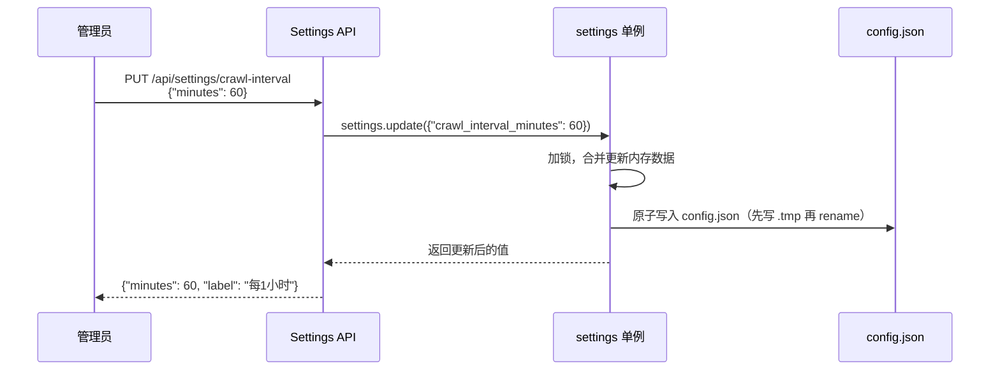

# 配置说明

Dungeon Lord 使用 `config.json` 文件进行集中配置管理。配置支持 **热更新**，大部分配置项修改后无需重启服务即可生效。

## 配置文件位置

系统按以下优先级查找配置文件：

1. `backend/config.json`（推荐）
2. 项目根目录 `config.json`（备选）

首次启动时，如果 `config.json` 不存在，系统会自动从 `config.example.json` 复制一份。

## 完整配置项参考

### LLM 相关

| 字段 | 类型 | 默认值 | 说明 |
|------|------|--------|------|
| `openai_api_key` | string | `""` | OpenAI 或兼容服务的 API 密钥 |
| `openai_base_url` | string | `""` | API 基础 URL。留空使用 OpenAI 官方地址；填入其他地址可使用兼容服务 |
| `openai_model` | string | `"gpt-4o"` | 用于问答生成的模型名称 |
| `vision_model` | string | `""` | 视觉模型名称（用于图片理解，留空则不启用） |

### 嵌入模型相关

| 字段 | 类型 | 默认值 | 说明 |
|------|------|--------|------|
| `embedding_provider` | string | `"openai"` | 嵌入模型提供商。`"openai"` 使用 API 服务，`"local"` 使用本地 bge-small-zh-v1.5 |
| `embedding_model` | string | `"text-embedding-3-small"` | 嵌入模型名称（当 provider 为 openai 时生效） |
| `hf_mirror_url` | string | `"https://hf-mirror.com"` | HuggingFace 镜像地址（下载本地模型时使用） |

:::tip
国内网络环境下，建议将 `hf_mirror_url` 保持默认的 `https://hf-mirror.com`，以加速本地模型下载。
:::

### 爬虫相关

| 字段 | 类型 | 默认值 | 说明 |
|------|------|--------|------|
| `author_name` | string | `""` | 目标 KOL 名称（用于系统提示词和展示） |
| `zsxq_cookie` | string | `""` | 知识星球登录 Cookie |
| `zsxq_group_id` | string | `""` | 知识星球的星球 ID |
| `zhihu_cookie` | string | `""` | 知乎登录 Cookie |
| `zhihu_url_token` | string | `""` | 知乎用户的 URL Token（个人主页 URL 中的标识符） |
| `zhihu_sign_server` | string | `"http://localhost:17007"` | 知乎签名服务器地址（用于 API 签名） |
| `crawl_schedule` | string | `""` | Cron 表达式（如 `"0 3 * * *"` 表示每天凌晨 3 点） |
| `crawl_interval_minutes` | int | `0` | 定时爬取间隔（分钟），`0` 表示关闭。与 `crawl_schedule` 二选一 |

### 认证与安全

| 字段 | 类型 | 默认值 | 说明 |
|------|------|--------|------|
| `admin_password` | string | `""` | 管理员登录密码 |
| `jwt_secret` | string | `"change-me-to-a-random-string"` | JWT 签名密钥，**必须修改为随机字符串** |
| `jwt_expire_hours` | int | `24` | JWT 令牌过期时间（小时） |
| `public_chat_daily_limit` | int | `10` | 公众用户（未登录）每日问答次数限制 |

:::warning
`jwt_secret` 在生产环境中必须更换为强随机字符串，否则存在安全风险。可使用以下命令生成：

```bash
python -c "import secrets; print(secrets.token_urlsafe(48))"
```
:::

### RAG 相关

| 字段 | 类型 | 默认值 | 说明 |
|------|------|--------|------|
| `enable_bm25` | bool | `true` | 是否启用 BM25 混合检索。关闭后仅使用 Dense 向量检索 |
| `chunk_size` | int | `500` | 文本切块大小（字符数） |
| `chunk_overlap` | int | `80` | 相邻切块的重叠字符数 |

### 服务器相关

| 字段 | 类型 | 默认值 | 说明 |
|------|------|--------|------|
| `api_host` | string | `"0.0.0.0"` | 后端监听地址 |
| `api_port` | int | `8000` | 后端监听端口 |

## 热更新机制

Dungeon Lord 的配置支持 **运行时热更新**，无需重启服务。热更新的工作流程如下：



### 热更新的关键代码

配置管理的核心是一个全局单例 `_Settings`，内部使用 `threading.Lock` 保证线程安全：

```python title="backend/app/config.py"
class _Settings:
    def __init__(self):
        self._data: dict = {}
        self._lock = Lock()
        self.reload()  # 启动时从 config.json 加载

    def __getattr__(self, key: str):
        """读取配置：config.json > 计算字段 > 默认值"""
        if key in self._data:
            return self._data[key]
        if key in _COMPUTED:
            return _COMPUTED[key]
        if key in _DEFAULTS:
            return _DEFAULTS[key]
        raise AttributeError(f"配置项不存在: {key}")

    def update(self, patch: dict):
        """合并更新并持久化到 config.json"""
        with self._lock:
            self._data.update(patch)
            self._save()

    def _save(self):
        """原子写入：先写临时文件，再 rename"""
        tmp = _CONFIG_PATH.with_suffix(".tmp")
        tmp.write_text(json.dumps(self._data, ...), "utf-8")
        tmp.replace(_CONFIG_PATH)  # 原子替换
```

### 通过 API 更新配置

管理员可以通过 Settings API 实时更新配置。以下是使用 `curl` 的示例：

```bash
# 1. 先登录获取 JWT Token
TOKEN=$(curl -s -X POST http://localhost:8000/api/auth/login \
  -H "Content-Type: application/json" \
  -d '{"password": "your-admin-password"}' | jq -r '.token')

# 2. 查看当前爬取间隔
curl -s http://localhost:8000/api/settings/crawl-interval \
  -H "Authorization: Bearer $TOKEN" | jq

# 输出: {"minutes": 0, "label": "关闭"}

# 3. 设置为每小时爬取一次
curl -s -X PUT http://localhost:8000/api/settings/crawl-interval \
  -H "Authorization: Bearer $TOKEN" \
  -H "Content-Type: application/json" \
  -d '{"minutes": 60}' | jq

# 输出: {"minutes": 60, "label": "每1小时"}

# 4. 查看调度器状态
curl -s http://localhost:8000/api/settings/scheduler \
  -H "Authorization: Bearer $TOKEN" | jq
```

### 在 Python 中调用

```python
from app.config import settings

# 读取配置
print(settings.openai_model)       # "gpt-4o"
print(settings.enable_bm25)        # True
print(settings.api_port)           # 8000

# 热更新（写入内存 + 持久化到 config.json）
settings.update({"chunk_size": 800, "chunk_overlap": 100})

# 手动重新加载（从磁盘重新读取）
settings.reload()
```

## 敏感字段获取指南

### 知乎 Cookie

1. 在浏览器中登录 [知乎](https://www.zhihu.com)
2. 打开开发者工具（F12） -> Network 标签
3. 刷新页面，找到任意一个 `zhihu.com/api` 请求
4. 在请求头中复制完整的 `Cookie` 值
5. 粘贴到 `zhihu_cookie` 配置项

### 知乎 URL Token

知乎用户的 URL Token 就是个人主页 URL 中的标识符：

```
https://www.zhihu.com/people/zhang-san-88
                          ^^^^^^^^^^^^^^^
                          这就是 url_token
```

### 知识星球 Cookie

1. 在浏览器中登录 [知识星球](https://wx.zsxq.com)
2. 打开开发者工具（F12） -> Network 标签
3. 找到任意一个 `api.zsxq.com` 请求
4. 复制请求头中的 `Cookie` 值
5. 粘贴到 `zsxq_cookie` 配置项

### 知识星球 Group ID

在浏览器中打开目标星球，URL 中的数字即为 Group ID：

```
https://wx.zsxq.com/group/1234567890
                           ^^^^^^^^^^
                           这就是 group_id
```

### OpenAI API Key

1. 前往 [OpenAI Platform](https://platform.openai.com/api-keys)
2. 创建新的 API Key
3. 复制以 `sk-` 开头的密钥
4. 粘贴到 `openai_api_key` 配置项

如果使用其他兼容服务（如 DeepSeek、Moonshot 等），同时需要修改 `openai_base_url` 为对应的服务地址。

## 计算字段

以下字段由系统自动计算，**不需要手动配置**：

| 字段 | 计算方式 | 说明 |
|------|---------|------|
| `database_url` | `sqlite:///{PROJECT_ROOT}/data/app.db` | SQLite 数据库路径 |
| `chroma_persist_dir` | `{PROJECT_ROOT}/data/chroma` | ChromaDB 持久化目录 |

## 下一步

配置完成后，请继续阅读 [首次运行](./first-run) 启动系统。
