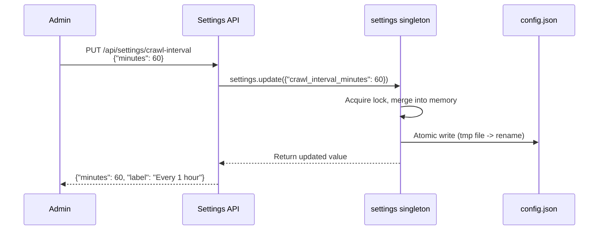

# Configuration Reference

Dungeon Lord uses a single `config.json` file for all settings. The configuration
supports **hot-reload** — most options take effect immediately after saving, without
restarting the server.

---

## Config File Location

The system searches for the configuration file in this order:

1. `backend/config.json` (recommended)
2. Project root `config.json` (fallback)

On first startup, if no `config.json` exists, the system automatically copies
`config.example.json` to create one.

:::tip
You can edit `config.json` by hand or update it at runtime through the admin
Settings API — both approaches are equivalent.
:::

---

## LLM Settings

These fields control which language model is used for answer generation.

| Field | Type | Default | Description |
|-------|------|---------|-------------|
| `openai_api_key` | string | `""` | API key for OpenAI or any OpenAI-compatible provider. **Required.** |
| `openai_base_url` | string | `""` | Base URL for the API. Leave empty for OpenAI official; set to a custom URL for compatible services (e.g. DeepSeek, Moonshot, Ollama). |
| `openai_model` | string | `"gpt-4o"` | Model name used for chat completions (answer generation). |
| `vision_model` | string | `""` | Vision-capable model name for image understanding. Leave empty to disable vision support. |

:::note
When using a third-party compatible provider, set `openai_base_url` to the
provider's API endpoint. For example, for Ollama running locally:
`"http://localhost:11434/v1"`.
:::

---

## Embedding Settings

These fields control how text chunks are converted into dense vectors.

| Field | Type | Default | Description |
|-------|------|---------|-------------|
| `embedding_provider` | string | `"openai"` | Embedding backend. `"openai"` uses the OpenAI embedding API; `"local"` uses the locally-downloaded `bge-small-zh-v1.5` model via sentence-transformers. |
| `embedding_model` | string | `"text-embedding-3-small"` | Model name when `embedding_provider` is `"openai"`. Ignored for local provider. |
| `hf_mirror_url` | string | `"https://hf-mirror.com"` | HuggingFace mirror URL for downloading the local model. Useful for users in China. |

:::tip
The local embedding model (`bge-small-zh-v1.5`) is a good choice if you want to
avoid API costs or need offline operation. It requires roughly 100 MB of disk and
runs on CPU (no GPU needed for inference on small datasets).
:::

---

## Data Source Settings

Configure the target KOL and platform credentials. You need at least **one**
platform configured to crawl content.

### General

| Field | Type | Default | Description |
|-------|------|---------|-------------|
| `author_name` | string | `""` | Display name of the target KOL. Used in system prompts and shown in the UI. |

### Zsxq / Knowledge Planet

| Field | Type | Default | Description |
|-------|------|---------|-------------|
| `zsxq_cookie` | string | `""` | Login cookie for Zsxq. Obtain from browser DevTools after logging in to `wx.zsxq.com`. |
| `zsxq_group_id` | string | `""` | Numeric group (planet) ID. Found in the URL: `https://wx.zsxq.com/group/{id}`. |

### Zhihu

| Field | Type | Default | Description |
|-------|------|---------|-------------|
| `zhihu_cookie` | string | `""` | Login cookie for Zhihu. Obtain from browser DevTools after logging in to `zhihu.com`. |
| `zhihu_url_token` | string | `""` | User URL token (the slug in `https://www.zhihu.com/people/{token}`). |
| `zhihu_sign_server` | string | `"http://localhost:17007"` | URL of the Zhihu signature server (Node.js helper for API request signing). |

:::caution
Cookies expire periodically. If crawls start returning empty results, re-log in
to the platform and update the cookie value in `config.json`.
:::

---

## Authentication & Security

| Field | Type | Default | Description |
|-------|------|---------|-------------|
| `admin_password` | string | `""` | Password for the admin login page. **Required** for admin access. |
| `jwt_secret` | string | `"change-me-to-a-random-string"` | Secret key used to sign JWT tokens (HS256). **Must be changed** in production. |
| `jwt_expire_hours` | int | `24` | Token validity period in hours. After expiry the admin must log in again. |
| `public_chat_daily_limit` | int | `10` | Maximum number of Q&A queries allowed per day for public (unauthenticated) visitors, tracked by visitor fingerprint. |

:::warning
The default `jwt_secret` is intentionally insecure. Generate a strong random
secret before deploying:

```bash
python -c "import secrets; print(secrets.token_urlsafe(48))"
```
:::

---

## Crawling Schedule

| Field | Type | Default | Description |
|-------|------|---------|-------------|
| `crawl_schedule` | string | `""` | Cron expression for scheduled crawling (e.g. `"0 3 * * *"` for daily at 3 AM). Mutually exclusive with `crawl_interval_minutes`. |
| `crawl_interval_minutes` | int | `0` | Fixed interval in minutes between crawl runs. Set to `0` to disable. If both this and `crawl_schedule` are set, `crawl_schedule` takes precedence. |

:::note
You can also manage the crawl schedule through the admin Settings UI or the
`PUT /api/settings/crawl-interval` API endpoint at runtime.
:::

---

## RAG Settings

These fields control the retrieval-augmented generation pipeline.

| Field | Type | Default | Description |
|-------|------|---------|-------------|
| `enable_bm25` | bool | `true` | Enable BM25 keyword retrieval alongside dense vector search. When `false`, only dense retrieval is used. |
| `chunk_size` | int | `500` | Maximum number of characters per text chunk during ingestion. Larger chunks provide more context but reduce retrieval precision. |
| `chunk_overlap` | int | `80` | Number of overlapping characters between adjacent chunks. Overlap helps preserve context that spans chunk boundaries. |

:::tip
If your KOL writes long-form articles, increasing `chunk_size` to 800-1000 may
improve answer quality. For short posts (tweets/ideas), the default 500 works well.
:::

---

## API Server Settings

| Field | Type | Default | Description |
|-------|------|---------|-------------|
| `api_host` | string | `"0.0.0.0"` | Network interface the backend listens on. Use `"0.0.0.0"` to accept connections from any host; use `"127.0.0.1"` for local-only access. |
| `api_port` | int | `8000` | TCP port for the backend API server. |
| `cors_origins` | list[string] | `["*"]` | Allowed CORS origins. Use `["*"]` to allow all (development); restrict to your domain in production (e.g. `["https://example.com"]`). |

---

## Tools & Integrations

These fields enable optional LLM tool-calling capabilities.

| Field | Type | Default | Description |
|-------|------|---------|-------------|
| `enable_tools` | bool | `true` | Allow the LLM to invoke external tools during answer generation. Currently supports Tavily web search and stock data lookup. |
| `tavily_api_key` | string | `""` | API key for [Tavily](https://tavily.com/) web search. Required only if `enable_tools` is `true` and you want the LLM to search the web. |

---

## Miscellaneous

| Field | Type | Default | Description |
|-------|------|---------|-------------|
| `system_title` | string | `"大V观点分析"` | Title displayed in the frontend header and browser tab. |
| `system_subtitle` | string | `"财经大V最新观点与 AI 智能问答"` | Subtitle displayed below the title on the dashboard. |
| `professor_index_interval_days` | int | `7` | How often (in days) the professor index is rebuilt. |

---

## Computed Fields

The following fields are **automatically derived** from the project root directory
and cannot be configured manually:

| Field | Computed Value | Description |
|-------|---------------|-------------|
| `database_url` | `sqlite:///{PROJECT_ROOT}/data/app.db` | SQLite database file path |
| `chroma_persist_dir` | `{PROJECT_ROOT}/data/chroma` | ChromaDB persistence directory |

---

## Hot-Reload Mechanism

Dungeon Lord's configuration singleton supports runtime hot-reload via a
thread-safe update-and-save cycle:



### Reading Config in Python

```python
from app.config import settings

# Read any config value
print(settings.openai_model)       # "gpt-4o"
print(settings.enable_bm25)        # True
print(settings.api_port)           # 8000

# Hot-update (writes to memory + persists to config.json)
settings.update({"chunk_size": 800, "chunk_overlap": 100})

# Force reload from disk
settings.reload()
```

### Updating via the API

```bash
# 1. Log in and obtain a JWT token
TOKEN=$(curl -s -X POST http://localhost:8000/api/auth/login \
  -H "Content-Type: application/json" \
  -d '{"password": "your-admin-password"}' | jq -r '.token')

# 2. View current crawl interval
curl -s http://localhost:8000/api/settings/crawl-interval \
  -H "Authorization: Bearer $TOKEN" | jq
# Output: {"minutes": 0, "label": "Off"}

# 3. Set crawl interval to every hour
curl -s -X PUT http://localhost:8000/api/settings/crawl-interval \
  -H "Authorization: Bearer $TOKEN" \
  -H "Content-Type: application/json" \
  -d '{"minutes": 60}' | jq
# Output: {"minutes": 60, "label": "Every 1 hour"}
```

---

## Full Example Configuration

Below is a complete `config.json` with all fields populated:

```json title="backend/config.json"
{
  "system_title": "KOL Analysis",
  "system_subtitle": "Financial KOL opinions with AI-powered Q&A",

  "openai_api_key": "sk-proj-xxxxxxxxxxxx",
  "openai_base_url": "",
  "openai_model": "gpt-4o",
  "vision_model": "",

  "embedding_provider": "openai",
  "embedding_model": "text-embedding-3-small",
  "hf_mirror_url": "https://hf-mirror.com",

  "author_name": "John Doe",

  "zsxq_cookie": "",
  "zsxq_group_id": "",

  "zhihu_cookie": "z_c0=xxx; _zap=xxx; ...",
  "zhihu_url_token": "john-doe-88",
  "zhihu_sign_server": "http://localhost:17007",

  "crawl_schedule": "0 3 * * *",
  "crawl_interval_minutes": 0,

  "admin_password": "my-secure-password",
  "jwt_secret": "a-very-long-random-string-here",
  "jwt_expire_hours": 24,
  "public_chat_daily_limit": 10,

  "enable_bm25": true,
  "chunk_size": 500,
  "chunk_overlap": 80,

  "api_host": "0.0.0.0",
  "api_port": 8000,
  "cors_origins": ["*"],

  "tavily_api_key": "",
  "enable_tools": true,

  "professor_index_interval_days": 7
}
```

---

## Next Steps

Once your configuration is ready, proceed to the **[First Run](./first-run)** guide
to start the system and perform your initial data crawl.
