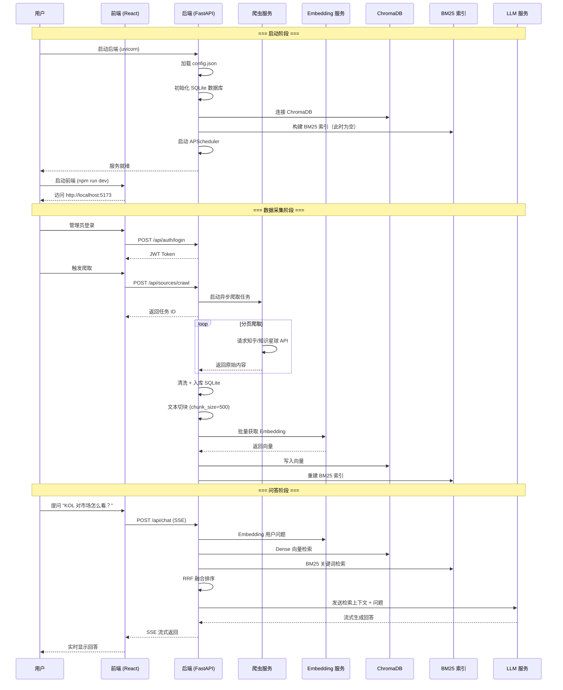

# 首次运行

本指南将带你完成 Dungeon Lord 的首次启动、数据采集和问答验证。

## 前置条件

请确保已完成以下步骤：

- [x] 已完成 [安装指南](./installation) 中的所有步骤
- [x] 已填写 `config.json` 中的必填配置项
- [x] 至少配置了一个数据源的 Cookie（知乎或知识星球）

## 第一步：启动后端

```bash
cd backend

# 激活虚拟环境
source .venv/bin/activate

# 启动 FastAPI 服务
uvicorn app.main:app --host 0.0.0.0 --port 8000 --reload
```

启动成功后，你会看到类似以下的日志输出：

```
INFO:     Uvicorn running on http://0.0.0.0:8000 (Press CTRL+C to quit)
INFO:     Started reloader process
配置已加载: /path/to/dungeon-lord/backend/config.json
INFO:     数据库初始化完成
INFO:     调度器已启动
INFO:     BM25 索引构建完成: 0 个文档
INFO:     Application startup complete.
```

:::note
`--reload` 参数使代码修改后自动重启，便于开发调试。生产环境请去掉此参数。
:::

### 验证后端启动

在另一个终端中执行健康检查：

```bash
curl http://localhost:8000/api/health
```

预期输出：

```json
{"status": "ok"}
```

## 第二步：启动前端

```bash
cd frontend

# 启动 Vite 开发服务器
npm run dev
```

启动成功后会显示：

```
  VITE v8.x.x  ready in xxx ms

  ➜  Local:   http://localhost:5173/
  ➜  press h + enter to show help
```

## 第三步：打开浏览器

在浏览器中访问 `http://localhost:5173`，你应该能看到 Dungeon Lord 的主界面。

### 管理员登录

1. 点击页面上的 **登录** 按钮
2. 输入你在 `config.json` 中设置的 `admin_password`
3. 登录成功后即可访问管理功能

## 第四步：首次数据采集

首次运行时，向量数据库是空的，需要先爬取数据。

### 通过前端触发

1. 进入 **数据源** 页面
2. 你会看到已配置的数据源（知乎 / 知识星球）
3. 点击 **立即爬取** 按钮

### 通过 API 触发

```bash
# 先获取 Token
TOKEN=$(curl -s -X POST http://localhost:8000/api/auth/login \
  -H "Content-Type: application/json" \
  -d '{"password": "your-admin-password"}' | jq -r '.token')

# 触发爬取任务
curl -s -X POST http://localhost:8000/api/sources/crawl \
  -H "Authorization: Bearer $TOKEN" \
  -H "Content-Type: application/json" \
  -d '{"platform": "zhihu"}' | jq
```

### 爬取过程

爬取是一个异步过程，后台日志会显示进度：

```
INFO: 开始爬取 zhihu (url_token: zhang-san-88)
INFO: [zhihu] 第 1 页: 获取 20 条 answers
INFO: [zhihu] 第 2 页: 获取 20 条 answers
INFO: [zhihu] 第 3 页: 获取 15 条 answers
INFO: [zhihu] 空页计数 3/3，判定翻页完成
INFO: [zhihu] 爬取完成: 55 条内容
INFO: 数据入库: 55 条主题, 0 条评论
INFO: 开始 embedding 处理: 55 个主题
INFO: 文本切块: 55 个主题 -> 187 个片段 (chunk_size=500, overlap=80)
INFO: Embedding 完成: 187 个向量已写入 ChromaDB
INFO: BM25 索引重建: 187 个文档
```

:::caution
首次爬取可能需要几分钟到十几分钟，取决于目标 KOL 的内容数量。请耐心等待。
:::

## 第五步：验证系统

### 检查 ChromaDB 是否有数据

可以通过 API 查询数据源状态：

```bash
curl -s http://localhost:8000/api/sources \
  -H "Authorization: Bearer $TOKEN" | jq
```

返回结果中应包含已爬取的条目数。

### 测试 RAG 问答

**通过前端测试：**

1. 进入 **问答** 页面
2. 输入一个与目标 KOL 相关的问题，例如：
   - "xxx 对当前 A 股市场怎么看？"
   - "xxx 推荐了哪些投资策略？"
3. 观察回答是否包含引用来源和原文链接

**通过 API 测试：**

```bash
curl -s -X POST http://localhost:8000/api/chat \
  -H "Authorization: Bearer $TOKEN" \
  -H "Content-Type: application/json" \
  -d '{"message": "这位KOL最近对市场有什么看法？"}' \
  --no-buffer
```

预期返回 SSE 流式数据：

```
data: 根据
data: 参考资料
data: ，该KOL最近的观点如下
data: ...
data: [DONE]
```

## 首次运行流程

以下是首次运行的完整流程：



## 配置定时爬取

首次手动爬取完成后，建议配置定时任务以持续更新数据：

```bash
# 设置每小时自动爬取
curl -s -X PUT http://localhost:8000/api/settings/crawl-interval \
  -H "Authorization: Bearer $TOKEN" \
  -H "Content-Type: application/json" \
  -d '{"minutes": 60}' | jq
```

也可以在前端的 **设置** 页面中进行配置。

## 常见问题与排查

### 后端启动失败

**问题：** `ModuleNotFoundError: No module named 'app'`

```
解决：确保在 backend/ 目录下运行 uvicorn，并且虚拟环境已激活。
正确的启动命令：cd backend && uvicorn app.main:app --host 0.0.0.0 --port 8000
```

**问题：** `config.json 解析失败`

```
解决：检查 JSON 语法是否正确（多余的逗号、缺少引号等）。
可使用 python -m json.tool config.json 验证格式。
```

**问题：** `Address already in use: port 8000`

```
解决：端口被占用，找到并关闭占用进程：
lsof -i :8000
kill -9 <PID>
或修改 config.json 中的 api_port 使用其他端口。
```

### 爬取相关

**问题：** 爬取返回 0 条内容

```
解决：
1. 检查 Cookie 是否过期（Cookie 通常有有效期，过期需重新获取）
2. 检查 zsxq_group_id / zhihu_url_token 是否正确
3. 查看后端日志中的详细错误信息
```

**问题：** 知乎爬取报签名错误

```
解决：
1. 确认 zhihu_sign_server 已启动（如果使用签名服务器方案）
2. 或者系统会自动降级为 Playwright 浏览器爬取（较慢但无需签名）
```

**问题：** Embedding 失败

```
解决：
1. 如果使用 OpenAI embedding：检查 openai_api_key 是否有效，账户是否有余额
2. 如果使用本地 embedding：检查模型是否下载完成，显存是否充足
3. 检查 hf_mirror_url 是否可访问
```

### 问答相关

**问题：** 问答返回"参考资料不足"

```
解决：
1. 确认 ChromaDB 中已有数据（检查爬取是否成功完成）
2. 尝试换一种问法
3. 降低检索门槛：增加 top_k 值
```

**问题：** LLM 返回错误

```
解决：
1. 检查 openai_api_key 是否有效
2. 检查 openai_base_url 是否正确（兼容服务需要填写）
3. 检查 openai_model 是否为服务支持的模型
4. 查看后端日志中的详细错误信息
```

**问题：** 前端无法连接后端

```
解决：
1. 确认后端已启动且端口正确
2. 检查浏览器控制台是否有 CORS 错误
3. 确认前端请求的 API 地址与后端一致
```

## 下一步

系统运行成功后，你可以：

- 配置定时爬取以保持数据更新
- 根据需要调整 RAG 参数（`chunk_size`、`enable_bm25` 等）
- 阅读进阶文档了解更多架构细节
