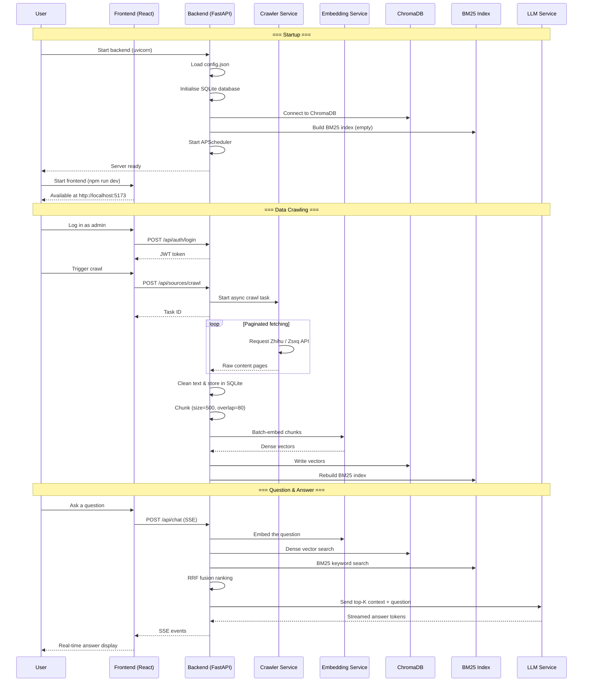

# First Run

This guide walks you through starting Dungeon Lord for the first time, crawling
your initial dataset, and verifying that RAG-powered Q&A works end to end.

---

## Prerequisites

Make sure you have completed the following before continuing:

- [x] All steps in the [Installation Guide](./installation) are done
- [x] `config.json` has the required fields filled in (`openai_api_key`,
  `admin_password`, `jwt_secret`)
- [x] At least one data source cookie is configured (Zhihu or Zsxq)

---

## Step 1: Start the Backend

Open a terminal and run:

```bash
cd backend

# Activate the virtual environment
source .venv/bin/activate

# Start the FastAPI server with auto-reload
uvicorn app.main:app --reload --port 8000
```

On success you will see output similar to:

```
INFO:     Uvicorn running on http://0.0.0.0:8000 (Press CTRL+C to quit)
INFO:     Started reloader process
Config loaded: /path/to/dungeon-lord/backend/config.json
INFO:     Database initialised
INFO:     Scheduler started
INFO:     BM25 index built: 0 documents
INFO:     Application startup complete.
```

:::note
The `--reload` flag watches for code changes and restarts the server automatically.
This is convenient during development. Remove it in production deployments.
:::

### Verify the Backend

In a separate terminal, run a health check:

```bash
curl http://localhost:8000/api/health
```

Expected response:

```json
{"status": "ok"}
```

---

## Step 2: Start the Frontend

Open another terminal:

```bash
cd frontend
npm run dev
```

Vite will print the dev server address:

```
  VITE v8.x.x  ready in 320 ms

  ->  Local:   http://localhost:5173/
  ->  press h + enter to show help
```

---

## Step 3: Open the Application

Navigate to [http://localhost:5173](http://localhost:5173) in your browser. You
should see the Dungeon Lord public dashboard.

### Log In as Admin

1. Click the **Login** button in the sidebar or header.
2. Enter the `admin_password` you set in `config.json`.
3. After a successful login you will have access to the admin-only pages
   (Sources, Settings).

---

## Step 4: Trigger Your First Crawl

The vector database is empty on first run. You need to crawl content before
the Q&A system can answer questions.

### Via the Web UI

1. Navigate to the **Sources** page.
2. You will see the configured platforms (Zhihu and/or Zsxq).
3. Click **Crawl Now** (or **Crawl All**) to start the ingestion pipeline.

### Via the API

```bash
# Log in and capture the JWT token
TOKEN=$(curl -s -X POST http://localhost:8000/api/auth/login \
  -H "Content-Type: application/json" \
  -d '{"password": "your-admin-password"}' | jq -r '.token')

# Trigger a crawl for a specific platform
curl -s -X POST http://localhost:8000/api/sources/crawl \
  -H "Authorization: Bearer $TOKEN" \
  -H "Content-Type: application/json" \
  -d '{"platform": "zhihu"}' | jq
```

### What Happens During a Crawl

The backend logs will show the full ingestion pipeline:

```
INFO: Starting crawl: zhihu (url_token: john-doe-88)
INFO: [zhihu] Page 1: fetched 20 answers
INFO: [zhihu] Page 2: fetched 20 answers
INFO: [zhihu] Page 3: fetched 15 answers
INFO: [zhihu] Empty-page count 3/3, pagination complete
INFO: [zhihu] Crawl finished: 55 items
INFO: Ingested: 55 topics, 0 comments
INFO: Starting embedding: 55 topics
INFO: Chunking: 55 topics -> 187 chunks (chunk_size=500, overlap=80)
INFO: Embedding complete: 187 vectors written to ChromaDB
INFO: BM25 index rebuilt: 187 documents
```

:::caution
The first crawl may take several minutes depending on how much content the
target KOL has published. Be patient — subsequent crawls are incremental and
much faster.
:::

---

## Step 5: Browse the Topics

Once the crawl finishes, navigate to the **Topics** page to browse the ingested
content. You should see a list of posts with titles, dates, platform tags, and
content previews.

---

## Step 6: Ask Your First Question

Navigate to the **Chat** page and ask a question related to the KOL's content.
For example:

- "What are this KOL's recent views on the A-share market?"
- "Summarise the investment strategies discussed in the last month."
- "What does the author think about tech stocks?"

The system will:

1. Embed your question as a dense vector
2. Run hybrid retrieval (dense + BM25 + RRF fusion)
3. Feed the top-K chunks plus conversation history to the LLM
4. Stream the answer back to you via SSE in real time
5. Attach source citations (topic title, platform, date) at the end

### Verify via the API

```bash
curl -s -X POST http://localhost:8000/api/chat \
  -H "Authorization: Bearer $TOKEN" \
  -H "Content-Type: application/json" \
  -d '{"message": "What are the latest views on the market?"}' \
  --no-buffer
```

You will receive an SSE stream:

```
data: Based
data:  on
data:  the
data:  reference
data:  materials
data: ...
data: [DONE]
```

---

## First-Run Sequence Diagram

The diagram below shows the complete flow from startup through your first Q&A:



---

## Step 7: Set Up Scheduled Crawling

After your initial crawl succeeds, configure a recurring schedule so the
knowledge base stays up to date automatically.

### Via the Settings UI

1. Navigate to the **Settings** page.
2. Find the **Crawl Interval** section.
3. Choose an interval (e.g. every 1 hour, every 6 hours) or enter a cron expression.

### Via the API

```bash
# Set crawl interval to every 60 minutes
curl -s -X PUT http://localhost:8000/api/settings/crawl-interval \
  -H "Authorization: Bearer $TOKEN" \
  -H "Content-Type: application/json" \
  -d '{"minutes": 60}' | jq
# Output: {"minutes": 60, "label": "Every 1 hour"}
```

---

## Troubleshooting

### Backend Won't Start

| Symptom | Solution |
|---------|----------|
| `ModuleNotFoundError: No module named 'app'` | Make sure you are inside the `backend/` directory and the virtual environment is activated |
| `config.json parse error` | Validate JSON syntax: `python -m json.tool config.json` |
| `Address already in use: port 8000` | Kill the process occupying the port: `lsof -i :8000` then `kill <PID>`, or change `api_port` in `config.json` |

### Crawl Returns Zero Results

| Symptom | Solution |
|---------|----------|
| Cookie expired | Re-log in to the platform in your browser, copy the fresh cookie, and update `config.json` |
| Wrong `zsxq_group_id` or `zhihu_url_token` | Double-check the ID/token from the platform URL |
| Zhihu signature error | Ensure `zhihu_sign_server` is running, or let the system fall back to Playwright-based crawling |

### Embedding Fails

| Symptom | Solution |
|---------|----------|
| OpenAI API error | Verify `openai_api_key` is valid and your account has available quota |
| Local model download timeout | Set `hf_mirror_url` to `https://hf-mirror.com` or configure the `HF_ENDPOINT` environment variable |

### Q&A Returns "Insufficient References"

| Symptom | Solution |
|---------|----------|
| ChromaDB is empty | Verify the crawl completed successfully; check the Topics page for content |
| Query too specific | Try rephrasing the question with broader terms |
| Retrieval too strict | The system uses default top-K values; content may not match the query closely enough |

### Frontend Cannot Connect to Backend

| Symptom | Solution |
|---------|----------|
| CORS error in browser console | Check `cors_origins` in `config.json`; ensure the frontend origin is allowed |
| Network error | Confirm the backend is running on the expected port; check for proxy/firewall issues |

---

## What's Next

Your system is now operational. Here are some things you can explore:

- Adjust RAG parameters (`chunk_size`, `enable_bm25`) in the
  [Configuration Reference](./configuration) to tune answer quality.
- Explore the public dashboard at `/` — this is what non-admin visitors see.
- Review the API documentation at `http://localhost:8000/docs` (auto-generated
  by FastAPI).
