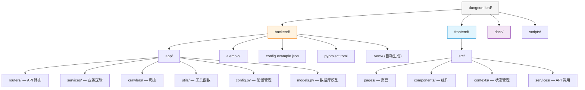

# 安装指南

本指南将帮助你从零开始搭建 Dungeon Lord 的本地开发环境。

## 环境要求

在开始之前，请确保你的系统已安装以下软件：

| 软件 | 最低版本 | 检查命令 | 说明 |
|------|---------|---------|------|
| **Python** | 3.11+ | `python --version` | 后端运行时 |
| **Node.js** | 18+ | `node --version` | 前端构建与开发 |
| **npm** | 9+ | `npm --version` | 随 Node.js 一同安装 |
| **Git** | 2.30+ | `git --version` | 版本控制 |

:::tip
推荐使用 [pyenv](https://github.com/pyenv/pyenv) 管理 Python 版本，[nvm](https://github.com/nvm-sh/nvm) 管理 Node.js 版本。
:::

## 项目目录结构

下图展示了克隆后的项目目录布局及其用途：



## 第一步：克隆仓库

```bash
git clone https://github.com/your-org/dungeon-lord.git
cd dungeon-lord
```

## 第二步：后端设置

### 创建 Python 虚拟环境

```bash
cd backend

# 创建虚拟环境
python -m venv .venv

# 激活虚拟环境
# macOS / Linux:
source .venv/bin/activate
# Windows:
# .venv\Scripts\activate

# 确认 Python 版本
python --version
# 应输出 Python 3.11.x 或更高
```

### 安装依赖

使用 `pip install -e .` 以可编辑模式安装，便于开发调试：

```bash
pip install -e .
```

这将安装 `pyproject.toml` 中声明的所有依赖：

| 依赖包 | 用途 |
|--------|------|
| `fastapi` | Web 框架 |
| `uvicorn` | ASGI 服务器 |
| `sqlalchemy[asyncio]` | 异步 ORM |
| `aiosqlite` | SQLite 异步驱动 |
| `alembic` | 数据库迁移 |
| `chromadb` | 向量数据库 |
| `openai` | LLM API 客户端 |
| `httpx` | 异步 HTTP 客户端 |
| `rank-bm25` | BM25 检索算法 |
| `sentence-transformers` | 本地嵌入模型（可选） |
| `playwright` | 浏览器自动化爬虫 |
| `apscheduler` | 定时任务调度 |
| `python-jose` | JWT 令牌 |
| `beautifulsoup4` | HTML 解析 |
| `sse-starlette` | SSE 流式响应 |

:::info
如需本地嵌入模型（bge-small-zh-v1.5），首次运行时系统会自动从 HuggingFace 下载模型文件。如果网络受限，可配置 `hf_mirror_url` 使用国内镜像。
:::

### 安装开发依赖（可选）

```bash
pip install -e ".[dev]"
```

额外安装 `pytest` 和 `pytest-asyncio`，用于运行测试。

## 第三步：前端设置

```bash
cd frontend

# 安装依赖
npm install
```

前端使用以下核心技术：

| 依赖 | 用途 |
|------|------|
| `react` + `react-dom` | UI 框架 |
| `react-router-dom` | 路由管理 |
| `tailwindcss` | 原子化 CSS |
| `@tanstack/react-query` | 数据请求与缓存 |
| `react-markdown` + `remark-gfm` | Markdown 渲染 |
| `lucide-react` | 图标库 |
| `vite` | 构建工具 |

## 第四步：配置文件

### 复制配置模板

```bash
cd backend
cp config.example.json config.json
```

### 编辑配置

使用你喜欢的编辑器打开 `config.json`：

```json title="backend/config.json"
{
  "openai_api_key": "sk-your-api-key-here",
  "openai_base_url": "",
  "openai_model": "gpt-4o",

  "embedding_provider": "openai",
  "embedding_model": "text-embedding-3-small",

  "author_name": "目标KOL的名字",

  "zsxq_cookie": "",
  "zsxq_group_id": "",

  "zhihu_cookie": "",
  "zhihu_url_token": "",

  "admin_password": "your-admin-password",
  "jwt_secret": "change-me-to-a-random-string",

  "api_host": "0.0.0.0",
  "api_port": 8000
}
```

### 必填配置项

以下是系统启动前 **必须** 填写的配置项：

| 配置项 | 说明 | 获取方式 |
|--------|------|---------|
| `openai_api_key` | LLM API 密钥 | 从 OpenAI 或兼容服务商获取 |
| `admin_password` | 管理员登录密码 | 自行设定 |
| `jwt_secret` | JWT 签名密钥 | 改为随机字符串 |

### 数据源配置（至少选一个）

| 配置项 | 说明 | 获取方式 |
|--------|------|---------|
| `zsxq_cookie` | 知识星球登录 Cookie | 浏览器登录后从 DevTools 复制 |
| `zsxq_group_id` | 知识星球星球 ID | 从星球 URL 中获取 |
| `zhihu_cookie` | 知乎登录 Cookie | 浏览器登录后从 DevTools 复制 |
| `zhihu_url_token` | 知乎用户 URL Token | 从个人主页 URL 中获取 |

:::caution
`config.json` 包含敏感信息（API 密钥、Cookie），已被 `.gitignore` 排除，请勿提交到版本控制系统。
:::

## 第五步：验证安装

### 检查后端

```bash
cd backend
python -c "from app.config import settings; print('配置加载成功:', settings.openai_model)"
```

### 检查前端

```bash
cd frontend
npm run build
```

如果构建成功，说明前端环境已就绪。

## 环境变量说明

除 `config.json` 外，系统还支持以下环境变量（优先级低于 config.json）：

| 环境变量 | 对应配置项 | 说明 |
|---------|-----------|------|
| `OPENAI_API_KEY` | `openai_api_key` | LLM API 密钥 |
| `OPENAI_BASE_URL` | `openai_base_url` | API 基础 URL（用于兼容服务） |
| `DATABASE_URL` | — | 数据库连接字符串（覆盖默认 SQLite 路径） |

:::note
系统优先读取 `config.json` 中的值。环境变量仅作为备选方案。
:::

## 下一步

配置完成后，请继续阅读 [配置说明](./configuration) 了解各配置项的详细含义，或直接跳转到 [首次运行](./first-run) 启动系统。
