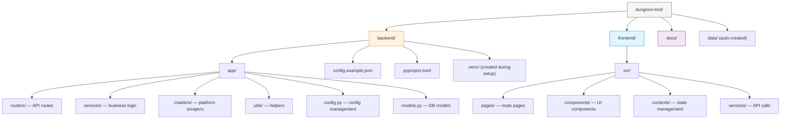

# Installation Guide

This guide walks you through setting up a local development environment for
Dungeon Lord from scratch.

---

## Requirements

Before you begin, make sure the following software is installed on your system:

| Software | Minimum Version | Check Command | Notes |
|----------|----------------|---------------|-------|
| **Python** | 3.11+ | `python --version` | Backend runtime |
| **Node.js** | 18+ | `node --version` | Frontend dev server & build |
| **npm** | 9+ | `npm --version` | Bundled with Node.js |
| **Git** | 2.30+ | `git --version` | Version control |

:::tip
We recommend managing Python versions with [pyenv](https://github.com/pyenv/pyenv)
and Node.js versions with [nvm](https://github.com/nvm-sh/nvm). This makes it easy
to switch between projects without conflicts.
:::

---

## Directory Layout

The diagram below shows the structure you will have after cloning the repository:



---

## Step 1: Clone the Repository

```bash
git clone https://github.com/your-org/dungeon-lord.git
cd dungeon-lord
```

---

## Step 2: Backend Setup

### Create a Python Virtual Environment

```bash
cd backend

# Create the virtual environment
python -m venv .venv

# Activate it
# macOS / Linux:
source .venv/bin/activate
# Windows:
# .venv\Scripts\activate

# Verify the Python version
python --version
# Should print Python 3.11.x or higher
```

### Install Dependencies

Install the project in editable mode so that code changes take effect immediately:

```bash
pip install -e .
```

This reads `pyproject.toml` and installs all runtime dependencies:

| Package | Purpose |
|---------|---------|
| `fastapi` (>= 0.115.0) | Async web framework |
| `uvicorn[standard]` | ASGI server with auto-reload |
| `sqlalchemy[asyncio]` (>= 2.0.0) | Async ORM |
| `aiosqlite` | SQLite async driver |
| `alembic` | Database schema migrations |
| `chromadb` (>= 0.5.0) | Vector database |
| `openai` (>= 1.50.0) | LLM & embedding API client |
| `httpx` | Async HTTP client for crawlers |
| `rank-bm25` | BM25 keyword retrieval |
| `sentence-transformers` | Local embedding models (optional) |
| `beautifulsoup4` | HTML parsing & text extraction |
| `sse-starlette` | Server-Sent Events for streaming |
| `apscheduler` | Periodic crawl scheduling |
| `python-jose[cryptography]` | JWT token creation & verification |
| `playwright` | Browser automation (Zhihu fallback) |
| `yfinance` | Stock data lookup for tool calling |

:::info
If you plan to use the local embedding model (`bge-small-zh-v1.5`), the model
weights will be downloaded automatically from HuggingFace on first use. If you
are in China, configure `hf_mirror_url` to use the domestic mirror
(`https://hf-mirror.com`) — see the [Configuration Reference](./configuration).
:::

### Install Development Dependencies (Optional)

```bash
pip install -e ".[dev]"
```

This additionally installs `pytest` and `pytest-asyncio` for running the test suite.

---

## Step 3: Frontend Setup

```bash
cd frontend

# Install all Node.js dependencies
npm install
```

The frontend relies on the following key packages:

| Package | Purpose |
|---------|---------|
| `react` + `react-dom` (19.x) | UI framework |
| `react-router-dom` (7.x) | Client-side routing |
| `tailwindcss` (4.x) | Utility-first CSS |
| `@tanstack/react-query` | Server-state management & caching |
| `react-markdown` + `remark-gfm` | Markdown rendering for LLM output |
| `lucide-react` | Icon library |
| `vite` (8.x) | Dev server & production bundler |
| `typescript` (6.x) | Type safety |

---

## Step 4: Configuration

### Copy the Template

```bash
cd backend
cp config.example.json config.json
```

### Edit Required Fields

Open `config.json` in your editor and fill in the following **mandatory** fields:

```json title="backend/config.json"
{
  "openai_api_key": "sk-your-api-key-here",
  "admin_password": "choose-a-strong-password",
  "jwt_secret": "replace-with-a-random-string"
}
```

:::warning
The default `jwt_secret` value (`change-me-to-a-random-string`) is insecure.
Generate a strong secret with:

```bash
python -c "import secrets; print(secrets.token_urlsafe(48))"
```
:::

### Required Configuration Items

| Field | Description | How to Obtain |
|-------|-------------|---------------|
| `openai_api_key` | LLM API key | From [OpenAI Platform](https://platform.openai.com/api-keys) or a compatible provider |
| `admin_password` | Admin login password | Choose any strong password |
| `jwt_secret` | JWT signing secret | Generate a random string (see above) |

### Data Source Configuration

You need at least **one** data source configured to crawl content. Set the fields
for whichever platforms you want to use:

| Field | Description | How to Obtain |
|-------|-------------|---------------|
| `zsxq_cookie` | Zsxq login cookie | Log in to [wx.zsxq.com](https://wx.zsxq.com), open DevTools (F12) > Network, copy the `Cookie` header from any `api.zsxq.com` request |
| `zsxq_group_id` | Zsxq group (planet) ID | The numeric ID in the URL: `https://wx.zsxq.com/group/1234567890` |
| `zhihu_cookie` | Zhihu login cookie | Log in to [zhihu.com](https://www.zhihu.com), open DevTools > Network, copy the `Cookie` header from any `zhihu.com/api` request |
| `zhihu_url_token` | Zhihu user URL token | The slug in the profile URL: `https://www.zhihu.com/people/zhang-san-88` — the token is `zhang-san-88` |

:::caution
`config.json` contains sensitive credentials (API keys, cookies). It is already
listed in `.gitignore` — **never** commit it to version control.
:::

---

## Step 5: Verify the Installation

### Check the Backend

```bash
cd backend
python -c "from app.config import settings; print('Config loaded:', settings.openai_model)"
```

Expected output:

```
Config loaded: gpt-4o
```

### Check the Frontend

```bash
cd frontend
npm run build
```

A successful build confirms that the frontend environment is correctly set up.

```bash
✓ 57 modules transformed.
dist/index.html          0.45 kB │ gzip:  0.30 kB
dist/assets/index-*.css  18.2 kB │ gzip:  3.91 kB
dist/assets/index-*.js  142.7 kB │ gzip: 45.12 kB
✓ built in 1.23s
```

---

## Tips & Troubleshooting

### Using pyenv and nvm

```bash
# Install and use Python 3.11 via pyenv
pyenv install 3.11.9
pyenv local 3.11.9

# Install and use Node.js 20 LTS via nvm
nvm install 20
nvm use 20
```

### HuggingFace Mirror (China)

If you are in China and plan to use the local embedding model, the default mirror
is already configured:

```json
{
  "hf_mirror_url": "https://hf-mirror.com"
}
```

You can also set the environment variable before starting the backend:

```bash
export HF_ENDPOINT=https://hf-mirror.com
```

### Common Issues

| Problem | Solution |
|---------|----------|
| `ModuleNotFoundError: No module named 'app'` | Make sure you are in the `backend/` directory and the virtual environment is activated |
| `pip install` hangs on `chromadb` | ChromaDB has large dependencies; give it a few minutes. Try `pip install --upgrade pip` first |
| `npm install` fails with ERESOLVE | Run `npm install --legacy-peer-deps` |
| Port 8000 already in use | Find the process with `lsof -i :8000` and kill it, or change `api_port` in `config.json` |

---

## Next Steps

Installation complete! Continue with the
**[Configuration Reference](./configuration)** to fine-tune all settings, or jump
straight to **[First Run](./first-run)** to start the system.
