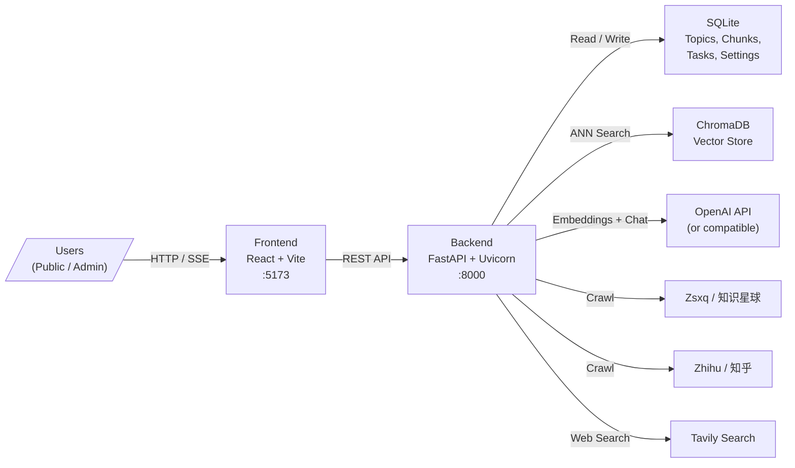
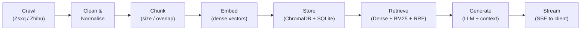

# Dungeon Lord

**Financial KOL Opinion Analysis & RAG Q&A System**

Dungeon Lord automatically crawls content from financial Key Opinion Leaders (KOLs)
on **Zhihu** (知乎) and **Zsxq / Knowledge Planet** (知识星球), builds a searchable
vector knowledge base, and provides AI-powered question-answering with source
citations. Think of it as your personal research assistant that never misses a post
from the analysts you follow.

---

## What the System Does

1. **Crawl** — Periodically fetches new posts, comments, and articles from configured
   Zhihu users and Zsxq groups using authenticated browser cookies.
2. **Clean & Chunk** — Strips HTML, normalises text, and splits long-form content into
   overlapping semantic chunks (configurable size and overlap).
3. **Embed & Store** — Generates dense vector embeddings (OpenAI `text-embedding-3-small`
   or local `bge-small-zh-v1.5`) and persists them in ChromaDB. A parallel BM25 inverted
   index is built for keyword matching.
4. **Retrieve & Generate** — At query time, performs **hybrid retrieval** (dense vectors
   + BM25 keywords + Reciprocal Rank Fusion), feeds the top-K chunks plus conversation
   history to an OpenAI-compatible LLM, and streams the answer back to the client via SSE.

---

## Two-Role Access Model

The system supports two distinct user roles:

| Role | Capabilities | Daily Q&A Limit |
|------|-------------|-----------------|
| **Public Visitor** | Browse the dashboard, ask questions without logging in | Configurable (default: **10/day**, tracked by visitor fingerprint) |
| **Admin** | Unlimited Q&A, trigger crawls, manage settings, view scheduler status | Unlimited |

The public dashboard (`/`) lets anyone explore the latest KOL opinions and ask a
limited number of questions. The admin panel (`/sources`, `/settings`) is protected
behind JWT (HS256) authentication.

---

## Core Features

- **Multi-turn Dialogue** — The chat engine maintains conversation history so
  follow-up questions work naturally without re-establishing context.
- **Source Citation** — Every answer includes the original topic titles, platform name,
  and publication date so you can verify the information at the source.
- **Streaming SSE** — Responses are delivered as Server-Sent Events for a real-time
  typing experience; no need to wait for the full answer.
- **Platform Filtering** — Restrict retrieval to Zhihu-only, Zsxq-only, or both
  platforms in a single query.
- **Vision Model Support** — Optionally route image-containing posts through a
  vision-capable model for richer understanding.
- **Tool Calling** — Enable external tools such as web search (Tavily) or stock
  data lookup that the LLM can invoke autonomously during answer generation.
- **Scheduled Crawling** — APScheduler runs crawl jobs at configurable intervals
  (cron expressions or fixed-minute periods) so the knowledge base stays fresh.
- **Hot-reload Configuration** — Edit `config.json` and most settings take effect
  immediately without restarting the server.

---

## Tech Stack

| Layer | Technology | Purpose |
|-------|-----------|---------|
| **Backend Framework** | FastAPI + Uvicorn | Async HTTP API with auto-generated OpenAPI docs |
| **ORM / Database** | SQLAlchemy 2 (async) + aiosqlite + SQLite | Topic, chunk, and task metadata storage |
| **Vector Store** | ChromaDB | Dense embedding storage and approximate nearest-neighbour search |
| **Keyword Retrieval** | rank-bm25 | BM25 inverted index for hybrid retrieval |
| **Embeddings** | OpenAI `text-embedding-3-small` or `bge-small-zh-v1.5` | Dense vector representation of text chunks |
| **LLM** | OpenAI-compatible API (GPT-4o default) | Answer generation via chat completions |
| **Crawlers** | httpx + BeautifulSoup4 | Authenticated scraping of Zhihu and Zsxq |
| **Auth** | python-jose (JWT HS256) | Stateless admin authentication |
| **Scheduler** | APScheduler | Periodic crawl job orchestration |
| **Frontend** | React 19 + TypeScript + Vite | Single-page application |
| **Styling** | Tailwind CSS 4 | Utility-first CSS framework |
| **Markdown Rendering** | react-markdown + remark-gfm | Rich formatting of LLM responses |
| **Deployment** | Docker + Docker Compose + Nginx | Containerised production setup |

---

## High-Level Architecture



---

## Data Flow



---

## Project Directory Structure

```
dungeon-lord/
├── backend/
│   ├── app/
│   │   ├── crawlers/            # Platform-specific crawlers
│   │   │   ├── base.py          # Abstract crawler interface
│   │   │   ├── zsxq.py          # Zsxq / Knowledge Planet crawler
│   │   │   └── zhihu.py         # Zhihu crawler
│   │   ├── routers/             # FastAPI route handlers
│   │   │   ├── auth.py          # Login / JWT endpoints
│   │   │   ├── chat.py          # RAG Q&A (SSE streaming)
│   │   │   ├── dashboard.py     # Public dashboard data
│   │   │   ├── holdings.py      # Portfolio / holdings data
│   │   │   ├── professor_index.py # Professor index endpoints
│   │   │   ├── proxy.py         # Image proxy
│   │   │   ├── settings.py      # Admin settings CRUD
│   │   │   ├── sources.py       # Crawl triggers & task history
│   │   │   └── topics.py        # Topic browsing & search
│   │   ├── services/            # Business logic layer
│   │   │   ├── embedding.py     # Embedding provider abstraction
│   │   │   ├── hybrid_retriever.py  # Dense + BM25 + RRF fusion
│   │   │   ├── ingestion.py     # Crawl -> clean -> chunk -> embed pipeline
│   │   │   ├── llm_client.py    # OpenAI-compatible chat client
│   │   │   ├── rag.py           # RAG orchestration
│   │   │   ├── tools.py         # LLM tool definitions (Tavily, stocks)
│   │   │   └── vectorstore.py   # ChromaDB wrapper
│   │   ├── utils/
│   │   │   ├── scheduler.py     # APScheduler setup
│   │   │   ├── streaming.py     # SSE helpers
│   │   │   └── text.py          # Text cleaning utilities
│   │   ├── auth.py              # JWT creation & verification
│   │   ├── config.py            # Hot-reloadable config singleton
│   │   ├── database.py          # Async SQLAlchemy engine & session
│   │   ├── main.py              # FastAPI app entry point
│   │   ├── models.py            # SQLAlchemy ORM models
│   │   └── schemas.py           # Pydantic request / response schemas
│   ├── config.example.json      # Template configuration
│   ├── pyproject.toml           # Python project metadata & dependencies
│   └── Dockerfile
├── frontend/
│   ├── src/
│   │   ├── components/          # Reusable UI components
│   │   ├── contexts/            # Auth & Theme React contexts
│   │   ├── pages/               # Route-level page components
│   │   ├── services/            # API client functions
│   │   └── utils/               # SSE, chat history, visitor helpers
│   ├── package.json
│   └── Dockerfile
├── data/                        # SQLite DB + ChromaDB persistence (git-ignored)
├── deploy/nginx/                # Nginx config for production
├── docker-compose.yml
└── README.md
```

---

## Next Steps

Ready to get Dungeon Lord up and running? Follow these guides in order:

1. **[Installation Guide](./guides/installation)** — Set up Python, Node.js, clone
   the repo, and install all dependencies.
2. **[Configuration Reference](./guides/configuration)** — Learn about every config
   option: LLM keys, data source cookies, RAG tuning, and more.
3. **[First Run](./guides/first-run)** — Start the servers, trigger your first crawl,
   and ask your first question.
