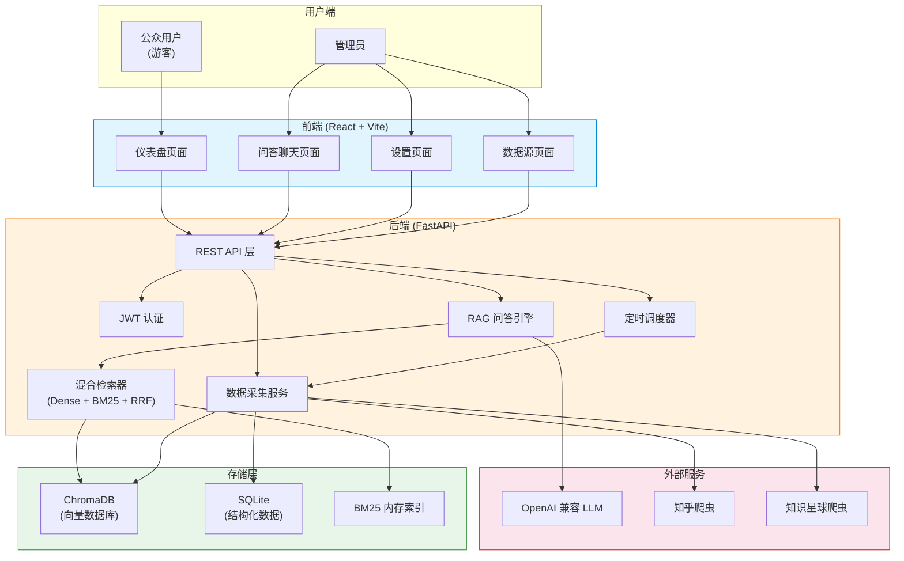
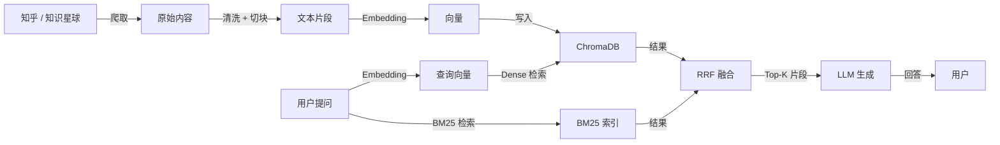

# Dungeon Lord — 财经大V观点分析系统

**Dungeon Lord** 是一个面向财经领域的 **KOL（Key Opinion Leader）观点分析与 RAG 智能问答系统**。它能够自动爬取指定财经大V在 **知乎** 和 **知识星球** 上的发言内容，构建语义向量知识库，并通过大语言模型提供精准的多轮对话式问答服务。

## 系统概述

传统方式下，想要了解一位财经大V的观点需要翻阅大量的历史帖子和回答，费时费力。Dungeon Lord 通过以下流程解决这一痛点：

1. **数据采集** — 自动爬取目标 KOL 在知乎和知识星球上的全部内容（文章、回答、想法、帖子）
2. **语义索引** — 使用嵌入模型将文本切块后转化为向量，存入 ChromaDB 向量数据库
3. **混合检索** — 结合 BM25 稀疏检索与 Dense 向量检索，通过 RRF 融合排序提升召回质量
4. **智能问答** — 基于检索到的参考资料，由大语言模型生成准确、有据可查的回答

## 核心功能

### 双角色访问

系统支持两种用户角色，满足不同使用场景：

| 角色 | 功能 | 说明 |
|------|------|------|
| **公众用户**（游客） | 浏览仪表盘、有限次数的问答 | 无需登录，每日问答有次数限制 |
| **管理员** | 无限问答、触发爬取、管理配置、查看调度状态 | 需要密码登录，拥有完整控制权 |

### RAG 智能问答

- **多轮对话** — 支持上下文记忆，可在已有对话基础上追问
- **来源引用** — 每条回答均附带原文链接，方便溯源验证
- **流式输出** — 基于 SSE（Server-Sent Events）的流式返回，实时查看回答
- **平台过滤** — 可按平台（知乎/知识星球）或 KOL 筛选检索范围

### 混合检索引擎

系统采用 **Dense + BM25 + RRF** 的三段式混合检索架构：

- **Dense 检索** — 使用嵌入模型（OpenAI 或 bge-small-zh-v1.5）进行语义相似度搜索
- **BM25 检索** — 基于关键词的经典稀疏检索，擅长精确匹配专有名词和数字
- **RRF 融合** — 使用加权 Reciprocal Rank Fusion 算法融合两种检索结果

## 技术栈

| 层级 | 技术 | 用途 |
|------|------|------|
| 后端框架 | **FastAPI** | 高性能异步 Web 框架，提供 REST API |
| 前端框架 | **React 19 + TypeScript** | 单页应用，TailwindCSS 样式 |
| 构建工具 | **Vite** | 前端开发与构建 |
| 向量数据库 | **ChromaDB** | 本地持久化向量存储 |
| 关系数据库 | **SQLite + SQLAlchemy** | 结构化数据存储（主题、评论、爬取任务） |
| 数据库迁移 | **Alembic** | 数据库 schema 版本管理 |
| LLM 接口 | **OpenAI 兼容 API** | 支持 OpenAI / 其他兼容服务 |
| 嵌入模型 | **OpenAI / bge-small-zh-v1.5** | 文本向量化（可切换） |
| 稀疏检索 | **rank-bm25** | BM25 关键词检索 |
| 爬虫 | **httpx + Playwright** | HTTP 请求与浏览器自动化 |
| 任务调度 | **APScheduler** | 定时爬取任务 |
| 认证 | **python-jose (JWT)** | 管理员身份验证 |

## 系统架构

下图展示了系统的高层架构：



## 数据流概览



## 项目目录结构

```
dungeon-lord/
├── backend/                  # 后端 (FastAPI)
│   ├── app/
│   │   ├── routers/          # API 路由
│   │   ├── services/         # 核心业务逻辑
│   │   ├── crawlers/         # 爬虫实现
│   │   ├── utils/            # 工具函数
│   │   ├── config.py         # 配置管理
│   │   ├── models.py         # 数据库模型
│   │   ├── database.py       # 数据库连接
│   │   └── auth.py           # 认证逻辑
│   ├── alembic/              # 数据库迁移
│   ├── config.example.json   # 配置示例
│   └── pyproject.toml        # Python 依赖
├── frontend/                 # 前端 (React)
│   ├── src/
│   │   ├── pages/            # 页面组件
│   │   ├── components/       # 通用组件
│   │   ├── contexts/         # React Context
│   │   ├── services/         # API 调用
│   │   └── types/            # TypeScript 类型
│   └── package.json          # Node 依赖
├── docs/                     # 本文档站点
└── scripts/                  # 辅助脚本
```

## 下一步

- [安装指南](./guides/installation) — 从零开始搭建开发环境
- [配置说明](./guides/configuration) — 了解所有配置项的含义
- [首次运行](./guides/first-run) — 启动系统并完成首次数据采集
