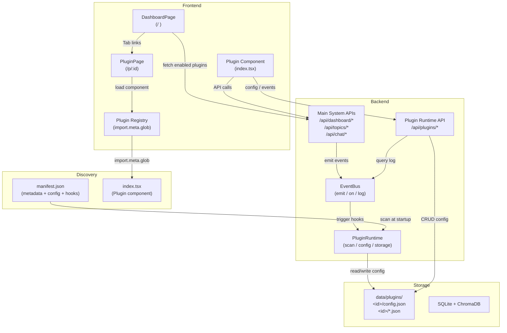
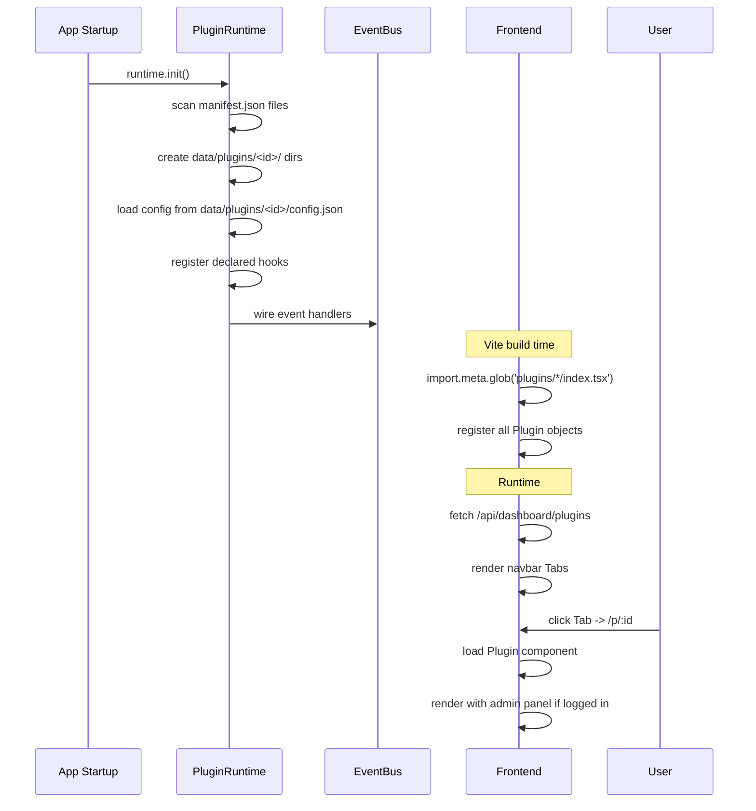
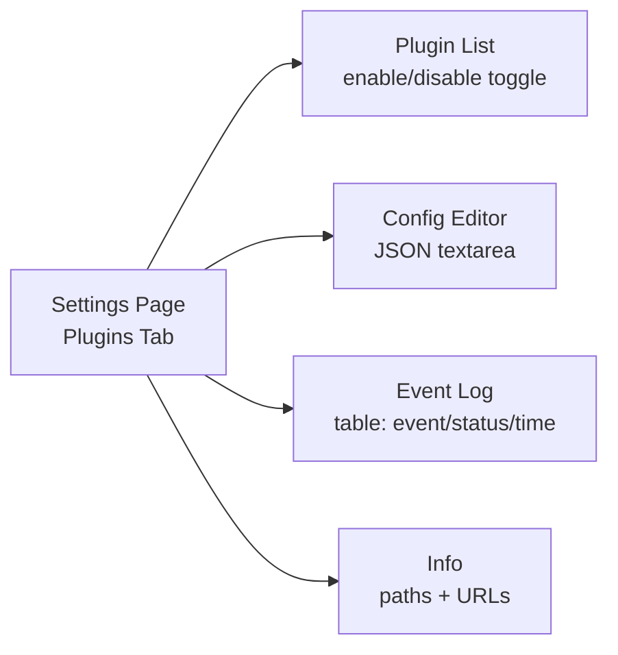

# Plugin System

Dungeon Lord has a pluggable public page system. Plugins are self-contained modules
that extend the public dashboard with new Tab pages, each with independent data,
configuration, and lifecycle management.

---

## Design Principles

| Principle | Description |
|-----------|-------------|
| **Auto-discovery** | Drop a directory into `src/plugins/`, system finds it automatically |
| **Zero-config entry** | Only `manifest.json` + `index.tsx` required |
| **Full data access** | Plugins can call any main system API |
| **Isolated storage** | Each plugin gets `data/plugins/<id>/` |
| **Event-driven** | Plugins hook into main system events |
| **Runtime management** | Config editing, event logs, enable/disable — all in admin UI |

---

## Architecture Diagram



---

## Directory Layout

```
dungeon-lord/
├── frontend/src/plugins/            # Plugin source code
│   ├── registry.ts                  # Auto-discovery via import.meta.glob
│   ├── types.ts                     # Plugin / PluginMeta interfaces
│   ├── PLUGIN.md                    # Development convention doc
│   ├── professor-index/
│   │   ├── manifest.json            # Metadata + config_defaults + hooks
│   │   └── index.tsx                # Default export Plugin object
│   └── recent-insights/
│       ├── manifest.json
│       └── index.tsx
│
├── backend/app/plugins/             # Plugin runtime (Python)
│   ├── __init__.py
│   ├── events.py                    # EventBus singleton
│   └── runtime.py                   # PluginRuntime singleton
│
├── backend/app/routers/plugins.py   # Plugin REST API endpoints
│
└── data/plugins/                    # Per-plugin persistent data
    ├── professor-index/
    │   └── config.json
    └── recent-insights/
        └── config.json
```

---

## Lifecycle



---

## Core Components

### PluginRuntime (`backend/app/plugins/runtime.py`)

Singleton that manages the entire plugin lifecycle:

- **Scanning**: Reads `frontend/src/plugins/*/manifest.json` at startup
- **Config**: Initializes `data/plugins/<id>/config.json` from `config_defaults`
- **Storage**: Manages `data/plugins/<id>/` directory creation
- **Events**: Wires declared hooks to the EventBus

```python
from app.plugins.runtime import runtime

runtime.init()                              # called once at app startup
runtime.get_all_plugins()                   # list all scanned plugins
runtime.get_config("professor-index")       # read plugin config
runtime.update_config("professor-index", {"show_donut_chart": False})
runtime.emit_event("crawl_completed")       # trigger hooks
```

### EventBus (`backend/app/plugins/events.py`)

Central event bus for plugin hooks:

- **`on(event, plugin_id, handler)`** — Register a handler
- **`emit(event, **kwargs)`** — Fire an event, run all hooks, log results
- **`report(plugin_id, event, status, message)`** — Plugin manually reports execution
- **`get_log(plugin_id, event, limit)`** — Query execution history

```python
from app.plugins.events import event_bus

# Register a handler
event_bus.on("crawl_completed", "professor-index", my_handler)

# Emit (runs all hooks, logs each)
await event_bus.emit("crawl_completed")

# Manual report
event_bus.report("my-plugin", "data_sync", "ok", "Synced 50 records")
```

### Plugin Registry (`frontend/src/plugins/registry.ts`)

Frontend auto-discovery using Vite's `import.meta.glob`:

```ts
// Automatically found at build time:
const pluginModules = import.meta.glob<{ default: Plugin }>('./plugins/*/index.tsx')
```

No manual imports needed. `initPlugins()` is called once at app startup.

---

## Event System

### Available Events

| Event | Fired When | Typical Hook Use |
|-------|-----------|-----------------|
| `crawl_completed` | A crawl task finishes successfully | Trigger data re-analysis |
| `topic_created` | A new topic is inserted into the DB | Refresh cached lists |
| `topic_updated` | An existing topic is modified | Invalidate caches |
| `message_received` | A public visitor sends a chat message | Analytics, logging |

### Declaring Hooks

In `manifest.json`:

```json
{
  "hooks": {
    "crawl_completed": "Auto-parse professor index when new articles arrive",
    "topic_created": "Refresh insights list when new content is indexed"
  }
}
```

### Execution Model

1. Main system calls `event_bus.emit("event_name")` at the appropriate point
2. EventBus iterates all registered handlers for that event
3. Each handler runs (sync or async), result is logged
4. Log entries are stored in-memory (max 1000), queryable via API

### Reporting from Frontend

Plugin components can report events back to the system:

```ts
import { reportPluginEvent } from '../../services/api'

await reportPluginEvent('my-plugin', 'manual_sync', 'ok', 'Synced 100 items')
```

These appear in the event log alongside hook executions.

---

## Configuration Model

Each plugin has a JSON config file persisted at `data/plugins/<id>/config.json`.

### Initialization

At startup, if no config file exists, it's created from `manifest.json` `config_defaults`:

```json
// manifest.json
{
  "config_defaults": {
    "auto_parse_enabled": true,
    "auto_parse_interval_days": 7,
    "show_donut_chart": true
  }
}
```

### Runtime Access

**Backend (Python):**
```python
config = runtime.get_config("professor-index")
# {"auto_parse_enabled": true, "auto_parse_interval_days": 7, ...}

runtime.update_config("professor-index", {"show_donut_chart": False})
```

**Frontend (TypeScript):**
```ts
const data = await fetchPluginConfig('professor-index')
// data.config, data.defaults
```

### Admin Editing

In Admin Settings > Plugins, each plugin has an inline JSON editor. Changes are
merge-patched and persisted immediately. A "Reset to Defaults" button is available.

---

## Storage Model

```
data/plugins/
  professor-index/
    config.json          # auto-managed by runtime
    holdings_cache.json  # plugin's own data
  recent-insights/
    config.json
    last_sync.json
```

### Access Rules

- Each plugin can only read/write within its own `data/plugins/<id>/` directory
- Path traversal (`../`) is blocked at the API layer
- Config files are auto-managed; other files are plugin-defined

### API Endpoints

| Endpoint | Method | Description |
|----------|--------|-------------|
| `/api/plugins/data/{id}/{path}` | GET | Read a plugin data file |
| `/api/plugins/data/{id}/{path}` | PUT | Write a plugin data file |

---

## Admin UI

The **Plugins** tab in Admin Settings provides:

1. **Plugin List** — All discovered plugins with enable/disable toggle
2. **Config Editor** — Expand a plugin to edit its JSON config inline
3. **Event Log** — View recent hook executions and reported events
4. **Plugin Info** — Data directory path, config file path, access URL



---

## Security Model

| Concern | Mitigation |
|---------|-----------|
| Config access | Public read, admin-only write |
| Data file access | Admin-only, path traversal blocked |
| Event reporting | Public (plugins need to report), rate-limited by design |
| Plugin code | Runs in user's browser (frontend) — same origin, no sandboxing needed |
| Backend hooks | Run in server process — trusted code only |
