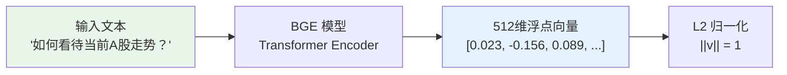
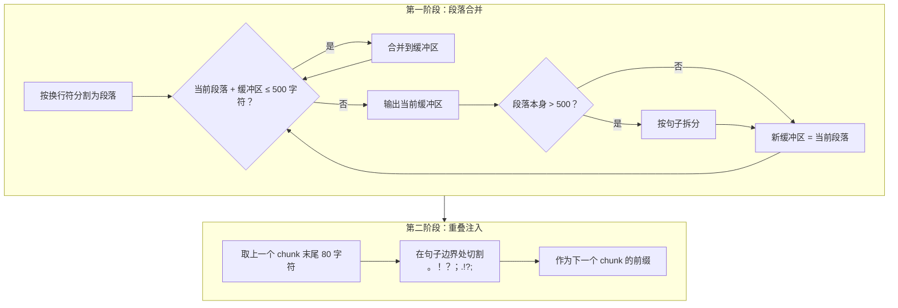
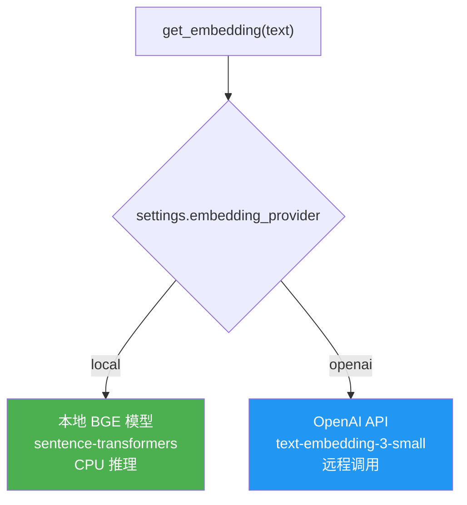

# Embedding 系统

## 概述

Embedding 是 RAG 系统的基础——它将自然语言文本转换为高维向量，使计算机能够通过数学运算衡量文本之间的语义相似度。Dungeon Lord 使用本地部署的中文 Embedding 模型，配合 ChromaDB 向量数据库，实现了高效的语义检索。

---

## Embedding 流程


---

## 本地 Embedding 模型

### BAAI/bge-small-zh-v1.5

这是由智源人工智能研究院（BAAI）发布的中文小规模向量模型，专为中文语义检索场景优化。

| 属性 | 值 |
|------|-----|
| 模型 ID | `BAAI/bge-small-zh-v1.5` |
| 向量维度 | **512** |
| 模型大小 | ~90MB |
| 推理设备 | CPU |
| 加载框架 | `sentence-transformers` |
| 归一化 | `normalize_embeddings=True` |
| 批处理大小 | 64 |

### 工作原理



模型将输入文本经过 Transformer 编码器后，提取 `[CLS]` token 的隐藏状态作为句子向量，再通过 L2 归一化使其单位化，便于后续使用余弦相似度进行比较。

### 代码实现

```python title="backend/app/services/embedding.py"
LOCAL_MODEL_ID = "BAAI/bge-small-zh-v1.5"

async def get_embedding(text: str) -> list[float]:
    """获取单条文本的embedding向量"""
    if settings.embedding_provider == "local":
        model = _get_local_model()
        vec = model.encode(text, normalize_embeddings=True)
        return vec.tolist()  # -> 512维浮点数组

async def get_embeddings(texts: list[str]) -> list[list[float]]:
    """批量获取embedding向量"""
    if settings.embedding_provider == "local":
        model = _get_local_model()
        vecs = model.encode(texts, normalize_embeddings=True, batch_size=64)
        return [v.tolist() for v in vecs]
```

:::tip 延迟加载
模型采用延迟加载策略——首次调用 `get_embedding()` 时才通过 `SentenceTransformer` 加载到内存，后续调用复用同一实例。启动时通过 `ensure_local_model()` 检查模型是否已下载，未下载则自动从 HuggingFace 拉取。
:::

### HuggingFace 镜像支持

为解决国内网络访问 HuggingFace 的问题，系统支持配置镜像源：

```json title="config.json"
{
  "hf_mirror_url": "https://hf-mirror.com"
}
```

代码中自动设置环境变量：
```python
if settings.hf_mirror_url:
    os.environ["HF_ENDPOINT"] = settings.hf_mirror_url
```

---

## ChromaDB 向量数据库

### 配置

```python title="backend/app/services/vectorstore.py"
COLLECTION_NAME = "kol_opinions"

def get_collection() -> chromadb.Collection:
    client = get_chroma_client()
    _collection = client.get_or_create_collection(
        name=COLLECTION_NAME,
        metadata={"hnsw:space": "cosine"},  # 余弦相似度
    )
```

| 配置项 | 值 | 说明 |
|--------|-----|------|
| 存储类型 | `PersistentClient` | 持久化到磁盘 |
| 存储路径 | `data/chroma/` | 重启后数据不丢失 |
| 集合名称 | `kol_opinions` | 存储 KOL 观点片段 |
| 距离度量 | `cosine` | 余弦相似度（HNSW 索引） |

### 余弦相似度

两个向量 **a** 和 **b** 的余弦相似度计算公式：

```
cosine_sim(a, b) = (a . b) / (||a|| * ||b||)
```

由于向量已经过 L2 归一化（`||a|| = 1`），余弦相似度简化为向量点积，计算效率极高。相似度范围为 `[-1, 1]`：

| 范围 | 含义 |
|------|------|
| **1.0** | 完全相同 |
| **0.7 - 0.9** | 高度相关 |
| **0.3 - 0.7** | 部分相关 |
| **< 0.3** | 关联较弱 |

### 查询操作

```python title="backend/app/services/vectorstore.py"
def query(
    query_embedding: list[float],
    n_results: int = 10,
    where: dict | None = None,
) -> dict:
    """向量检索，支持元数据过滤"""
    collection = get_collection()
    kwargs = {
        "query_embeddings": [query_embedding],
        "n_results": n_results,
    }
    if where:
        kwargs["where"] = where  # 例如 {"platform": "zhihu"}
    return collection.query(**kwargs)
```

:::info 元数据过滤
查询时可按 `platform`（平台）或 `kol_id`（作者ID）等字段过滤，ChromaDB 在 HNSW 索引上执行预过滤，不影响检索性能。
:::

---

## 文本切分策略

### 设计目标

文本切分（Chunking）的目标是将长文档拆分为适合 Embedding 和检索的片段，同时保证：

- **语义完整性** — 每个 chunk 应包含完整的语义单元
- **上下文连续性** — 相邻 chunk 之间有重叠，避免信息断裂
- **长度适中** — 太短缺乏上下文，太长稀释关键信息

### 切分参数

| 参数 | 值 | 说明 |
|------|-----|------|
| `chunk_size` | **500 字符** | 每个 chunk 的最大长度 |
| `chunk_overlap` | **80 字符** | 相邻 chunk 的重叠长度 |
| 切分单位 | 字符（非 token） | 中文场景更直观 |

### 两阶段切分算法



### 代码实现

```python title="backend/app/utils/text.py"
def split_text_to_chunks(
    text: str,
    chunk_size: int = 500,
    chunk_overlap: int = 80,
) -> list[str]:
    # 第一步：按段落合并
    paragraphs = [p.strip() for p in text.split("\n") if p.strip()]
    raw_chunks: list[str] = []
    current_chunk = ""

    for para in paragraphs:
        if len(current_chunk) + len(para) + 1 <= chunk_size:
            current_chunk = f"{current_chunk}\n{para}" if current_chunk else para
        else:
            if current_chunk:
                raw_chunks.append(current_chunk.strip())
            if len(para) > chunk_size:
                # 段落过长，按句子拆分
                sub_chunks = _split_by_sentences(para, chunk_size)
                raw_chunks.extend(sub_chunks)
                current_chunk = ""
            else:
                current_chunk = para

    # 第二步：添加重叠
    chunks: list[str] = [raw_chunks[0]]
    for i in range(1, len(raw_chunks)):
        prev = raw_chunks[i - 1]
        overlap_text = prev[-chunk_overlap:]  # 取末尾80字符
        # 尝试在句子边界切割
        for sep in ["。", "！", "？", "；", ".", "!", "?", "\n"]:
            idx = overlap_text.find(sep)
            if idx != -1:
                overlap_text = overlap_text[idx + 1:]
                break
        chunks.append(f"{overlap_text.strip()}\n{raw_chunks[i]}")

    return chunks
```

### 可视化示例

以下是一段知乎回答的切分过程：

```
原始文本 (约 1200 字符):
┌─────────────────────────────────────────────────────────┐
│ 当前A股市场处于震荡整理阶段。从技术面来看，上证指数在     │
│ 3200点附近获得支撑，但上方3300点压力较大。MACD指标显示    │
│ 短期动能不足，成交量持续萎缩。                            │
│                                                          │
│ 从基本面来看，经济复苏的节奏比预期要慢。消费数据虽然环     │
│ 比改善，但同比仍处于低位。社融数据有所回升，主要靠政府     │
│ 债券支撑，企业中长期贷款需求偏弱。                        │
│                                                          │
│ 板块方面，建议关注三个方向：                              │
│ 一是AI产业链，算力需求持续增长；                          │
│ 二是新能源，光伏组件价格企稳回升；                        │
│ 三是医药创新药，政策环境持续改善。                        │
│                                                          │
│ 操作上建议保持6成仓位，逢低布局优质成长股...              │
└─────────────────────────────────────────────────────────┘

切分结果 (chunk_size=500, chunk_overlap=80):

Chunk 1 (490 字符):
┌─────────────────────────────────────────────────────────┐
│ 当前A股市场处于震荡整理阶段。从技术面来看，上证指数在     │
│ 3200点附近获得支撑，但上方3300点压力较大。MACD指标显示    │
│ 短期动能不足，成交量持续萎缩。                            │
│                                                          │
│ 从基本面来看，经济复苏的节奏比预期要慢。消费数据虽然环     │
│ 比改善，但同比仍处于低位。                                │
└─────────────────────────────────────────────────────────┘

Chunk 2 (470 字符):
┌─────────────────────────────────────────────────────────┐
│ 消费数据虽然环比改善，但同比仍处于低位。社融数据有所      │ ← 重叠
│ 回升，主要靠政府债券支撑，企业中长期贷款需求偏弱。        │
│                                                          │
│ 板块方面，建议关注三个方向：                              │
│ 一是AI产业链，算力需求持续增长；                          │
│ 二是新能源，光伏组件价格企稳回升；                        │
│ 三是医药创新药，政策环境持续改善。                        │
└─────────────────────────────────────────────────────────┘

Chunk 3 (180 字符):
┌─────────────────────────────────────────────────────────┐
│ 政策环境持续改善。                                        │ ← 重叠
│                                                          │
│ 操作上建议保持6成仓位，逢低布局优质成长股...              │
└─────────────────────────────────────────────────────────┘
```

:::note 重叠的作用
Chunk 2 的开头与 Chunk 1 的末尾有约 80 字符的重叠。这确保了"社融数据"这一关键信息同时出现在两个 chunk 中，避免在 chunk 边界处丢失语义连贯性。
:::

---

## 数据预处理

在文本切分之前，原始数据需要经过预处理清洗。

### 知识星球 (ZSXQ) Q&A 重组

知识星球的问答格式被重组为统一的结构化文本：

```
原始格式:                          重组后:
┌─────────────────────┐           ┌─────────────────────┐
│ {                   │           │ 提问者: 张三        │
│   "question": {     │    →      │ 问题: 现在适合入场吗 │
│     "owner": "张三",│           │ 回答者: 星主        │
│     "text": "..."   │           │ 回答: 目前市场...   │
│   },                │           └─────────────────────┘
│   "answer": {       │
│     "text": "..."   │
│   }                 │
│ }                   │
└─────────────────────┘
```

### HTML 清理

去除 `<e>`、`<br>` 及其他 HTML 标签，保留纯文本内容。

### 知乎内容处理

| 内容类型 | 处理方式 |
|----------|----------|
| 回答（answer） | 在文本前拼接问题标题作为上下文 |
| 想法（pin） | HTML 标签清理 |
| 文章（article） | 直接使用正文 |

---

## 双 Provider 架构

系统支持两种 Embedding Provider，通过配置切换：



| 对比项 | 本地 BGE | OpenAI API |
|--------|----------|------------|
| 维度 | 512 | 1536 |
| 延迟 | ~10ms/条 | ~100ms/条 |
| 成本 | 免费 | 按 token 计费 |
| 网络依赖 | 无 | 需要网络 |
| 中文优化 | 专门优化 | 通用模型 |
| 批处理大小 | 64 | 512 |

:::info 默认配置
当前部署使用 **本地 BGE 模型**（`embedding_provider: "local"`），适合对延迟敏感、对成本敏感的场景。如需更高精度，可切换为 OpenAI 的 `text-embedding-3-small`。
:::

---

## 下一步

- [混合检索](./hybrid-retrieval.mdx) — 了解 Dense + BM25 + RRF 的融合检索机制
- [Prompt 工程](./prompt-engineering.mdx) — 系统提示词设计与响应生成策略
