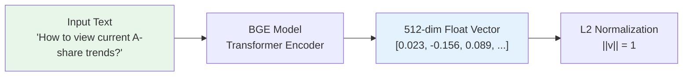
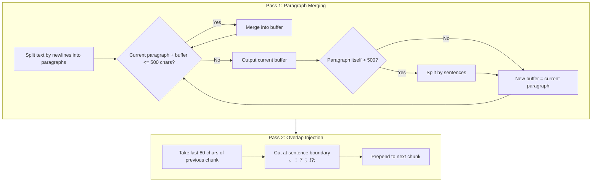
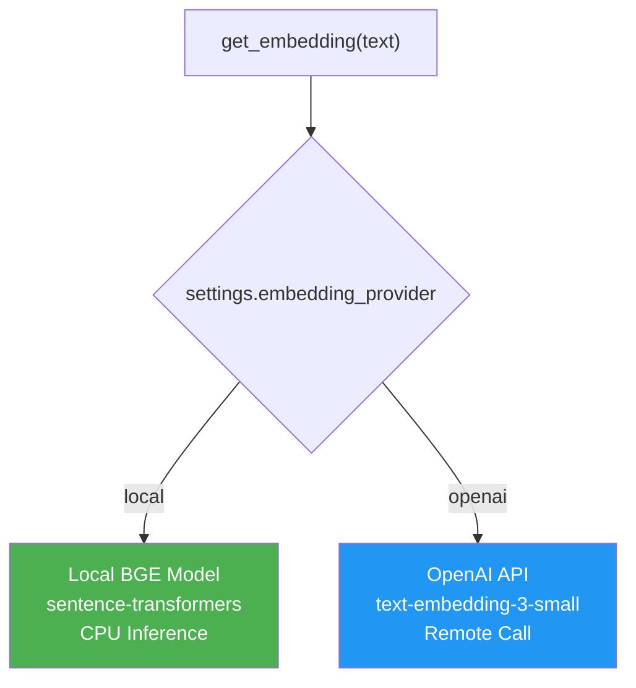

# Embedding System

## Overview

Embedding is the foundation of the RAG system. It converts natural language text into high-dimensional vectors, enabling the system to measure semantic similarity through mathematical operations. Dungeon Lord uses a locally deployed Chinese embedding model paired with ChromaDB for efficient semantic retrieval, with an optional OpenAI API provider for higher-dimensional embeddings.

---

## Embedding Pipeline


---

## Local Embedding Model

### BAAI/bge-small-zh-v1.5

This is a small-scale Chinese vector model released by the Beijing Academy of Artificial Intelligence (BAAI), specifically optimized for Chinese semantic retrieval scenarios.

| Property | Value |
|----------|-------|
| Model ID | `BAAI/bge-small-zh-v1.5` |
| Vector Dimensions | **512** |
| Model Size | ~90MB |
| Inference Device | CPU |
| Loading Framework | `sentence-transformers` |
| Normalization | `normalize_embeddings=True` |
| Batch Size | 64 |

### How the Model Works



The model passes input text through a Transformer encoder, extracts the `[CLS]` token's hidden state as the sentence vector, then applies L2 normalization to unitize it. This makes cosine similarity computation equivalent to a simple dot product, which is highly efficient.

### Code Implementation

```python title="backend/app/services/embedding.py"
LOCAL_MODEL_ID = "BAAI/bge-small-zh-v1.5"

async def get_embedding(text: str) -> list[float]:
    """Get the embedding vector for a single text."""
    if settings.embedding_provider == "local":
        model = _get_local_model()
        vec = model.encode(text, normalize_embeddings=True)
        return vec.tolist()  # -> 512-dim float array

async def get_embeddings(texts: list[str]) -> list[list[float]]:
    """Batch-get embedding vectors for multiple texts."""
    if settings.embedding_provider == "local":
        model = _get_local_model()
        vecs = model.encode(texts, normalize_embeddings=True, batch_size=64)
        return [v.tolist() for v in vecs]
```

:::tip Lazy Loading
The model uses a lazy loading strategy -- it is only loaded into memory via `SentenceTransformer` on the first call to `get_embedding()`. Subsequent calls reuse the same instance. At startup, `ensure_local_model()` checks whether the model has been downloaded; if not, it is automatically fetched from HuggingFace.
:::

### HuggingFace Mirror Support

To address network access issues in certain regions, the system supports configuring a mirror source:

```json title="config.json"
{
  "hf_mirror_url": "https://hf-mirror.com"
}
```

The environment variable is set automatically in code:

```python
if settings.hf_mirror_url:
    os.environ["HF_ENDPOINT"] = settings.hf_mirror_url
```

---

## ChromaDB Vector Database

### Configuration

```python title="backend/app/services/vectorstore.py"
COLLECTION_NAME = "kol_opinions"

def get_collection() -> chromadb.Collection:
    client = get_chroma_client()
    _collection = client.get_or_create_collection(
        name=COLLECTION_NAME,
        metadata={"hnsw:space": "cosine"},  # cosine similarity
    )
```

| Setting | Value | Description |
|---------|-------|-------------|
| Storage Type | `PersistentClient` | Persisted to disk |
| Storage Path | `data/chroma/` | Data survives restarts |
| Collection Name | `kol_opinions` | Stores KOL opinion fragments |
| Distance Metric | `cosine` | Cosine similarity (HNSW index) |

### Cosine Similarity

The cosine similarity between two vectors **a** and **b** is defined as:

```
cosine_sim(a, b) = (a . b) / (||a|| * ||b||)
```

Since vectors are already L2-normalized (`||a|| = 1`), cosine similarity simplifies to the dot product, making computation highly efficient. The similarity range is `[-1, 1]`:

| Range | Interpretation |
|-------|----------------|
| **1.0** | Identical |
| **0.7 - 0.9** | Highly related |
| **0.3 - 0.7** | Partially related |
| **< 0.3** | Weakly related |

### Query Operations

```python title="backend/app/services/vectorstore.py"
def query(
    query_embedding: list[float],
    n_results: int = 10,
    where: dict | None = None,
) -> dict:
    """Vector search with optional metadata filtering."""
    collection = get_collection()
    kwargs = {
        "query_embeddings": [query_embedding],
        "n_results": n_results,
    }
    if where:
        kwargs["where"] = where  # e.g., {"platform": "zhihu"}
    return collection.query(**kwargs)
```

:::info Metadata Filtering
Queries can be filtered by `platform` or `kol_id` (author ID). ChromaDB performs pre-filtering on the HNSW index without impacting retrieval performance.
:::

---

## Text Chunking Strategy

### Design Goals

Text chunking (splitting long documents into segments) aims to produce fragments suitable for embedding and retrieval while ensuring:

- **Semantic completeness** -- Each chunk should contain a complete semantic unit
- **Contextual continuity** -- Adjacent chunks overlap to prevent information loss at boundaries
- **Appropriate length** -- Too short lacks context; too long dilutes key information

### Chunking Parameters

| Parameter | Value | Description |
|-----------|-------|-------------|
| `chunk_size` | **500 characters** | Maximum length of each chunk |
| `chunk_overlap` | **80 characters** | Overlap length between adjacent chunks |
| Splitting Unit | Characters (not tokens) | More intuitive for Chinese text |

### Two-Pass Chunking Algorithm



### Code Implementation

```python title="backend/app/utils/text.py"
def split_text_to_chunks(
    text: str,
    chunk_size: int = 500,
    chunk_overlap: int = 80,
) -> list[str]:
    # Pass 1: Merge paragraphs
    paragraphs = [p.strip() for p in text.split("\n") if p.strip()]
    raw_chunks: list[str] = []
    current_chunk = ""

    for para in paragraphs:
        if len(current_chunk) + len(para) + 1 <= chunk_size:
            current_chunk = f"{current_chunk}\n{para}" if current_chunk else para
        else:
            if current_chunk:
                raw_chunks.append(current_chunk.strip())
            if len(para) > chunk_size:
                # Paragraph too long, split by sentences
                sub_chunks = _split_by_sentences(para, chunk_size)
                raw_chunks.extend(sub_chunks)
                current_chunk = ""
            else:
                current_chunk = para

    # Pass 2: Add overlap
    chunks: list[str] = [raw_chunks[0]]
    for i in range(1, len(raw_chunks)):
        prev = raw_chunks[i - 1]
        overlap_text = prev[-chunk_overlap:]  # last 80 chars
        # Try to cut at sentence boundary
        for sep in ["。", "！", "？", "；", ".", "!", "?", "\n"]:
            idx = overlap_text.find(sep)
            if idx != -1:
                overlap_text = overlap_text[idx + 1:]
                break
        chunks.append(f"{overlap_text.strip()}\n{raw_chunks[i]}")

    return chunks
```

### Visual Example

Below is a step-by-step chunking example for a Chinese financial text:

```
Original Text (~1200 characters):
+-------------------------------------------------------------+
| The A-share market is in a consolidation phase. From a      |
| technical perspective, the Shanghai Composite found support  |
| near 3200, but faces strong resistance at 3300. MACD shows  |
| weak short-term momentum with declining volume.              |
|                                                              |
| Fundamentally, economic recovery is slower than expected.    |
| Consumer data improved month-over-month but remains low      |
| year-over-year. Social financing rebounded, mainly driven    |
| by government bonds, while corporate medium-to-long-term     |
| loan demand is weak.                                        |
|                                                              |
| Sector-wise, three directions are worth watching:           |
| 1. AI industry chain -- computing demand continues to grow   |
| 2. New energy -- photovoltaic component prices stabilizing   |
| 3. Innovative pharma -- policy environment improving         |
|                                                              |
| Operationally, maintain 60% position, buy quality growth...  |
+-------------------------------------------------------------+

Chunking Result (chunk_size=500, chunk_overlap=80):

Chunk 1 (490 chars):
+-------------------------------------------------------------+
| The A-share market is in a consolidation phase. From a      |
| technical perspective, the Shanghai Composite found support  |
| near 3200, but faces strong resistance at 3300. MACD shows  |
| weak short-term momentum with declining volume.              |
|                                                              |
| Fundamentally, economic recovery is slower than expected.    |
| Consumer data improved month-over-month but remains low      |
+-------------------------------------------------------------+

Chunk 2 (470 chars):
+-------------------------------------------------------------+
| Consumer data improved month-over-month but remains low      | <-- overlap
| year-over-year. Social financing rebounded, mainly driven    |
| by government bonds, while corporate medium-to-long-term     |
| loan demand is weak.                                        |
|                                                              |
| Sector-wise, three directions are worth watching:           |
| 1. AI industry chain -- computing demand continues to grow   |
| 2. New energy -- photovoltaic component prices stabilizing   |
| 3. Innovative pharma -- policy environment improving         |
+-------------------------------------------------------------+

Chunk 3 (180 chars):
+-------------------------------------------------------------+
| policy environment improving.                                | <-- overlap
|                                                              |
| Operationally, maintain 60% position, buy quality growth...  |
+-------------------------------------------------------------+
```

:::note Purpose of Overlap
Chunk 2's beginning overlaps with Chunk 1's end by approximately 80 characters. This ensures that "social financing" (a key concept) appears in both chunks, preventing semantic discontinuity at chunk boundaries.
:::

---

## Data Preprocessing

Before chunking, raw data undergoes preprocessing and cleaning.

### Zsxq (Knowledge Planet) Q&A Reformatting

Q&A-format posts from Zsxq are restructured into a unified text format:

```
Original Format:                   Reformatted:
+--------------------+            +--------------------+
| {                  |            | Questioner: Zhang  |
|   "question": {    |     -->    | Q: Is now a good   |
|     "owner": "...",|            |    time to enter?   |
|     "text": "..."  |            | Answerer: Star     |
|   },               |            | A: Currently the   |
|   "answer": {      |            |    market...       |
|     "text": "..."  |            +--------------------+
|   }                |
| }                  |
+--------------------+
```

### HTML Cleaning

Removes `<e>`, `<br>`, and other HTML tags, retaining only plain text content.

### Zhihu Content Processing

| Content Type | Processing |
|--------------|------------|
| Answer | Prepends the question title as context |
| Pin (thought) | HTML tag cleaning |
| Article | Uses body text directly |

---

## Dual Provider Architecture

The system supports two embedding providers, switchable via configuration:



| Comparison | Local BGE | OpenAI API |
|------------|-----------|------------|
| Dimensions | 512 | 1536 |
| Latency | ~10ms per text | ~100ms per text |
| Cost | Free | Per-token billing |
| Network Dependency | None | Requires internet |
| Chinese Optimization | Purpose-built | General-purpose |
| Batch Size | 64 | 512 |

:::info Default Configuration
The current deployment uses the **local BGE model** (`embedding_provider: "local"`), which is ideal for latency-sensitive and cost-sensitive scenarios. For higher precision, switch to OpenAI's `text-embedding-3-small` by changing the provider setting.
:::

---

## Next Steps

- [Hybrid Retrieval](./hybrid-retrieval.mdx) -- Understand the Dense + BM25 + RRF fusion retrieval mechanism
- [Prompt Engineering](./prompt-engineering.mdx) -- System prompt design and response generation strategies
