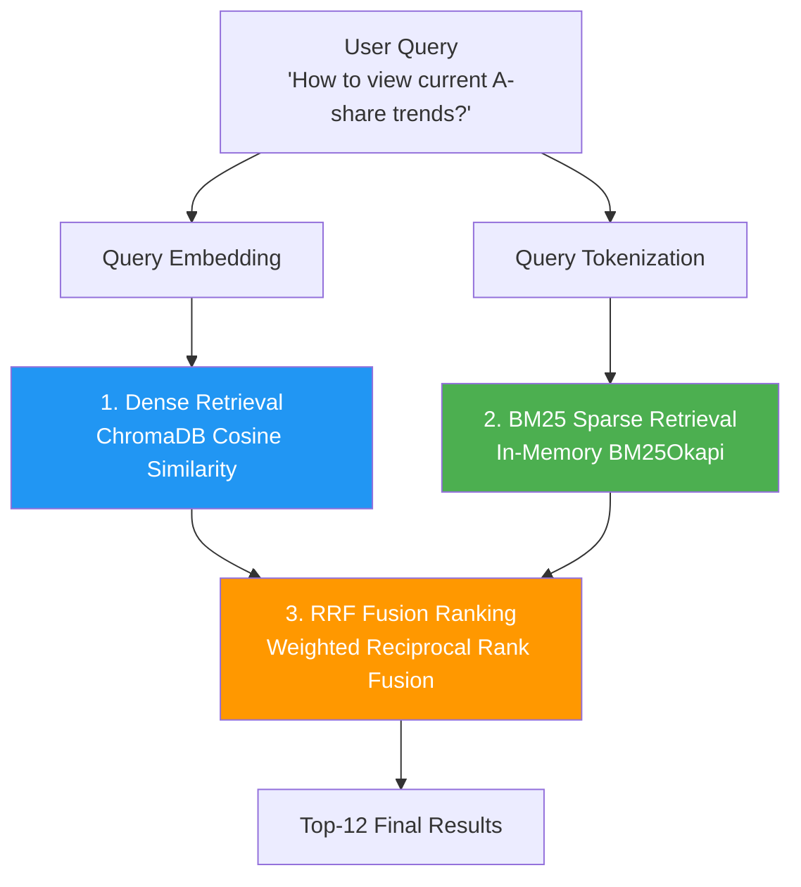
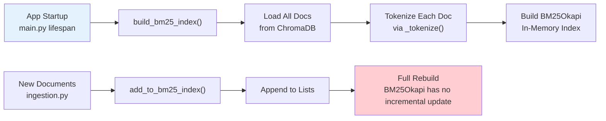
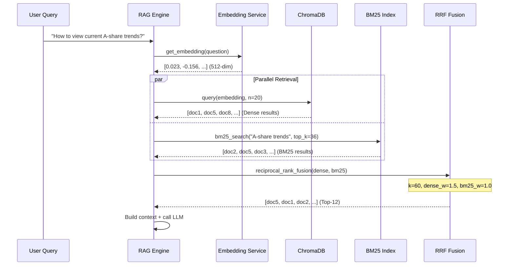

# Hybrid Retrieval

## Overview

Hybrid Retrieval is the core competitive advantage of Dungeon Lord's RAG system. It simultaneously executes **semantic vector retrieval** and **keyword sparse retrieval**, then merges both result sets through **RRF (Reciprocal Rank Fusion)** to combine the strengths of semantic understanding and exact keyword matching.

---

## Three Retrieval Methods



---

## 1. Dense Vector Retrieval

Dense retrieval is based on cosine similarity between embedding vectors. It excels at capturing **semantically similar** queries that use different wording.

### How It Works

1. The query text is encoded into a 512-dimensional vector by `bge-small-zh-v1.5`
2. An approximate nearest neighbor search is executed in ChromaDB (HNSW index)
3. Candidate documents with the highest cosine similarity are returned

### Implementation

```python title="backend/app/services/rag.py"
# Dense vector retrieval
question_embedding = await get_embedding(question)

dense_raw = query(
    query_embedding=question_embedding,
    n_results=min(top_k * 3, 20),  # over-fetch for fusion
    where=filters,
)
dense_results = []
for i in range(len(dense_docs)):
    dense_results.append({
        "id": dense_ids[i],
        "document": dense_docs[i],
        "metadata": dense_metas[i],
    })
```

:::note Over-Fetch Strategy
Dense retrieval fetches `min(top_k * 3, 20)` candidates (20 when top_k=12), rather than returning exactly 12. This provides a larger candidate pool for downstream RRF fusion, improving recall.
:::

### Strengths and Limitations

| Strengths | Limitations |
|-----------|-------------|
| Understands synonyms ("bull market" = "upward trend") | Weaker at exact terminology matching |
| Captures metaphors and contextual semantics | Bounded by embedding model quality |
| No dependency on tokenization | Performance degrades on long-tail queries |

---

## 2. BM25 Sparse Retrieval

BM25 is a classic keyword retrieval algorithm that excels at **exact terminology matching**. The system uses the `BM25Okapi` implementation from the `rank_bm25` library.

### Chinese N-gram Tokenization

Since Chinese has no natural word boundaries (unlike English with spaces), the system uses an **n-gram tokenization strategy** rather than relying on a segmentation library:

```python title="backend/app/services/hybrid_retriever.py"
def _tokenize(text: str) -> list[str]:
    """Chinese-English mixed tokenization: English words + Chinese n-grams (1-3) + numbers."""
    # English words (preserved as whole words)
    words = re.findall(r'[a-zA-Z]+', text.lower())
    # Chinese characters
    chinese_chars = re.findall(r'[一-鿿]', text)
    # Chinese bigrams + trigrams (improves multi-char word matching)
    ngrams = list(chinese_chars)                             # unigram: each char
    for i in range(len(chinese_chars) - 1):
        ngrams.append(chinese_chars[i] + chinese_chars[i+1])   # bigram: adjacent pair
    for i in range(len(chinese_chars) - 2):
        ngrams.append(chinese_chars[i] + chinese_chars[i+1] + chinese_chars[i+2])  # trigram: adjacent triple
    # Numbers
    numbers = re.findall(r'\d+', text)
    return words + ngrams + numbers
```

### N-gram Example Breakdown

Tokenizing the text `"A-share market consolidation"` (A股市场震荡):

```
Input: "A股市场震荡"

English words: ["a"]
Chinese characters: ["股", "市", "场", "震", "荡"]

Unigram (single chars):
  股 | 市 | 场 | 震 | 荡

Bigram (adjacent pairs):
  股市 | 市场 | 场震 | 震荡

Trigram (adjacent triples):
  股市场 | 市场震 | 场震荡

Final token list:
  ["a", "股", "市", "场", "震", "荡", "股市", "市场", "场震", "震荡",
   "股市场", "市场震", "场震荡"]
```

:::tip Advantages of N-gram Tokenization
- **Unigram** guarantees single-character recall ("牛" matches all documents containing "牛")
- **Bigram** captures common two-character words ("市场", "震荡")
- **Trigram** covers three-character terms ("创业板", "概念股")
- No dictionary or segmentation model required; naturally handles new terms and professional jargon
:::

### BM25 Search Implementation

```python title="backend/app/services/hybrid_retriever.py"
def bm25_search(query: str, top_k: int = 20) -> list[dict]:
    """BM25 sparse retrieval."""
    if _bm25_index is None or not _bm25_docs:
        return []

    query_tokens = _tokenize(query)
    scores = _bm25_index.get_scores(query_tokens)

    # Take top_k highest scores
    ranked = sorted(enumerate(scores), key=lambda x: x[1], reverse=True)[:top_k]

    results = []
    for idx, score in ranked:
        if score <= 0:
            continue
        results.append({
            "id": _bm25_ids[idx],
            "document": _bm25_docs[idx],
            "metadata": _bm25_metadatas[idx],
            "score": float(score),
        })
    return results
```

### BM25 Index Lifecycle



:::warning Full Rebuild Required
`BM25Okapi` does not support incremental updates. Every time new documents are added, the entire index must be rebuilt from all documents. For large document sets (> 100K), rebuilding may take several seconds. BM25 can be disabled via `settings.enable_bm25 = false` to avoid this overhead.
:::

---

## 3. RRF Fusion Ranking

### What Is RRF?

**Reciprocal Rank Fusion (RRF)** is a rank-based fusion algorithm. It does not depend on raw scores from each retrieval method (since scores from different methods are not directly comparable). Instead, it uses only **rank positions** to compute a fusion score.

### Weighted RRF Formula

```
score(doc) = sum(weight_i / (k + rank_i + 1))
```

Where:
- `weight_i` -- Weight of the i-th retrieval method
- `k` -- Smoothing constant (controls sensitivity to rank differences)
- `rank_i` -- Document's rank in the i-th method (0-indexed)

### Parameter Table

| Parameter | Value | Description |
|-----------|-------|-------------|
| `dense_weight` | **1.5** | Dense retrieval weight (semantics prioritized) |
| `bm25_weight` | **1.0** | BM25 retrieval weight |
| `k` | **60** | RRF smoothing constant |
| `top_k` | **12** | Final number of returned results |

### Detailed Score Calculation Example

Consider 3 documents ranked differently by the two retrieval methods:

```
Document A: Dense rank #1, BM25 rank #3
Document B: Dense rank #3, BM25 rank #1
Document C: Dense rank #2, BM25 not found

k = 60

Document A RRF score:
  = 1.5 / (60 + 1 + 1) + 1.0 / (60 + 3 + 1)
  = 1.5 / 62 + 1.0 / 64
  = 0.02419 + 0.01563
  = 0.03982

Document B RRF score:
  = 1.5 / (60 + 3 + 1) + 1.0 / (60 + 1 + 1)
  = 1.5 / 64 + 1.0 / 62
  = 0.02344 + 0.01613
  = 0.03957

Document C RRF score:
  = 1.5 / (60 + 2 + 1) + 0
  = 1.5 / 63
  = 0.02381

Final ranking: A (0.03982) > B (0.03957) > C (0.02381)
```

Document A wins because its top Dense rank contributes a high weighted score, even though its BM25 rank is lower. Document C, found only by Dense retrieval, ranks last because it has no BM25 contribution.

### Code Implementation

```python title="backend/app/services/hybrid_retriever.py"
def reciprocal_rank_fusion(
    dense_results: list[dict],
    bm25_results: list[dict],
    k: int = 30,
    top_k: int = 8,
    dense_weight: float = 1.5,
    bm25_weight: float = 1.0,
) -> list[dict]:
    """Weighted Reciprocal Rank Fusion (RRF)."""

    rrf_scores: dict[str, float] = {}
    doc_map: dict[str, dict] = {}

    # Dense ranking (weighted)
    for rank, item in enumerate(dense_results):
        doc_id = item["id"]
        rrf_scores[doc_id] = rrf_scores.get(doc_id, 0) + dense_weight / (k + rank + 1)
        doc_map[doc_id] = item

    # BM25 ranking (weighted)
    for rank, item in enumerate(bm25_results):
        doc_id = item["id"]
        rrf_scores[doc_id] = rrf_scores.get(doc_id, 0) + bm25_weight / (k + rank + 1)
        if doc_id not in doc_map:
            doc_map[doc_id] = item

    # Sort by RRF score
    sorted_ids = sorted(
        rrf_scores.keys(),
        key=lambda x: rrf_scores[x],
        reverse=True,
    )[:top_k]

    results = []
    for doc_id in sorted_ids:
        item = doc_map[doc_id]
        item["rrf_score"] = rrf_scores[doc_id]
        results.append(item)

    return results
```

---

## Complete Retrieval Sequence



---

## Comparison Example

For the query "New energy vehicle industry chain investment opportunities" (新能源汽车产业链投资机会), here is how the three methods compare:

### Dense Only Results

| Rank | Document Fragment | Similarity |
|------|-------------------|------------|
| 1 | "...EV penetration continues to rise, lithium battery chain benefits..." | 0.87 |
| 2 | "...photovoltaic overcapacity risks need attention..." | 0.82 |
| 3 | "...carbon neutrality policy drives clean energy development..." | 0.79 |

> Dense retrieval captures the semantic association between "EV" and "new energy vehicles", but may include semantically related yet off-topic results (e.g., photovoltaics).

### BM25 Only Results

| Rank | Document Fragment | BM25 Score |
|------|-------------------|------------|
| 1 | "...new energy vehicle industry chain upstream/downstream analysis..." | 12.3 |
| 2 | "...new energy vehicle subsidy policy interpretation..." | 9.8 |
| 3 | "...auto parts supplier investment value..." | 5.2 |

> BM25 precisely matches keywords like "new energy vehicle" and "industry chain", but may miss content using different phrasing.

### Hybrid (RRF) Results

| Rank | Document Fragment | RRF Score |
|------|-------------------|-----------|
| 1 | "...new energy vehicle industry chain upstream/downstream analysis..." | 0.0412 |
| 2 | "...EV penetration continues to rise, lithium battery chain benefits..." | 0.0387 |
| 3 | "...new energy vehicle subsidy policy interpretation..." | 0.0354 |

> After RRF fusion, the results retain both exact keyword matches and semantically related content, achieving the best overall performance.

---

## Performance Characteristics

| Metric | Dense | BM25 | Hybrid |
|--------|-------|------|--------|
| Index Building | Persistent, incremental | Full rebuild | -- |
| Query Latency | ~50ms | ~5ms | ~60ms |
| Memory Usage | Low (ChromaDB on disk) | High (all docs in memory) | -- |
| Recall Rate | High | Medium | **Highest** |
| Precision | Medium | High | **Highest** |

:::info Configurable Toggle
BM25 retrieval can be disabled via configuration:
```json title="config.json"
{
  "enable_bm25": false
}
```
When disabled, the system degrades to pure Dense retrieval. This is suitable for smaller document sets or scenarios where latency is critical.
:::

---

## Interactive Component

The frontend provides an interactive `<HybridRetrieval />` component that lets you toggle between Dense-only, BM25-only, and Hybrid modes to observe how the same query produces different results under each strategy.

:::tip Try It Yourself
Navigate to the Dashboard page and use the retrieval mode toggle to experiment with the three strategies in real time.
:::

---

## Next Steps

- [Prompt Engineering](./prompt-engineering.mdx) -- System prompt design, multi-turn conversation, and streaming response mechanisms
