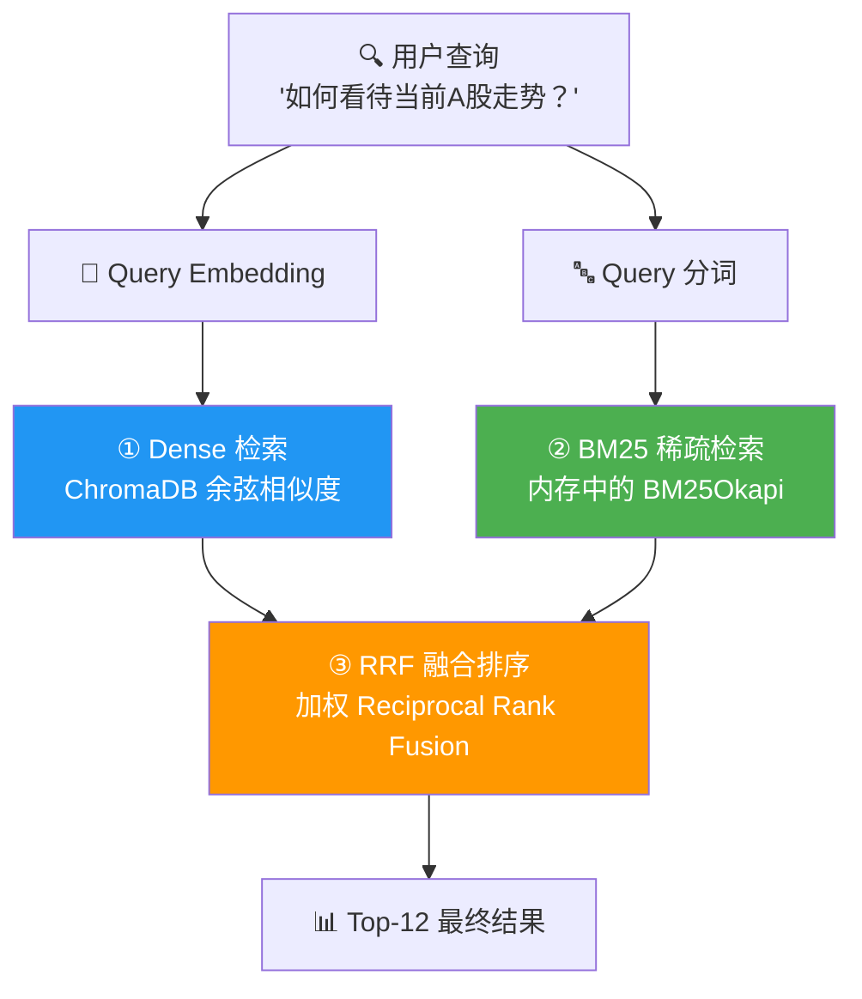
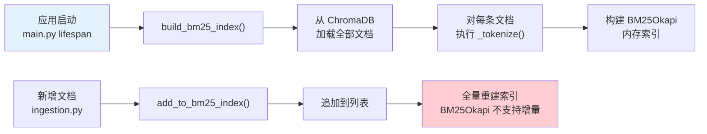
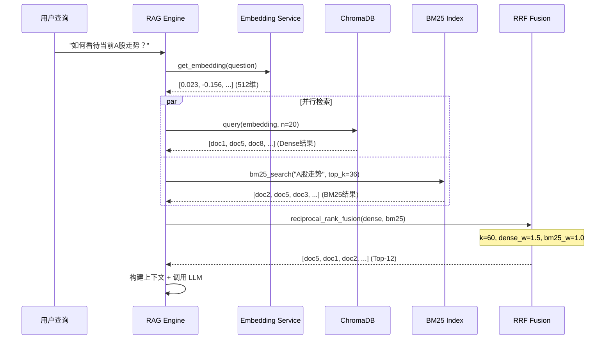

# 混合检索

## 概述

混合检索（Hybrid Retrieval）是 Dungeon Lord RAG 系统的核心竞争力。它同时执行**语义向量检索**和**关键词稀疏检索**，再通过 **RRF（Reciprocal Rank Fusion）** 融合两路结果，兼顾了语义理解和精确匹配的优势。

---

## 三种检索方法



---

## ① Dense 向量检索

Dense 检索基于 Embedding 向量的余弦相似度，擅长捕捉**语义相似**但用词不同的查询。

### 原理

1. 查询文本通过 `bge-small-zh-v1.5` 编码为 512 维向量
2. 在 ChromaDB 中执行近似最近邻搜索（HNSW 索引）
3. 返回余弦相似度最高的候选文档

### 实现

```python title="backend/app/services/rag.py"
# Dense 向量检索
question_embedding = await get_embedding(question)

dense_raw = query(
    query_embedding=question_embedding,
    n_results=min(top_k * 3, 20),  # 过取，用于后续融合
    where=filters,
)
dense_results = []
for i in range(len(dense_docs)):
    dense_results.append({
        "id": dense_ids[i],
        "document": dense_docs[i],
        "metadata": dense_metas[i],
    })
```

:::note 过取策略
Dense 检索取 `min(top_k * 3, 20)` 条候选（默认 top_k=12 时取 20 条），而非直接取 12 条。这是因为后续 RRF 融合需要更大的候选池来保证召回率。
:::

### 优势与局限

| 优势 | 局限 |
|------|------|
| 理解同义词（"牛市" ≈ "上涨趋势"） | 对精确术语匹配较弱 |
| 捕捉隐喻和上下文语义 | 受限于 Embedding 模型质量 |
| 不依赖分词 | 长尾查询效果下降 |

---

## ② BM25 稀疏检索

BM25 是经典的关键词检索算法，擅长**精确术语匹配**。系统使用 `rank_bm25` 库的 `BM25Okapi` 实现。

### 中文 n-gram 分词

由于中文没有天然的词边界（不像英文有空格），系统采用 **n-gram 分词策略**，而非依赖分词库：

```python title="backend/app/services/hybrid_retriever.py"
def _tokenize(text: str) -> list[str]:
    """中英文混合分词：英文单词 + 中文 n-gram (1-3) + 数字"""
    # 英文单词（保留完整词）
    words = re.findall(r'[a-zA-Z]+', text.lower())
    # 中文字符
    chinese_chars = re.findall(r'[一-鿿]', text)
    # 中文 bigram + trigram（提升多字词匹配）
    ngrams = list(chinese_chars)                             # unigram: 每个字
    for i in range(len(chinese_chars) - 1):
        ngrams.append(chinese_chars[i] + chinese_chars[i+1])   # bigram: 相邻两字
    for i in range(len(chinese_chars) - 2):
        ngrams.append(chinese_chars[i] + chinese_chars[i+1] + chinese_chars[i+2])  # trigram: 相邻三字
    # 数字
    numbers = re.findall(r'\d+', text)
    return words + ngrams + numbers
```

### n-gram 分词示例

对文本 `"A股市场震荡"` 进行分词：

```
原始文本: "A股市场震荡"

英文单词: ["a"]
中文字符: ["股", "市", "场", "震", "荡"]

Unigram (单字):
  股 | 市 | 场 | 震 | 荡

Bigram (相邻两字):
  股市 | 市场 | 场震 | 震荡

Trigram (相邻三字):
  股市场 | 市场震 | 场震荡

最终 token 列表:
  ["a", "股", "市", "场", "震", "荡", "股市", "市场", "场震", "震荡", "股市场", "市场震", "场震荡"]
```

:::tip n-gram 的优势
- **Unigram** 保证单字召回（"牛" 能匹配所有包含 "牛" 的文档）
- **Bigram** 捕捉常见双字词（"市场"、"震荡"）
- **Trigram** 覆盖三字术语（"创业板"、"概念股"）
- 无需词典或分词模型，对新词和专业术语天然友好
:::

### BM25 搜索实现

```python title="backend/app/services/hybrid_retriever.py"
def bm25_search(query: str, top_k: int = 20) -> list[dict]:
    """BM25 稀疏检索"""
    if _bm25_index is None or not _bm25_docs:
        return []

    query_tokens = _tokenize(query)
    scores = _bm25_index.get_scores(query_tokens)

    # 取 top_k 个最高分
    ranked = sorted(enumerate(scores), key=lambda x: x[1], reverse=True)[:top_k]

    results = []
    for idx, score in ranked:
        if score <= 0:
            continue
        results.append({
            "id": _bm25_ids[idx],
            "document": _bm25_docs[idx],
            "metadata": _bm25_metadatas[idx],
            "score": float(score),
        })
    return results
```

### 索引生命周期



:::warning 全量重建
`BM25Okapi` 不支持增量更新。每次新增文档后，需要从所有文档重建索引。在文档量较大时（> 10万条），重建可能需要数秒。可通过 `settings.enable_bm25 = false` 关闭 BM25 来避免此开销。
:::

---

## ③ RRF 融合排序

### 什么是 RRF？

**Reciprocal Rank Fusion (RRF)** 是一种基于排名的融合算法。它不依赖各检索方法的原始分数（不同方法的分数不可直接比较），而是仅使用**排名位置**来计算融合分数。

### 加权 RRF 公式

```
score(doc) = Σ (weight_i / (k + rank_i + 1))
```

其中：
- `weight_i` — 第 i 种检索方法的权重
- `k` — 平滑常数（控制排名差异的敏感度）
- `rank_i` — 文档在第 i 种方法中的排名（从 0 开始）

Dungeon Lord 的参数配置：

| 参数 | 值 | 说明 |
|------|-----|------|
| `dense_weight` | **1.5** | Dense 检索权重（语义更重要） |
| `bm25_weight` | **1.0** | BM25 检索权重 |
| `k` | **60** | RRF 平滑常数 |
| `top_k` | **12** | 最终返回结果数 |

### 分数计算示例

假设有 3 个文档在两路检索中的排名：

```
文档 A: Dense 排名 #1, BM25 排名 #3
文档 B: Dense 排名 #3, BM25 排名 #1
文档 C: Dense 排名 #2, BM25 未命中

k = 60

文档 A 的 RRF 分数:
  = 1.5 / (60 + 1 + 1) + 1.0 / (60 + 3 + 1)
  = 1.5 / 62 + 1.0 / 64
  = 0.02419 + 0.01563
  = 0.03982

文档 B 的 RRF 分数:
  = 1.5 / (60 + 3 + 1) + 1.0 / (60 + 1 + 1)
  = 1.5 / 64 + 1.0 / 62
  = 0.02344 + 0.01613
  = 0.03957

文档 C 的 RRF 分数:
  = 1.5 / (60 + 2 + 1) + 0
  = 1.5 / 63
  = 0.02381

最终排名: A (0.03982) > B (0.03957) > C (0.02381)
```

### 代码实现

```python title="backend/app/services/hybrid_retriever.py"
def reciprocal_rank_fusion(
    dense_results: list[dict],
    bm25_results: list[dict],
    k: int = 30,
    top_k: int = 8,
    dense_weight: float = 1.5,
    bm25_weight: float = 1.0,
) -> list[dict]:
    """加权 Reciprocal Rank Fusion (RRF) 融合排序"""

    rrf_scores: dict[str, float] = {}
    doc_map: dict[str, dict] = {}

    # Dense 排名（加权）
    for rank, item in enumerate(dense_results):
        doc_id = item["id"]
        rrf_scores[doc_id] = rrf_scores.get(doc_id, 0) + dense_weight / (k + rank + 1)
        doc_map[doc_id] = item

    # BM25 排名（加权）
    for rank, item in enumerate(bm25_results):
        doc_id = item["id"]
        rrf_scores[doc_id] = rrf_scores.get(doc_id, 0) + bm25_weight / (k + rank + 1)
        if doc_id not in doc_map:
            doc_map[doc_id] = item

    # 按 RRF 分数排序
    sorted_ids = sorted(
        rrf_scores.keys(),
        key=lambda x: rrf_scores[x],
        reverse=True,
    )[:top_k]

    results = []
    for doc_id in sorted_ids:
        item = doc_map[doc_id]
        item["rrf_score"] = rrf_scores[doc_id]
        results.append(item)

    return results
```

### 完整检索流程



---

## 结果对比示例

以查询 `"新能源汽车产业链投资机会"` 为例，对比三种检索方法的返回结果：

### Dense Only 结果

| 排名 | 文档片段 | 相似度 |
|------|----------|--------|
| 1 | "...电动车渗透率持续提升，锂电产业链受益..." | 0.87 |
| 2 | "...光伏行业产能过剩风险需关注..." | 0.82 |
| 3 | "...碳中和政策推动清洁能源发展..." | 0.79 |

> Dense 检索能捕捉到"电动车"≈"新能源汽车"的语义关联，但可能混入语义相近但主题偏移的结果（如光伏）。

### BM25 Only 结果

| 排名 | 文档片段 | BM25 分数 |
|------|----------|-----------|
| 1 | "...新能源汽车产业链上下游分析..." | 12.3 |
| 2 | "...新能源汽车补贴政策解读..." | 9.8 |
| 3 | "...汽车零部件供应商投资价值..." | 5.2 |

> BM25 精确匹配了"新能源汽车"和"产业链"等关键词，但可能遗漏使用不同表述的相关内容。

### Hybrid (RRF) 结果

| 排名 | 文档片段 | RRF 分数 |
|------|----------|----------|
| 1 | "...新能源汽车产业链上下游分析..." | 0.0412 |
| 2 | "...电动车渗透率持续提升，锂电产业链受益..." | 0.0387 |
| 3 | "...新能源汽车补贴政策解读..." | 0.0354 |

> RRF 融合后，既保留了精确匹配的结果，又召回了语义相关的内容，综合表现最优。

---

## 性能特征

| 指标 | Dense | BM25 | Hybrid |
|------|-------|------|--------|
| 索引构建 | 持久化，增量添加 | 全量重建 | — |
| 查询延迟 | ~50ms | ~5ms | ~60ms |
| 内存占用 | 低（ChromaDB 磁盘） | 高（全量文档在内存） | — |
| 召回率 | 高 | 中 | **最高** |
| 精确率 | 中 | 高 | **最高** |

:::info 可配置开关
BM25 检索可通过配置关闭：
```json title="config.json"
{
  "enable_bm25": false
}
```
关闭后系统退化为纯 Dense 检索，适用于文档量较小或对延迟极敏感的场景。
:::

---

## 下一步

- [Prompt 工程](./prompt-engineering.mdx) — 了解系统提示词设计、多轮对话和流式响应机制
