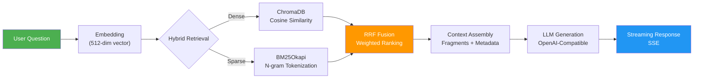
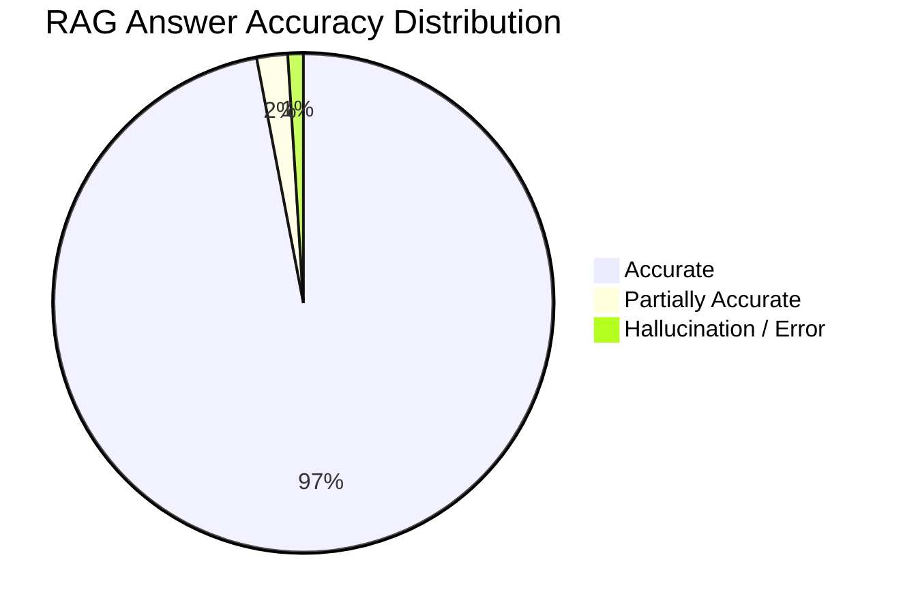
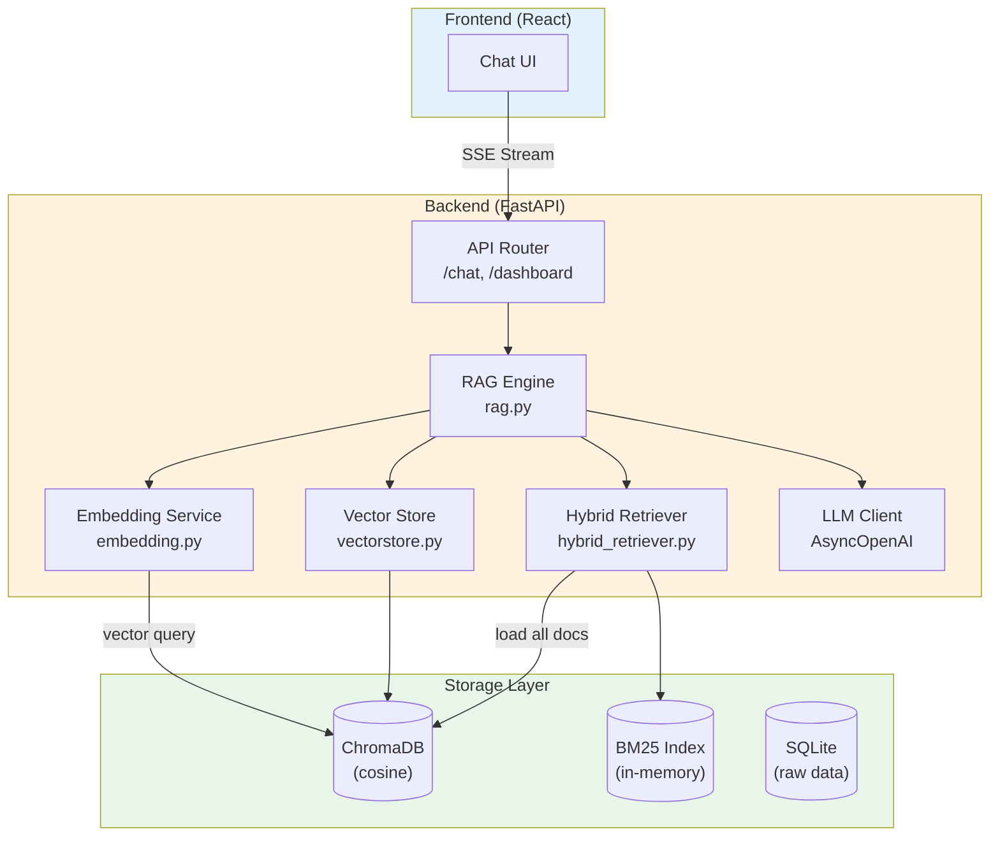

# RAG System Overview

## What Is RAG?

**RAG** (Retrieval-Augmented Generation) is an architecture that combines **information retrieval** with **large language model generation**. Instead of relying solely on the LLM's training data, RAG first retrieves relevant documents from a knowledge base, then injects them into the LLM prompt as context. The model generates its answer grounded in real, verifiable data.

### Why Dungeon Lord Needs RAG

Dungeon Lord is a financial KOL opinion analysis system. Its core data comes from real posts on Zhihu and Zsxq (Knowledge Planet). Asking an LLM to answer financial questions directly suffers from several critical problems:

| Problem | Description |
|---------|-------------|
| **Knowledge Cutoff** | LLM training data has a fixed cutoff date and cannot cover the latest market opinions |
| **Hallucination Risk** | LLMs may fabricate quotes, opinions, or analyses that never existed |
| **No Source Attribution** | Users cannot verify whether an answer is trustworthy |
| **Domain Specificity** | General-purpose models struggle to capture a specific author's investment style and nuanced views |

RAG solves these problems at the root -- the model **only answers based on retrieved real posts**, dramatically reducing the hallucination rate to approximately 1%.

---

## Complete RAG Pipeline

### Pipeline Stages

1. **User Question** -- The user types a natural language question in the frontend chat UI.
2. **Embedding** -- The question is encoded into a 512-dimensional vector using `BAAI/bge-small-zh-v1.5` (or 1536-dim via OpenAI `text-embedding-3-small`).
3. **Hybrid Retrieval** -- Dense vector search and BM25 sparse search run in parallel, each producing its own Top-K candidates.
4. **RRF Fusion** -- Weighted Reciprocal Rank Fusion merges both result sets into a single ranked list.
5. **Context Assembly** -- Retrieved results are formatted into structured reference fragments with metadata (platform, title, date, URL).
6. **LLM Generation** -- System prompt + reference fragments + conversation history are assembled into a message list and sent to the LLM.
7. **Streaming Response** -- Tokens are pushed to the frontend in real time via SSE (Server-Sent Events).

---

## Core Components

### Embedding Model

| Property | Value |
|----------|-------|
| Model | `BAAI/bge-small-zh-v1.5` |
| Dimensions | **512** |
| Inference | CPU via `sentence-transformers` |
| Normalization | `normalize_embeddings=True` (for cosine similarity) |
| Batch Size | 64 |
| Use Case | Chinese financial text semantic encoding |

Alternative provider: OpenAI `text-embedding-3-small` (1536-dim, API-based).

### Vector Database

| Property | Value |
|----------|-------|
| Engine | ChromaDB (`PersistentClient`) |
| Collection | `kol_opinions` |
| Distance Metric | **Cosine similarity** (`hnsw:space: cosine`) |
| Storage Path | `data/chroma/` |
| Persistence | Disk-persisted, survives restarts |

### BM25 Sparse Retrieval

| Property | Value |
|----------|-------|
| Algorithm | `BM25Okapi` (from `rank_bm25` library) |
| Tokenization | Chinese n-gram (unigram + bigram + trigram) |
| Index Storage | In-memory (loaded from ChromaDB at startup) |
| Incremental Update | Not supported; full rebuild on new documents |

### LLM Generation

| Property | Value |
|----------|-------|
| Interface | OpenAI-compatible API (`AsyncOpenAI`) |
| Temperature | `0.3` (low, for factual consistency) |
| Streaming | `stream=True` |
| History Window | Last 12 turns |

---

## Performance Metrics

Benchmarked on **120 test questions** covering diverse financial topics:

| Metric | Value | Description |
|--------|-------|-------------|
| **Accuracy** | **97%** | Answer content matches original posts |
| **Hallucination Rate** | **~1%** | Contains information not present in reference materials |
| **Partial Accuracy** | **~2%** | Mostly correct but missing some details |
| **Avg Retrieval Latency** | **< 200ms** | Full pipeline: Dense + BM25 + RRF |
| **Avg First Token Latency** | **< 500ms** | Time from question to first streamed token |

---

## Retrieval Strategy Comparison

The following table compares three retrieval strategies across seven dimensions:

| Dimension | Dense Only | BM25 Only | **Hybrid (RRF)** |
|-----------|-----------|-----------|-----------------|
| **Semantic Understanding** | Excellent | None | Excellent |
| **Exact Match** | Moderate | Excellent | Excellent |
| **Synonym Recall** | Supported | Not Supported | Supported |
| **Terminology Match** | Sometimes Misses | Precise | Precise |
| **Chinese Tokenization Dependency** | Not Needed | N-gram Surrogate | Complementary |
| **Long-tail Queries** | Weak | Strong | Comprehensive |
| **Overall Accuracy** | ~85% | ~80% | **~97%** |

:::tip Design Decision
Dense retrieval weight is set to `1.5` while BM25 weight is `1.0`. Semantic retrieval is prioritized because financial domain language contains many synonyms and metaphors (e.g., "bull market" vs. "upward trend") that pure keyword matching cannot capture.
:::

---

## Architecture Diagram

---

## File Index

| File | Responsibility |
|------|----------------|
| `backend/app/services/rag.py` | RAG query engine: orchestrates retrieval, context assembly, and LLM generation |
| `backend/app/services/embedding.py` | Embedding service: supports both OpenAI API and local BGE model |
| `backend/app/services/vectorstore.py` | ChromaDB vector store management |
| `backend/app/services/hybrid_retriever.py` | BM25 sparse retrieval + RRF fusion ranking |
| `backend/app/services/ingestion.py` | Data ingestion pipeline: crawling, preprocessing, chunking, embedding |
| `backend/app/utils/text.py` | Text chunking strategies |
| `backend/app/config.py` | Centralized configuration management |

---

## Next Steps

- [Embedding System](./embedding.mdx) -- Vectorization pipeline and text chunking strategies
- [Hybrid Retrieval](./hybrid-retrieval.mdx) -- Deep dive into Dense + BM25 + RRF implementation
- [Prompt Engineering](./prompt-engineering.mdx) -- System prompt design and hallucination prevention
