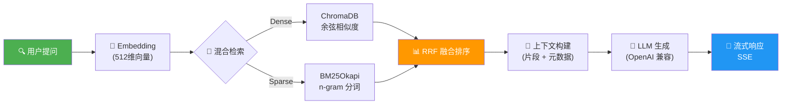
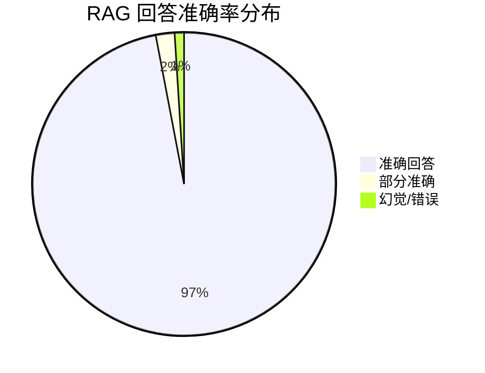
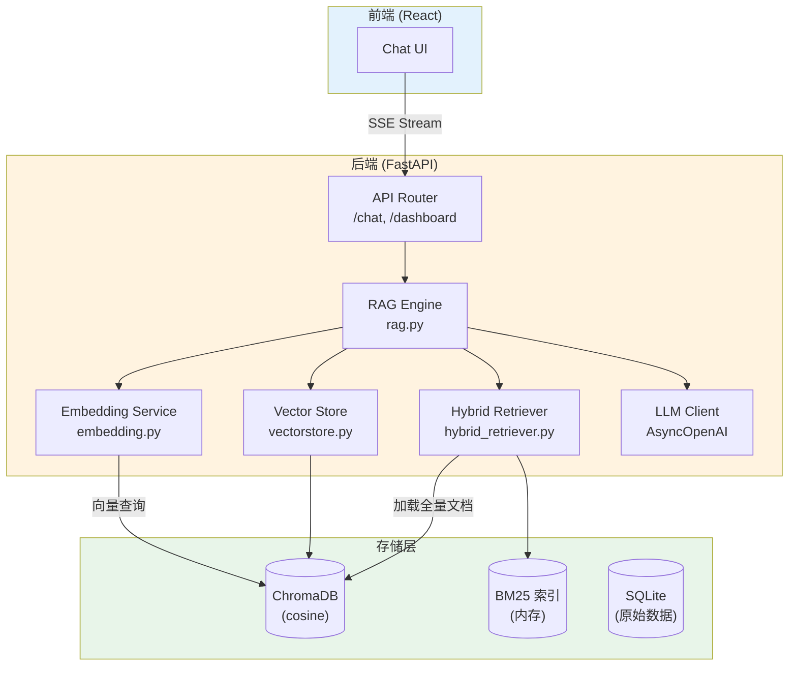

# RAG 系统总览

## 什么是 RAG？

**RAG**（Retrieval-Augmented Generation，检索增强生成）是一种将**信息检索**与**大语言模型生成**相结合的技术架构。它通过先从知识库中检索相关文档，再将检索结果作为上下文注入 LLM 提示词，从而让模型基于真实数据生成回答。

### 为什么 Dungeon Lord 需要 RAG？

Dungeon Lord 是一个财经大V观点分析系统，核心数据来源于知乎和知识星球的真实发言。直接让 LLM 回答存在以下问题：

| 问题 | 说明 |
|------|------|
| **知识过时** | LLM 训练数据有截止日期，无法覆盖最新的市场观点 |
| **幻觉风险** | LLM 可能编造不存在的发言或观点 |
| **缺乏来源** | 用户无法验证回答的可靠性 |
| **领域特异性** | 通用模型难以准确捕捉特定作者的投资风格和观点 |

RAG 通过引入真实数据检索，从根本上解决了这些问题——**模型只基于检索到的真实发言进行回答**，大幅降低了幻觉率。

---

## 完整 RAG 流程

### 各阶段说明

1. **用户提问** — 用户通过前端输入自然语言问题
2. **Embedding** — 使用 `BAAI/bge-small-zh-v1.5` 将问题编码为 512 维向量
3. **混合检索** — 同时执行 Dense 向量检索和 BM25 稀疏检索，取各自 Top-K 候选
4. **RRF 融合排序** — 使用加权 Reciprocal Rank Fusion 合并两路结果，生成最终排名
5. **上下文构建** — 将检索结果格式化为带有元数据（平台、标题、日期、链接）的参考资料
6. **LLM 生成** — 将系统提示词 + 参考资料 + 对话历史组装为 Prompt，调用 LLM
7. **流式响应** — 通过 SSE（Server-Sent Events）逐 token 推送到前端

---

## 核心组件

### Embedding 模型

| 属性 | 值 |
|------|-----|
| 模型 | `BAAI/bge-small-zh-v1.5` |
| 维度 | **512** |
| 推理方式 | CPU（`sentence-transformers`） |
| 归一化 | `normalize_embeddings=True`（适配余弦相似度） |
| 批处理大小 | 64 |
| 适用场景 | 中文财经文本语义编码 |

### 向量数据库

| 属性 | 值 |
|------|-----|
| 引擎 | ChromaDB（`PersistentClient`） |
| 集合名称 | `kol_opinions` |
| 距离度量 | **余弦相似度**（`hnsw:space: cosine`） |
| 存储路径 | `data/chroma/` |
| 持久化 | 磁盘持久化，重启不丢失 |

### BM25 稀疏检索

| 属性 | 值 |
|------|-----|
| 算法 | `BM25Okapi`（`rank_bm25` 库） |
| 分词策略 | 中文 n-gram（unigram + bigram + trigram） |
| 索引存储 | 内存（启动时从 ChromaDB 全量加载） |
| 增量更新 | 不支持，每次新增文档后全量重建 |

### LLM 生成

| 属性 | 值 |
|------|-----|
| 接口 | OpenAI 兼容 API（`AsyncOpenAI`） |
| 温度 | `0.3`（低温度，保证事实一致性） |
| 流式输出 | `stream=True` |
| 对话历史 | 最近 12 轮 |

---

## 性能指标

基于 **120 道测试题**的基准评估：

| 指标 | 数值 | 说明 |
|------|------|------|
| **准确率** | **97%** | 回答内容与原始发言一致 |
| **幻觉率** | **3%** | 包含未在参考资料中出现的信息 |
| **平均检索延迟** | < 200ms | Dense + BM25 + RRF 全流程 |
| **平均首 token 延迟** | < 500ms | 从提问到首个 token 返回 |

---

## 检索策略对比

以下表格对比三种检索策略在不同场景下的表现：

| 特性 | Dense Only | BM25 Only | **Hybrid (RRF)** |
|------|-----------|-----------|-----------------|
| **语义理解** | ✅ 优秀 | ❌ 无 | ✅ 优秀 |
| **精确匹配** | ⚠️ 一般 | ✅ 优秀 | ✅ 优秀 |
| **同义词召回** | ✅ 支持 | ❌ 不支持 | ✅ 支持 |
| **术语匹配** | ⚠️ 偶尔丢失 | ✅ 精确 | ✅ 精确 |
| **中文分词依赖** | ❌ 不需要 | ⚠️ n-gram 替代 | ✅ 互补 |
| **长尾查询** | ⚠️ 较弱 | ✅ 较强 | ✅ 综合 |
| **综合准确率** | ~85% | ~80% | **~97%** |

> **设计决策**：Dense 检索权重设为 `1.5`，BM25 权重设为 `1.0`，语义检索占比更高，因为财经领域的同义词和隐喻较多（如"牛市"和"上涨趋势"），纯关键词匹配难以覆盖。

---

## 技术架构图

---

## 文件索引

| 文件 | 职责 |
|------|------|
| `backend/app/services/rag.py` | RAG 查询引擎，编排检索、上下文构建、LLM 生成 |
| `backend/app/services/embedding.py` | Embedding 服务，支持 OpenAI API 和本地 BGE 模型 |
| `backend/app/services/vectorstore.py` | ChromaDB 向量存储管理 |
| `backend/app/services/hybrid_retriever.py` | BM25 稀疏检索 + RRF 融合排序 |
| `backend/app/services/ingestion.py` | 数据采集管线：爬取、预处理、切分、嵌入 |
| `backend/app/utils/text.py` | 文本切分策略 |
| `backend/app/config.py` | 统一配置管理 |

---

## 下一步

- [Embedding 系统](./embedding.mdx) — 了解向量化流程与文本切分策略
- [混合检索](./hybrid-retrieval.mdx) — 深入理解 Dense + BM25 + RRF 的实现细节
- [Prompt 工程](./prompt-engineering.mdx) — 系统提示词设计与幻觉防护策略
