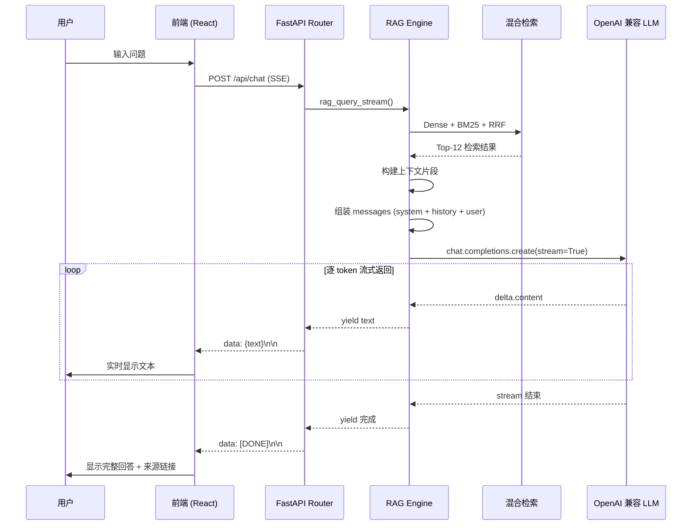
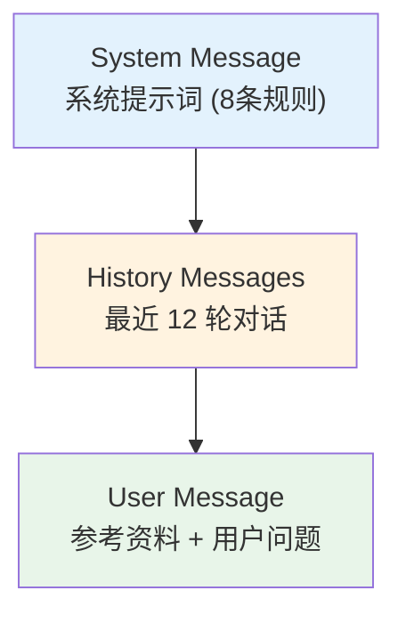
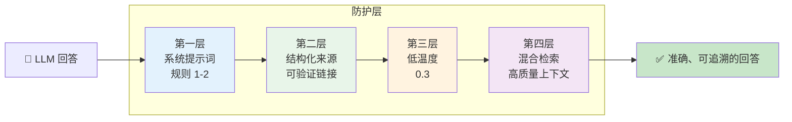

# Prompt 工程与响应生成

## 概述

Prompt 工程是 RAG 系统的最后一环，也是决定回答质量的关键环节。Dungeon Lord 通过精心设计的系统提示词、结构化的上下文模板和低温度生成策略，确保 LLM 基于检索到的真实资料生成准确、有据可查的回答。

---

## 流式响应流程



---

## 系统提示词设计

### 八条核心规则

系统提示词定义了 RAG 助手的行为准则，确保回答基于真实数据、引用可追溯：

```python title="backend/app/services/rag.py"
SYSTEM_PROMPT = f"""你是一个财经观点分析助手。你的任务是根据{settings.author_name or '星主'}在知乎和知识星球上的真实发言记录，回答用户的问题。

规则:
1. 只基于提供的参考资料回答，不要编造信息
2. 如果参考资料不足以回答问题，明确说明
3. 回答中引用原文时，用markdown链接标注来源，格式为 [来源标题](URL)
4. 如果参考资料中提供了原文链接(URL)，必须在引用时附上该链接，方便用户点击查看原文
5. 回答要简洁、有条理，使用markdown格式（粗体、列表等）
6. 支持多轮对话，结合上下文理解用户意图
7. 优先使用编号靠前的参考资料（相关性更高），但要综合所有片段给出完整答案
8. 当问题涉及"推荐""列举""有哪些"时，务必汇总所有相关片段中的信息，不要只看前几个"""
```

### 规则解析

| 规则 | 目的 | 对应策略 |
|------|------|----------|
| **规则 1** | 防止幻觉 | 严格约束 LLM 只使用参考资料中的信息 |
| **规则 2** | 诚实告知 | 当检索不足时明确承认，而非编造 |
| **规则 3-4** | 可追溯性 | 每条引用附带原文链接，用户可验证 |
| **规则 5** | 可读性 | 使用 Markdown 格式提升阅读体验 |
| **规则 6** | 多轮对话 | 结合历史上下文理解用户意图 |
| **规则 7** | 相关性优先 | 优先参考排名靠前的检索结果 |
| **规则 8** | 完整性 | 枚举类问题需汇总所有相关片段 |

:::tip 规则 8 的设计动机
当用户问"有哪些推荐？"时，LLM 倾向于只从前 2-3 个片段中提取信息。规则 8 明确要求"汇总所有相关片段"，避免遗漏排名靠后但内容相关的推荐。
:::

---

## 来源链接嵌入

### 上下文模板

检索结果被格式化为带有元数据的结构化参考资料：

```python title="backend/app/services/rag.py"
RAG_PROMPT_TEMPLATE = """参考资料:
{context}

用户问题: {question}

请基于以上参考资料回答用户的问题。每条引用都附上原文链接（参考资料中的URL）。"""
```

### 片段格式化

每条检索结果按以下格式组装：

```python
# 格式: --- 片段{N} [{平台} | {类型}] {标题} ({日期}) ---
#        原文链接: {URL}
#        {正文内容}

for i, item in enumerate(final_results):
    meta = item.get("metadata", {})
    doc = item.get("document", "")
    platform = {"zhihu": "知乎", "zsxq": "知识星球"}.get(
        meta.get("platform", ""), meta.get("platform", "")
    )
    content_type = meta.get("content_type", "")
    title = meta.get("topic_title", "")
    url = meta.get("url", "")
    published_at = meta.get("published_at", "")

    header = f"[{platform} | {content_type}]"
    if title:
        header += f" {title}"
    if published_at:
        header += f" ({published_at[:10]})"
    if url:
        header += f"\n原文链接: {url}"

    context_parts.append(f"--- 片段{i+1} {header} ---\n{doc}")
```

### 实际输出示例

注入 LLM 的参考资料格式如下：

```
参考资料:
--- 片段1 [知乎 | answer] 如何看待A股当前的估值水平？ (2024-03-15)
原文链接: https://www.zhihu.com/question/123456/answer/789
当前A股整体估值处于历史低位，沪深300的PE-TTM约11倍...

--- 片段2 [知识星球 | topic] 市场周报 2024-W11 (2024-03-18)
原文链接: https://wx.zsxq.com/topic/456789
本周市场先扬后抑，上证指数收于3054点...

--- 片段3 [知乎 | answer] 2024年值得关注的投资方向 (2024-01-20)
原文链接: https://www.zhihu.com/question/234567/answer/012
从宏观来看，今年有三条主线值得关注...
```

:::info 元数据翻译
平台名称自动翻译为中文（`zhihu` → `知乎`，`zsxq` → `知识星球`），日期截取前 10 位（`YYYY-MM-DD`），方便 LLM 引用。
:::

---

## 多轮对话管理

### 消息组装



### 代码实现

```python title="backend/app/services/rag.py"
# 组装消息列表
messages: list[dict] = [{"role": "system", "content": SYSTEM_PROMPT}]

# 加入对话历史（最近12轮）
if history:
    for msg in history[-12:]:
        if msg.get("role") in ("user", "assistant") and msg.get("content"):
            messages.append({"role": msg["role"], "content": msg["content"]})

# 加入当前问题（含参考资料）
messages.append({"role": "user", "content": prompt})
```

### 上下文窗口管理

| 策略 | 实现 | 说明 |
|------|------|------|
| 历史截断 | `history[-12:]` | 只保留最近 12 轮对话 |
| 角色过滤 | `role in ("user", "assistant")` | 过滤无效消息 |
| 内容校验 | `msg.get("content")` | 跳过空消息 |
| 检索结果 | Top-12 片段 | 控制参考资料总量 |

:::warning Token 预算
12 轮对话 + 12 条检索片段 + 系统提示词，总 token 数约 4000-6000，为 LLM 的回答预留了充足空间。对于 8K 上下文窗口的模型，这一配置已接近上限；如使用 16K 或更长窗口的模型，可适当增加历史轮数或检索片段数。
:::

---

## LLM 参数配置

```python title="backend/app/services/rag.py"
client = AsyncOpenAI(**client_kwargs)
response = await client.chat.completions.create(
    model=settings.openai_model,       # 可配置的模型名称
    messages=messages,
    temperature=0.3,                   # 低温度，保证事实一致性
    stream=True,                       # 流式输出
)
```

| 参数 | 值 | 说明 |
|------|-----|------|
| `model` | 配置文件指定 | OpenAI 兼容接口，支持任意模型 |
| `temperature` | **0.3** | 低温度减少随机性，提升事实准确性 |
| `stream` | `True** | 流式输出，降低首 token 延迟 |

### Temperature 选择

```
Temperature = 0.0  →  确定性输出，每次回答几乎相同
Temperature = 0.3  →  低随机性，适合事实性问答 (当前选择)
Temperature = 0.7  →  中等随机性，适合创意写作
Temperature = 1.0  →  高随机性，适合头脑风暴
```

:::info 为什么选择 0.3？
对于财经观点分析场景，准确性远比创意性重要。Temperature = 0.3 在保持回答自然流畅的同时，最大限度减少了 LLM "即兴发挥"的空间，使其更忠实于检索到的参考资料。
:::

---

## 幻觉防护策略

Dungeon Lord 采用多层防护机制来降低 LLM 幻觉率：

### 第一层：系统提示词约束

规则 1 和规则 2 从指令层面约束 LLM：

```
规则1: 只基于提供的参考资料回答，不要编造信息
规则2: 如果参考资料不足以回答问题，明确说明
```

### 第二层：结构化参考资料

每条检索结果包含明确的元数据（平台、日期、链接），使 LLM 的引用可被用户验证：

```
--- 片段1 [知乎 | answer] 标题 (2024-03-15)
原文链接: https://...
正文内容...
```

### 第三层：低温度生成

`temperature=0.3` 减少了 LLM 生成随机或虚构内容的概率。

### 第四层：检索质量保障

混合检索（Dense + BM25 + RRF）确保注入的参考资料高度相关，减少 LLM 因参考无关内容而产生误导的可能。



### 幻觉处理示例

**场景：用户提问 "星主对比亚迪的看法？"**

| 情况 | 参考资料 | LLM 回答 |
|------|----------|----------|
| 资料充足 | 包含比亚迪相关发言 | 基于原文回答，附带来源链接 |
| 资料不足 | 仅有"新能源汽车"泛论 | "参考资料中未找到星主对比亚迪的具体观点，但他在新能源汽车板块的讨论中提到..." |
| 无资料 | 无相关检索结果 | "抱歉，参考资料中没有找到相关信息" |

---

## SSE 流式传输

### 后端实现

```python title="backend/app/routers/chat.py"
async def event_stream():
    async for text in rag_query_stream(req.message, ...):
        yield f"data: {text}\n\n"
    yield "data: [DONE]\n\n"

return StreamingResponse(
    event_stream(),
    media_type="text/event-stream",
    headers={
        "Cache-Control": "no-cache",
        "X-Accel-Buffering": "no",  # 禁用 nginx 缓冲
    },
)
```

### SSE 数据格式

```
data: 根据

data: 星主

data: 在

data: 知乎

data: 上的

data: 发言

data: ...

data: [DONE]
```

### 关键 Header

| Header | 值 | 作用 |
|--------|-----|------|
| `Content-Type` | `text/event-stream` | 标识 SSE 流 |
| `Cache-Control` | `no-cache` | 禁用浏览器缓存 |
| `X-Accel-Buffering` | `no` | 禁用 nginx 代理缓冲，确保实时推送 |

:::warning Nginx 代理配置
如果系统部署在 nginx 反向代理之后，必须设置 `X-Accel-Buffering: no`，否则 nginx 会缓冲整个响应后才推送，失去流式效果。
:::

---

## API 端点

### 管理端 Chat

```
POST /api/chat
Authorization: Bearer <JWT Token>
Content-Type: application/json

{
  "message": "星主怎么看当前的A股行情？",
  "history": [
    {"role": "user", "content": "之前聊过什么话题？"},
    {"role": "assistant", "content": "我们之前讨论过..."}
  ],
  "kol_id": "123",      // 可选：指定作者
  "platform": "zhihu"    // 可选：指定平台
}
```

### 公共 Dashboard Chat

```
POST /api/dashboard/chat
Content-Type: application/json

{
  "message": "最近有什么投资建议？",
  "history": []
}
```

:::info 频率限制
公共 Dashboard 端点受 IP 频率限制（默认每天 10 次），管理端无限制。可通过 `GET /api/dashboard/chat-remaining` 查询剩余配额。
:::

---

## 下一步

- [RAG 系统总览](./overview.mdx) — 回顾 RAG 系统的整体架构
- [API 参考](/api/overview) — 查看完整的 API 文档
