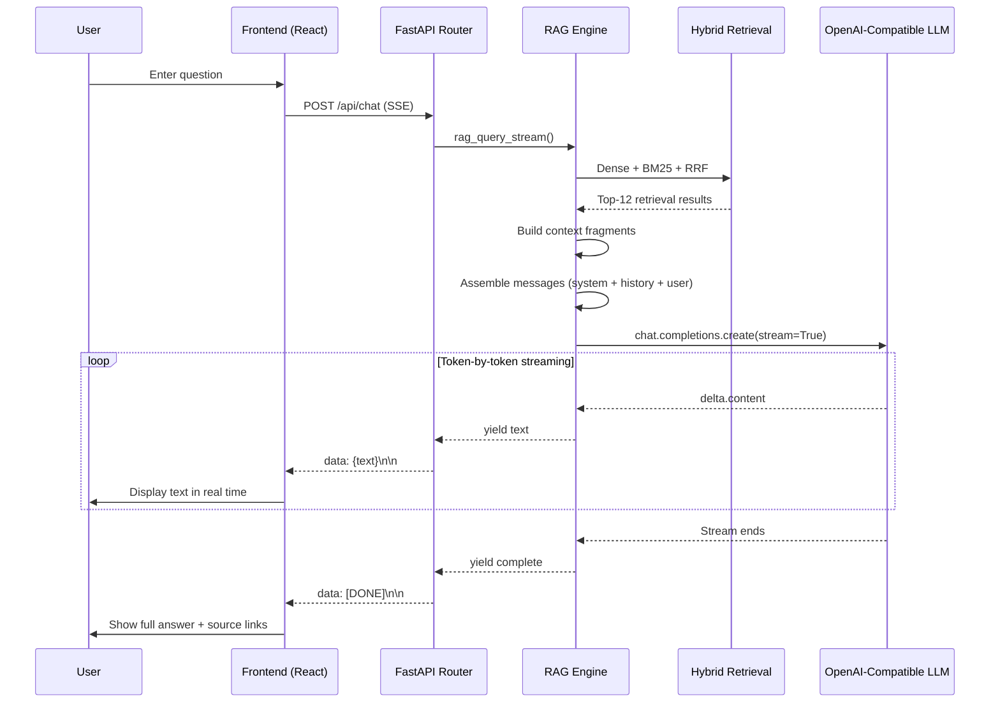
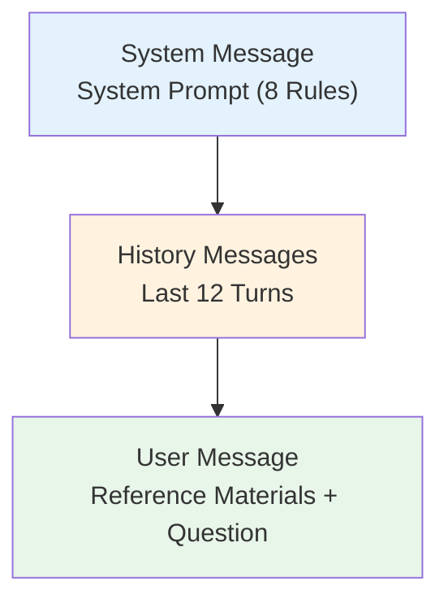
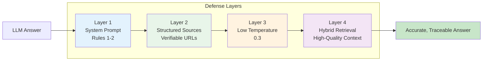

# Prompt Engineering & Response Generation

## Overview

Prompt engineering is the final stage of the RAG pipeline and a critical determinant of answer quality. Dungeon Lord uses a carefully designed system prompt, structured context templates, and a low-temperature generation strategy to ensure the LLM produces accurate, source-attributed answers grounded in retrieved real-world data.

---

## Streaming Response Flow



---

## System Prompt Design

### The Eight Core Rules

The system prompt defines the behavioral guidelines for the RAG assistant, ensuring answers are grounded in real data and citations are traceable:

```python title="backend/app/services/rag.py"
SYSTEM_PROMPT = f"""You are a financial opinion analysis assistant. Your task is to answer
user questions based on {settings.author_name or 'Star Author'}'s real posts from Zhihu
and Zsxq (Knowledge Planet).

Rules:
1. Only answer based on the provided reference materials; do not fabricate information
2. If the reference materials are insufficient to answer, state this clearly
3. When quoting original text, cite sources using markdown links: [Title](URL)
4. If original URLs are provided in the reference materials, you must include them
5. Keep answers concise and well-organized; use markdown formatting (bold, lists, etc.)
6. Support multi-turn conversation; understand user intent from context
7. Prioritize higher-ranked reference materials (more relevant), but synthesize all fragments
8. For questions involving "recommend", "list", "what are there", aggregate ALL relevant fragments"""
```

### Rule-by-Rule Explanation

| Rule | Purpose | Corresponding Strategy |
|------|---------|----------------------|
| **Rule 1** | Prevent hallucination | Strictly constrains the LLM to use only reference material |
| **Rule 2** | Honest disclosure | Acknowledge insufficient data rather than fabricate |
| **Rule 3-4** | Traceability | Every citation includes a source URL for user verification |
| **Rule 5** | Readability | Markdown formatting improves reading experience |
| **Rule 6** | Multi-turn conversation | Leverages historical context to understand user intent |
| **Rule 7** | Relevance prioritization | References higher-ranked retrieval results first |
| **Rule 8** | Completeness | Enumeration queries must aggregate all relevant fragments |

:::tip Why Rule 8 Matters
When a user asks "what recommendations are there?", LLMs tend to extract information from only the first 2-3 fragments. Rule 8 explicitly requires "aggregating all relevant fragments" to avoid missing lower-ranked but content-relevant recommendations.
:::

---

## Source Link Embedding

### Context Template

Retrieval results are formatted into structured reference materials with metadata:

```python title="backend/app/services/rag.py"
RAG_PROMPT_TEMPLATE = """Reference Materials:
{context}

User Question: {question}

Please answer based on the reference materials above. Attach original links for every citation (URLs from the reference materials)."""
```

### Fragment Formatting

Each retrieval result is assembled in the following format:

```python
# Format: --- Fragment {N} [{platform} | {type}] {title} ({date}) ---
#         URL: {url}
#         {content}

for i, item in enumerate(final_results):
    meta = item.get("metadata", {})
    doc = item.get("document", "")
    platform = {"zhihu": "Zhihu", "zsxq": "Zsxq"}.get(
        meta.get("platform", ""), meta.get("platform", "")
    )
    content_type = meta.get("content_type", "")
    title = meta.get("topic_title", "")
    url = meta.get("url", "")
    published_at = meta.get("published_at", "")

    header = f"[{platform} | {content_type}]"
    if title:
        header += f" {title}"
    if published_at:
        header += f" ({published_at[:10]})"
    if url:
        header += f"\nURL: {url}"

    context_parts.append(f"--- Fragment {i+1} {header} ---\n{doc}")
```

### Real Output Example

The reference materials injected into the LLM look like this:

```
Reference Materials:
--- Fragment 1 [Zhihu | answer] How to view current A-share valuation levels? (2024-03-15)
URL: https://www.zhihu.com/question/123456/answer/789
The overall A-share valuation is at a historical low. The CSI 300 PE-TTM is around 11x...

--- Fragment 2 [Zsxq | topic] Weekly Market Report 2024-W11 (2024-03-18)
URL: https://wx.zsxq.com/topic/456789
This week the market rose then fell. The Shanghai Composite closed at 3054...

--- Fragment 3 [Zhihu | answer] Investment Directions Worth Watching in 2024 (2024-01-20)
URL: https://www.zhihu.com/question/234567/answer/012
From a macro perspective, three main themes are worth watching this year...
```

:::info Metadata Translation
Platform names are translated to English (`zhihu` -> `Zhihu`, `zsxq` -> `Zsxq`), and dates are truncated to the first 10 characters (`YYYY-MM-DD`) for cleaner LLM output.
:::

---

## Multi-Turn Conversation Management

### Message Assembly



### Code Implementation

```python title="backend/app/services/rag.py"
# Assemble message list
messages: list[dict] = [{"role": "system", "content": SYSTEM_PROMPT}]

# Add conversation history (last 12 turns)
if history:
    for msg in history[-12:]:
        if msg.get("role") in ("user", "assistant") and msg.get("content"):
            messages.append({"role": msg["role"], "content": msg["content"]})

# Add current question (with reference materials)
messages.append({"role": "user", "content": prompt})
```

### Context Window Management

| Strategy | Implementation | Description |
|----------|---------------|-------------|
| History Truncation | `history[-12:]` | Only the last 12 turns are retained |
| Role Filtering | `role in ("user", "assistant")` | Filters out invalid messages |
| Content Validation | `msg.get("content")` | Skips empty messages |
| Retrieval Results | Top-12 fragments | Controls total reference material volume |

:::warning Token Budget
With 12 turns of conversation + 12 retrieval fragments + system prompt, the total token count is approximately **4000-6000 tokens**, leaving ample room for the LLM's response. For models with an 8K context window, this configuration is near the limit. With 16K or longer context models, you can increase the history turns or fragment count accordingly.
:::

---

## LLM Parameters

```python title="backend/app/services/rag.py"
client = AsyncOpenAI(**client_kwargs)
response = await client.chat.completions.create(
    model=settings.openai_model,       # configurable model name
    messages=messages,
    temperature=0.3,                   # low temperature for factual consistency
    stream=True,                       # streaming output
)
```

| Parameter | Value | Description |
|-----------|-------|-------------|
| `model` | Configured in settings | OpenAI-compatible interface, supports any model |
| `temperature` | **0.3** | Low temperature reduces randomness, improves factual accuracy |
| `stream` | **True** | Streaming output for lower first-token latency |

### Temperature Spectrum

```
Temperature = 0.0  -->  Deterministic output; nearly identical answers each time
Temperature = 0.3  -->  Low randomness; ideal for factual Q&A (current setting)
Temperature = 0.7  -->  Moderate randomness; suitable for creative writing
Temperature = 1.0  -->  High randomness; suitable for brainstorming
```

:::info Why 0.3?
For financial opinion analysis, accuracy matters far more than creativity. Temperature = 0.3 keeps answers natural and fluent while minimizing the LLM's tendency to "improvise", making it more faithful to the retrieved reference materials.
:::

---

## Hallucination Prevention

Dungeon Lord employs a **four-layer defense** to minimize LLM hallucination:

### Layer 1: System Prompt Constraints

Rules 1 and 2 constrain the LLM at the instruction level:

```
Rule 1: Only answer based on the provided reference materials; do not fabricate information
Rule 2: If the reference materials are insufficient to answer, state this clearly
```

### Layer 2: Structured Source Materials

Each retrieval result includes explicit metadata (platform, date, URL), making LLM citations verifiable by the user:

```
--- Fragment 1 [Zhihu | answer] Title (2024-03-15)
URL: https://...
Content...
```

### Layer 3: Low-Temperature Generation

`temperature=0.3` reduces the probability of the LLM generating random or fabricated content.

### Layer 4: Retrieval Quality Assurance

Hybrid retrieval (Dense + BM25 + RRF) ensures that the injected reference materials are highly relevant, reducing the chance of the LLM being misled by irrelevant content.



### Hallucination Handling Scenarios

**Scenario: User asks "What is the author's view on BYD?"**

| Situation | Reference Materials | LLM Response |
|-----------|-------------------|--------------|
| **Sufficient data** | Contains BYD-related posts | Answers based on original text with source links |
| **Insufficient data** | Only general "new energy vehicle" discussions | "The reference materials do not contain specific views on BYD, but in the new energy vehicle discussions, the author mentioned..." |
| **No data** | No relevant retrieval results | "Sorry, no relevant information was found in the reference materials" |

---

## SSE Streaming Implementation

### Backend Code

```python title="backend/app/routers/chat.py"
async def event_stream():
    async for text in rag_query_stream(req.message, ...):
        yield f"data: {text}\n\n"
    yield "data: [DONE]\n\n"

return StreamingResponse(
    event_stream(),
    media_type="text/event-stream",
    headers={
        "Cache-Control": "no-cache",
        "X-Accel-Buffering": "no",  # disable nginx buffering
    },
)
```

### SSE Data Format

```
data: Based

data: on

data: the

data: author's

data: posts

data: on

data: Zhihu

data: ...

data: [DONE]
```

### Key Headers

| Header | Value | Purpose |
|--------|-------|---------|
| `Content-Type` | `text/event-stream` | Identifies the response as an SSE stream |
| `Cache-Control` | `no-cache` | Disables browser caching |
| `X-Accel-Buffering` | `no` | Disables nginx proxy buffering to ensure real-time push |

:::warning Nginx Proxy Configuration
If the system is deployed behind an nginx reverse proxy, `X-Accel-Buffering: no` **must** be set. Otherwise, nginx will buffer the entire response before sending it to the client, defeating the purpose of streaming.
:::

---

## API Endpoints

### Admin Chat

```
POST /api/chat
Authorization: Bearer <JWT Token>
Content-Type: application/json

{
  "message": "What is the author's view on the current A-share market?",
  "history": [
    {"role": "user", "content": "What topics have we discussed?"},
    {"role": "assistant", "content": "We previously discussed..."}
  ],
  "kol_id": "123",      // optional: specify author
  "platform": "zhihu"    // optional: specify platform
}
```

### Public Dashboard Chat

```
POST /api/dashboard/chat
Content-Type: application/json

{
  "message": "Any recent investment advice?",
  "history": []
}
```

:::info Rate Limiting
The public Dashboard endpoint is subject to IP-based rate limiting (default: 10 requests per day). The admin endpoint has no rate limit. Check remaining quota via `GET /api/dashboard/chat-remaining`.
:::

---

## Next Steps

- [RAG System Overview](./overview.mdx) -- Review the overall RAG architecture
- [API Reference](/api/overview) -- View the complete API documentation
